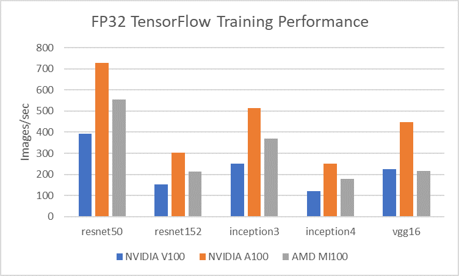
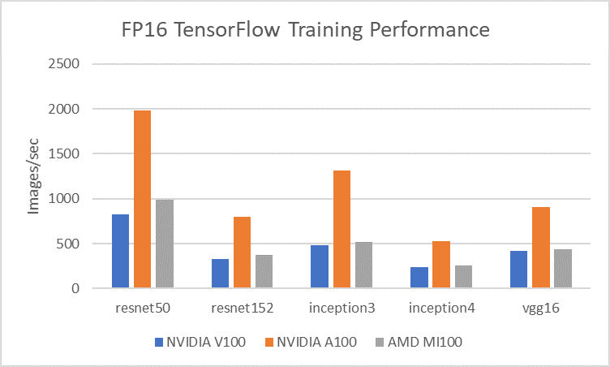

# AMD Instinct MI100 GPU 성능 테스트

AMD Instinct MI100은 AMD CDNA 아키텍처를 기반으로 설계된 GPU로 HPC와 AI를 모두 지원하도록 설계되어 있다. 일반 연산을 위한 Stream Processor (FP64: 11.5TFLOPs, FP32 23.1 TFLOPs) 및 FP32, F16 matrix (46.1TFLOPs, 184.6 TFLOPs) 가속을 위한 Matrix Core 두가지로 나뉘어 설계되어 있다. HBM2 32GB를 GPU 메모리로 사용하며 PCIe 4.0까지 지원하며 Infinity Fabric Link로 GPU 간 통신이 가능하나 테스트 보드 설계의 한계로 인해 본 성능 테스트에서는 PCIe 3.0을 활용하였다.

NVIDIA GPU와 비교하였을 때 AMD GPU의 가장 큰 차이점은 warp에 해당하는 wavefront가 64-wide로 구성되어 있다는 점이며, 내부 vector pipeline의 경우 16-wide로 구성되어 있어 4번에 나뉘어 처리된다. NVIDIA GPU에 있는 WMMA instruction과 대응되는 개념으로 Matrix Fused Multiply-ADD (MFMA) instruction이 존재하며 INT8, FP16, BF16, FP32 4가지 데이터 타입에 활용 가능하다.

CUDA C언어와 대응되는 HIP 언어가 존재하며 CUDA에서 제공하는 cuBLAS, cuFFT, cuDNN 등의 라이브러리 또한 rocBLAS, hipFFT, MIOpen 등 같은 수준으로 제공하고 있으며 nvidia-smi와 같은 모니터링 도구 또한 rocm-smi와 같은 형태로 제공하고 있다.

ROCm에서 제공하는 도커 환경에서 수행되었다. (https://hub.docker.com/r/rocm/tensorflow)\
실험 환경: ROCm 4.1.0, TensorFlow 2.4.1, Python 3.6.9, GCC 8.4.0, OpenMPI 4.0.3, Horovod 0.21.3

기본적인 AI 성능 테스트를 위해 TensorFlow 벤치마크를 수행하였으며 resnet50, resnet152, inception v3, inception v4, vgg16 5가지 네트워크에 대하여 수행하였다.

TFRecord로 변환된 ImageNet Dataset를 활용하여 수행하였으며, 뉴론 시스템의 Lustre를 마운트한 후 scratch에 저장된 데이터셋을 활용하였다.

FP32의 경우 V100은 Tensor Core가 아닌 CUDA Core에서 수행하므로 V100과 MI100을 비교하였을 때 많은 성능차이가 발생하였다. MI100이 평균적으로 V100 대비 1.4\~1.5배 정도 많이 처리하였으며 vgg16의 경우 메모리 용량 문제로 인하여 낮은 배치 값를 활용하여 성능저하가 발생했다.

A100의 경우 Tensor Core에서 TF32 데이터 타입을 활용하므로 V100 대비 약 2배, MI100 대비 약 1.4배 정도 많은 이미지를 처리할 수 있었다.

FP16의 경우 V100, A100 모두 Tensor Core를 활용하며 MI100 또한 Matrix Core를 활용하여 수행되었다. MI100이 평균적으로 V100 대비 1.1배 정도 많이 처리하였으며 A100과 MI100 비교하였을 때 2배 이상의 성능차이를 확인할 수 있었다.

Tensor Core 및 Matrix Core FP16 기준 V100 (125 TFLOPs), A100 (312 TFLOPs), MI100 (184.6 TFLOPs)로 MI100이 V100 대비 높은 이론성능을 보이지만 GPU 구조, Instruction Set Architecture, deep learning 연산 라이브러리 (cuDNN, MIOpen), memory hierarchy 등 다양한 원인으로 인하여 V100과 MI100의 성능이 흡사하게 나오는 것으로 분석된다. Deep learning 연산 라이브러리의 경우 NVIDIA 역시 긴 시간에 거쳐 성능개선을 진행하였으므로 AMD의 MIOpen 또한 향후 개선여지가 남아있다고 분석할 수 있다.
