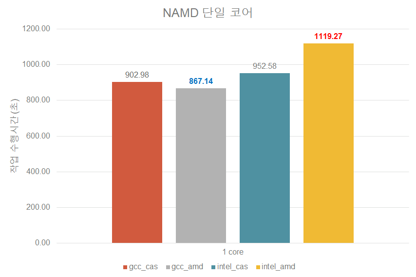
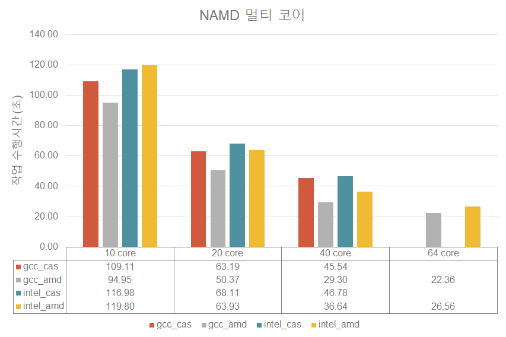
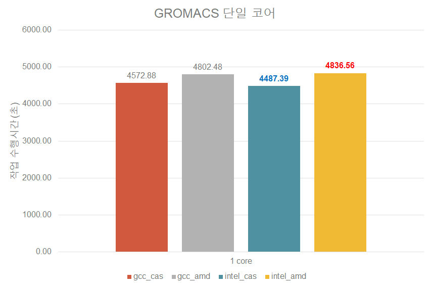
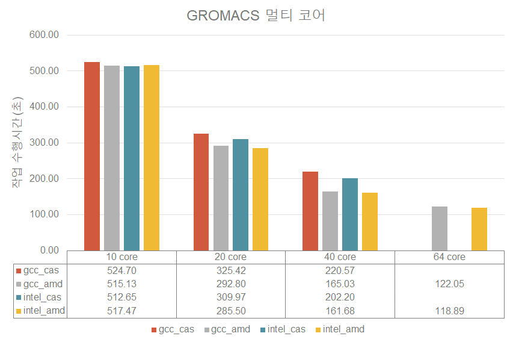
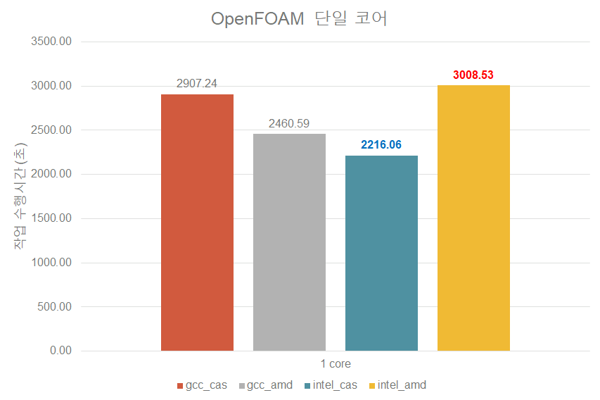
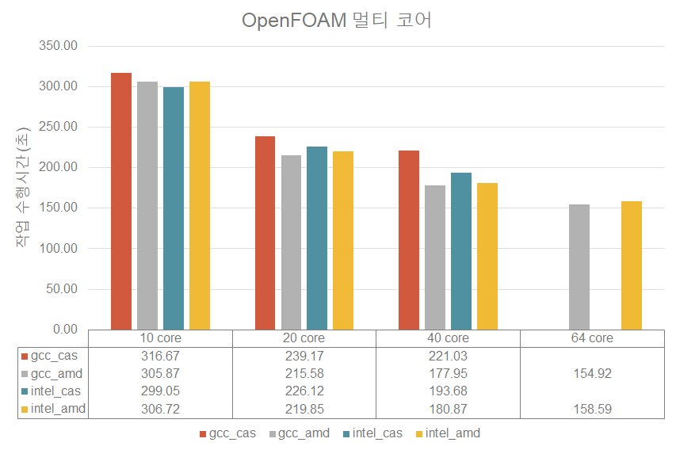

# 뉴론 AMD 노드 활용

다음은 KISTI 뉴론 시스템의 AMD 노드와 Cascade 노드의 CPU 만을 활용한 application 간 성능을 보여주는 예제이다.

### 1. 개요

### 2. applications 별 성능 분석

**1) NAMD 단일 코어**

* 단순 컴파일러 기준 gcc 는 AMD 노드에서 보다 좋은 성능을 보여줌
* 단순 컴파일러 기준 intel 은 Cascade 노드에서 보다 좋은 성능을 보여줌

**2) NAMD 멀티 코어**

* gcc 의 경우 AMD 노드에서 지속적으로 좋은 성능을 보여줌
* intel 의 경우 10 core 까지는 Cascade 노드에서 더 좋은 성능을 보이지만 20 core 부터는 AMD 노드에서 더 좋은 성능을 보여줌

**3) GROMACS 단일 코어**

* gcc 와 intel 컴파일러 모두 Cascade 노드에서 더 좋은 성능을 보여줌

**4) GROMACS 멀티 코어**

* 10 core 에서 intel 은 여전히 Cascade 노드에서 더 좋은 성능을 보여줌
* 10 core 에서 gcc는 AMD 노드에서 더 좋은 성능을 보이기 시작함
* 20 core 이후부터 gcc, intel 모두 AMD 노드에서 더 좋은 성능을 보여줌

**5) OpenFOAM 단일 코어**

* gcc 는 AMD 노드에서 더 좋은 성능
* intel 은 Cascade 노드에서 더 좋은 성능

****

**6) OpenFOAM 멀티 코어**

* gcc 의 경우 AMD 노드에서 지속적으로 좋은 성능을 보여줌
* intel 의 경우 10 core 까지는 Cascade 노드에서 더 좋은 성능을 보이지만 20 core 부터는 AMD 노드에서 더 좋은 성능을 보여줌
