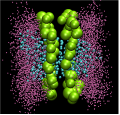
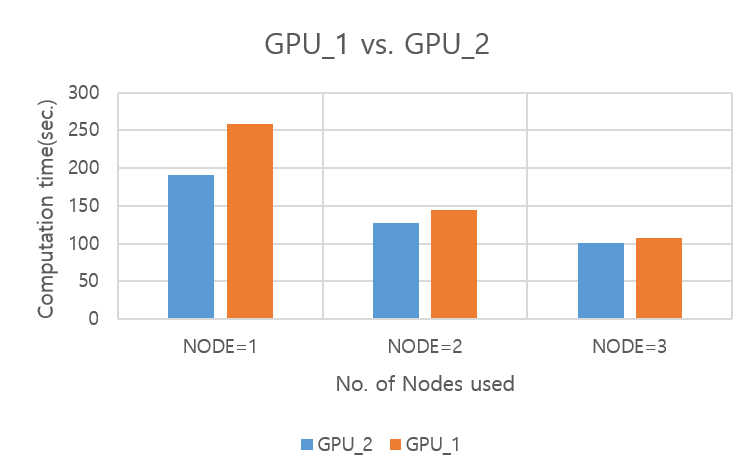

# 뉴론 LAMMPS 멀티노드 활용

다음은 뉴론을 활용한 LAMMPS 테스트 샘플의 실행 방법 및 성능을 보여주는 예제이다.

**가. 테스트 계산 모델**

Rhodopsin 프로틴을 모델 시스템으로 사용하여 성능을 테스트하였다. input은 LAMMPS의 benchmark 디렉터리의 input 파일 중 하나이며, 병렬환경에서의 테스트를 위해 run을 2000으로 변경하였고, -var x 8 –var y 8 –var z 8로 변경 테스트를 하였다.

**나. 실행 방법 및 성능 분석**

**1) 작업 스크립트 예제**

> \#!/bin/sh
>
> \#SBATCH -J LAMMPS\_small                      <mark style="color:blue;">#job의 이름을 지정</mark>&#x20;
>
> \#SBATCH -p ivy\_v100\_2                         <mark style="color:blue;"># 사용하고자 하는 파티션을 지정(누리온의 큐와 동일한 개념)</mark>
>
> \#SBATCH -N 1                                       <mark style="color:blue;"># 작업을 할당할 노드의 수</mark>
>
> \#SBATCH -n 20                                      <mark style="color:blue;"># 작업을 위해 할당할 전체 프로세스의 수</mark>
>
> \#SBATCH -o %x.o%j                                <mark style="color:blue;"># 표준 출력을 지정</mark>
>
> \#SBATCH -e %x.e%j                                <mark style="color:blue;"># 표준 오류를 지정</mark>
>
> \#SBATCH --time 10:00:00                         <mark style="color:blue;"># wall time limit을 지정</mark>
>
> \#SBATCH --gres=gpu:2                           <mark style="color:blue;"># 사용할 GPU개수를 지정(현재는 2개 사용하도록 설정됨)</mark>
>
> \#SBATCH --comment LAMMPS                 <mark style="color:blue;"># 사용하는 Application 지정(의무사항)</mark>
>
> module purge
>
> module load intel/18.0.2 cuda/10.0 cudampi/mvapich2-2.3 LAMMPS/16Mar18
>
> ulimit -s unlimited
>
> SCALE="-var x 4 -var y 4 -var z 4"
>
> ARGS="-sf gpu -pk gpu 1"
>
> EXEC="<mark style="color:red;">{설치 위치}</mark>/bin/lmp\_mpi\_V100"
>
> APP="$EXEC -in in.rhodo.scaled $SCALE -log LAMMPS.log $ARGS"
>
> time srun $APP

뉴론 시스템은 SLURM을 사용한다. 사용상에서 PBS와 약간의 차이는 있지만, 전체적으로는 유사한 방식으로 작성을 한다. GPU를 이용하기 위해서는 다음과 같은 라인을 추가해야 한다.

> \#SBATCH —gres=gpu:2

여기서 1은 GPU 카드를 1장을 사용하겠다는 의미이며, 2개를 사용하기 위해서는 2를 지정하면 된다.

LAMMPS는 CPU 계산 부분과 GPU 계산 부분이 함께 존재하므로 전체 프로세스의 개수를 20로 지정하였다.

****

**2) 계산 성능 결과**

작업을 수행할 노드의 개수를 정하는 –N 옵션과 노드당 프로세서 개수를 정하는 –n 옵션에 대한 부분은 LAMMPS는 GPU 계산 부분과 CPU 계산부분이 함께 존재하고, CPU의 계산은 MPI로 20개의 프로세스를 가지고 계산을 하고 GPU로 계산을 수행할 때는 CUDA로 계산을 수행하게 된다.

GPU\_1은 Tesla V100 카드가 1장 꽂혀있으며, 카드당 32GB의 메모리를 가지고 있고(gpu\[21-29]/ivy\_v100\_1), GPU\_2는 Tesla V100 카드가 2장이 꽂혀있으며, 카드당 16GB의 메모리를 가지고 있다(gpu\[21-29]/ivy\_v100\_1).

GPU슬롯에 따른 계산 시간의 차이를 확인해 보기 위해 각각 코드 수행을 하였고, 노드가 3개 이상이 되면 성능 차이가 거의 발생하지 않음을 알 수 있다.

**※ ivy\_v100\_1 큐는 6월 정기점검 이후 v100 카드를 추가하여 ivy\_v100\_2 로 통합**

※ KNL, SKL 시스템과의 비교는 "[누리온 LAMMPS](https://blog.ksc.re.kr/169)[멀티노드 활용 ](https://blog.ksc.re.kr/169)[(](https://blog.ksc.re.kr/169)[KNL)](https://blog.ksc.re.kr/169)" 참조
