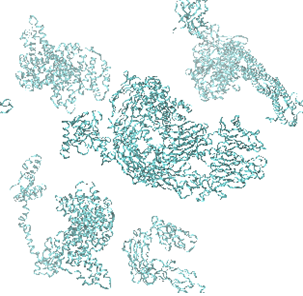
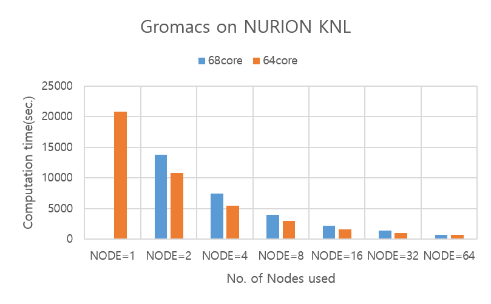
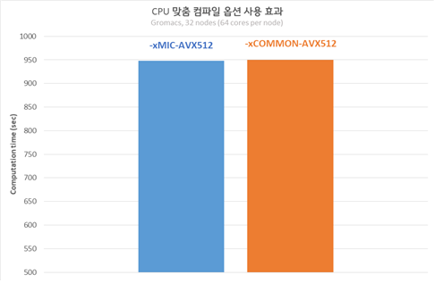
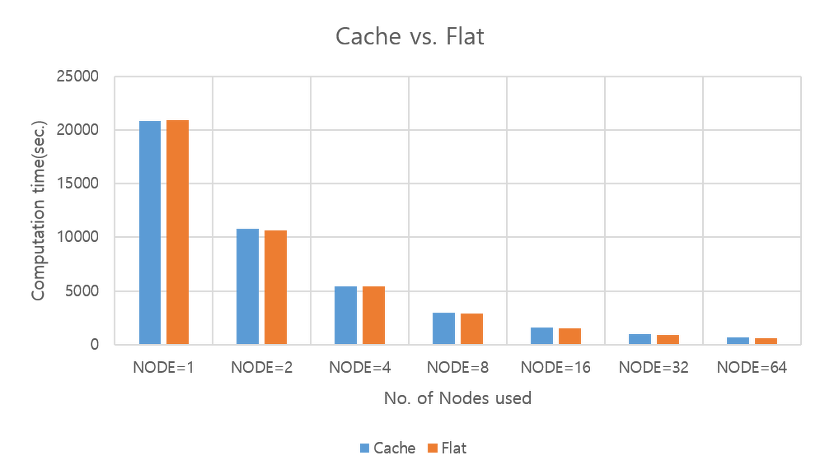
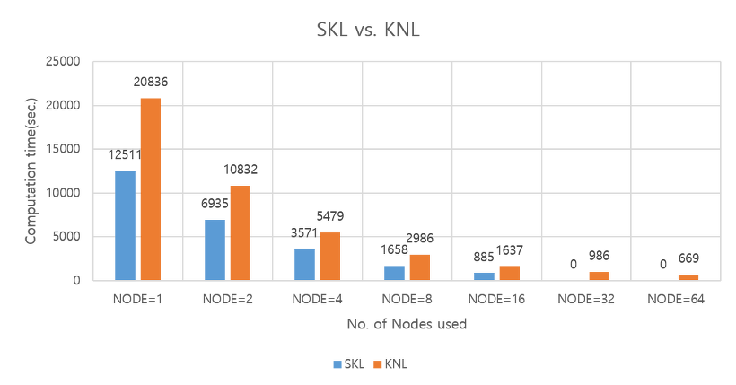
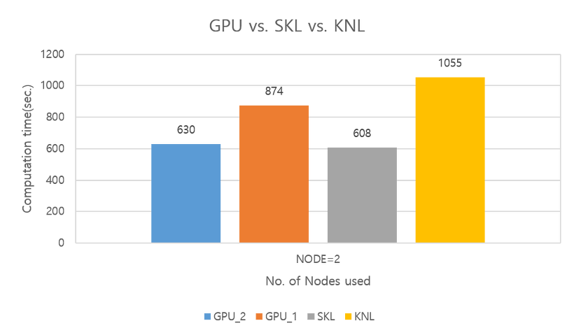

# 누리온 Gromacs 멀티노드 활용 (KNL)

다음은 누리온 KNL을 활용한 Gromacs 테스트 샘플의 실행 방법 및 성능을 보여주는 예제이다.

****

**가. 테스트 계산 모델**

Gromacs (2018.6 버전)의 실행 테스트를 위하여, 프로틴을 모델 시스템으로 사용하여 성능을 테스트하였다.

**나. 실행 방법 및 성능 분석**

**\[Gromacs 실행 명령 부분]**

> $gmxBin grompp -f opls.mdp -c em20.gro -p topol.top -o md00.tpr
>
> mpirun $gmxBin mdrun -notunepme -ntomp 1 -dlb yes -v -nsteps 40000 -resethway -noconfout -s ${WorkloadPath}/md00.tpr

**1) 작업 스크립트 예제**

> \#!/bin/sh
>
> \#PBS –N 64C01N                           <mark style="color:blue;"># job의 이름(여러 개의 작업 제출 시 사용자가 구분하기 위한 목적)</mark>
>
> \#PBS –V                  <mark style="color:blue;"># 작업 제출 노드(로그인 노드)에서 설정한 환경을 계산 노드에 적용하기 위해 사용</mark>
>
> \#PBS –l select=1:ncpus=64:mpiprocs=64:ompthreads=1     <mark style="color:blue;"># 아래 참조</mark>
>
> \#PBS –q normal                                            <mark style="color:blue;"># 사용 큐(일반 사용자는 normal 큐만 사용 가능)</mark>
>
> \#PBS –l walltime=06:00:00                      <mark style="color:blue;"># 작업을 수행할 시간( normal 큐는 최대 48시간까지 가능)</mark>
>
> \#PBS –A gromacs                             <mark style="color:blue;"># 자료 수집의 목적으로 프로그램 이름을 기입해야 함(의무사항)</mark>
>
> \#PBS –W sandbox=PRIVATE                             <mark style="color:blue;"># 아래 참조</mark>
>
> &#x20;
>
> module purge
>
> module load craype-network-opa intel/18.0.3 impi/18.0.3 cmake/3.12.3
>
> &#x20;
>
> cd $PBS\_O\_WORKDIR                                     # 작업 제출한 경로로 이동
>
> &#x20;
>
> WorkloadPath=<mark style="color:red;">{작업경로}</mark>
>
> InstallDir=<mark style="color:red;">{설치경로}</mark>/bin
>
> gmxBin="${InstallDir}/gmx\_mpi"
>
> &#x20;
>
> $gmxBin grompp -f opls.mdp -c em20.gro -p topol.top -o md00.tpr
>
> &#x20;
>
> export I\_MPI\_DEBUG=5
>
> export I\_MPI\_PIN\_MODE=lib
>
> &#x20;
>
> time -p mpirun $gmxBin mdrun -notunepme -ntomp 1 -dlb yes -v -nsteps 40000 -resethway -noconfout -s ${WorkloadPath}/md00.tpr

**\* #PBS –l select=**<mark style="color:red;">**1(A)**</mark>**:ncpus=**<mark style="color:red;">**64(B)**</mark>**:mpiprocs=**<mark style="color:red;">**64(C)**</mark>**:ompthreads=**<mark style="color:red;">**1(D)**</mark>

A(예제에서는 1) : 사용할 노드 수를 의미. 만일 4개의 노드를 사용하려면 4를 지정하면 됨.

B(예제에서는 64) :한 노드에서 사용할 Core 수(한 노드에 있는 core수보다 작거나 같아야 함)\
&#x20;                                 ****                                  (10월 PM 이후 지정한 값에 관계없이, 무조건 68로 적용됨)

C(예제에서는 64) : 한 노드에서 사용할 MPI 프로세스의 수

D(예제에서는 1) : 한 프로세스가 사용할 OpenMP스레드의 수

1\. 순수 MPI 실행에서는 D의 값은 1로 지정한다. Hybrid(MPI+OpenMP)일 때는 사용할 OpenMP 스레드의 개수로 지정한다. C\*D의 값이 68보다 크면 작업 제출이 안 됨.

2\. B, C, D의 값은 모두 한 노드 기준임

3\. 만일 2개의 노드를 사용하고 노드 당 프로세스의 수는 16, OpenMP 스레드의 수는 2로 지정하고 싶다면, 아래와 같이 지정한다.

\* #PBS –W sandbox=PRIVATE

PBS 배치 작업 수행하는 경우 작업 중 STDOUT과 STDERR을 시스템 디렉터리의 output에 저장하였다가 작업 완료 후 사용자 작업 제출 디렉터리로 복사한다. 그렇기 때문에 사용자는 작업 완료 시까지 작업 관련 내용을 볼 수 없다. 위의 키워드를 추가하면 PBS에의해 생성되는 STDOUT과 STDERR을 작업 실행 중 확인할 수 있다. 위치는 홈디럭터리 아래 작업 아이디에 해당하는 임시 디렉터리가 생기고 그 디렉터리 안에서 확인 가능하다.

**2) 계산 성능 결과**

**▶노드 당 코어를 모두 다 사용해야 가장 빠른 결과를 얻을 수 있을까?**

아래의 그림은 노드 당 64 core, 68 core를 사용하고 노드를 1, 2, 4, 8, 16, 32, 64개를 사용할 때의 성능을 비교한 그래프이다.

※ 실험 데이터는 2018년 6월 누리온에서 4번의 반복 실험을 평균한 결과임

\- 노드 당 64개 코어를 사용할 때 가장 좋은 성능을 나타냄

\- Pure MPI가 아닌 hybrid (openMP + MPI) 설정으로 실험한 결과 pure MPI보다 더 나은 성능을 보여주지는 않았음

\- 이 결과는, 이 실험의 예제에 사용된 문제 크기에 종속되는 결과이므로 사용자는 각자 풀고자 하는 문제 크기에 따라 다량의 반복 실험 이전에 위와 같은 성능 테스트를 거치는 것이 시스템 활용에 유리함

▶ -xMIC-AVX512 vs. -xCOMMON-AVX512

또한 누리온에서는 CPU 맞춤 컴파일 옵션을 사용하도록 권장하고 있다. 즉, Intel compiler인 경우, KNL에서만 실행되는 바이너리 파일을 생성하기 위해서는 ‘-xMIC-AVX512’ 옵션을 사용하고, KNL과 SKL 모두에서 실행되는 바이너리 파일을 생성하기 위해서는 ‘-xCOMMON-AVX512’ 옵션을 사용하도록 권장하고 있다. (gcc나 pgi 등 그 외의 compiler 활용 시 compiler option은 KISTI 홈페이지 (https://www.ksc.re.kr)의 기술지원 > 지침서 > 누리온 > 사용자 프로그래밍 환경 > 프로그램 컴파일의 권장 옵션 참고)

아래의 그림은 두 가지 옵션을 사용하여 테스트한 성능 결과인데, 성능 차이가 거의 없음을 알수 있다.

\\

\- Gromacs의 경우, -xMIC-AVX512 옵션과 -xCOMMON-AVX512 옵션 각각에 대한 설치 프로그램의 속도 성능 차이가 크지 않음

Gromacs인 경우 컴파일 옵션에 따른 성능 변화는 거의 없지만, 일반적으로 KNL 노드를 사용하는 경우 '-xMIC-AVX512' 옵션을 사용하는 경우가 사용하지 않는 경우보다 더 나은 성능을 보인다. 그러므로 사용하고자 하는 CPU에 맞는 컴파일 옵션을 사용하는 것이 성능 면에서 유리하다.

\\

**▶ Memory mode(Cache vs. Flat)**

KNL은 MCDRAM의 사용 방식에 따라 Cache mode, Flat mode, Hybrid mode로 나누어진다. 누리온은 대부분의 계산 노드가 Cache mode로 설정되었고, 일부 노드만 Flat mode로 설정되었다. Hybrid mode는 사용하지 않는다. Cache mode는 MCDRAM을 L3 Cache처럼 사용하는 것이고, Flat mode는 MCDRAM을 main memory처럼 사용하는 것이다. Flat mode를 사용하는 경우, 프로그램 실행 시, 'numactl -p 1' 옵션을 사용하여 MCDRAM을 우선 사용하도록 하였다.

다음 표와 그래프는 데이터를 적재하는 방식에 따른 성능을 비교하였다.

\\

|       | NODE=1 | NODE=2 | NODE=4 | NODE=8 | NODE=16 | NODE=32 | NODE=64 |
| ----- | ------ | ------ | ------ | ------ | ------- | ------- | ------- |
| Cache | 20836  | 10832  | 5479   | 2986   | 1637    | 986     | 669     |
| Flat  | 20931  | 10638  | 5456   | 2887   | 1570    | 906     | 632     |

결과 표와 그래프를 보면, 하나의 노드를 사용하는 경우만 제외하고 전체 노드에서 Flat mode의 성능이 조금 더 나은 것을 확인할 수 있다.

\\

**3) 시스템 별 성능 비교**

**▶SKL vs. KNL**

누리온의 경우 SKL 노드와 KNL 노드가 있으며, 이 둘의 이론 성능은 거의 비슷하다. 하지만, 실제 Gromacs 코드를 실행해 보면 SKL 노드를 사용할 경우 더 빠른 계산 결과를 얻을 수 있었다.

누리온 시스템은 SKL node가 132개, KNL은 8305개로 구성되어 있어, 현실적으로 SKL node를 많이 사용하는 것은 불가능하다. 대신에 KNL 노드를 많이 확보하여 프로그램을 실행하는 것이 유리할 것으로 판단되며, 위의 그래프에서도 KNL인 경우 64노드까지 성능이 계속 나아지는 것을 볼 수 있다. 즉, KNL노드에서의 병렬확장성이 좋은 결과를 보여준다. 그리고, KNL노드가 SKL 노드에 비해 2배 저렴하므로 KNL 노드 사용이 보다 경제적일 수 있다.

**▶ 누리온(KNL, SKL), 뉴론 시스템 성능 비교**

뉴론 시스템은 노당 Tesla V100카드가 1장 장착된 노드가 9개, 2장 장착된 노드가 23개 있다. 1장이 장착된 노드의 V100 카드는 32GB의 메모리를 가지고 있고, 2장이 장착된 노드의 V100카드는 16GB의 메모리를 가지고 있다.

GPU의 메모리가 작기 때문에, 시스템 성능 비교 테스트에서는 위에서 사용된 예제에서 문제의 크기를 줄여서 GPU, SKL, KNL의 성능 비교를 하였다. 또한 현재 GPU가 장착된 노드의 수가 적기 때문에, KISTI의 정책상 GPU 노드를 3개 이상 사용하지 못한다. 그렇기 때문에 실험은 노드 2개에 대해서만 진행하였다.

\\

|        | NODE=2 |
| ------ | ------ |
| GPU\_2 | 630    |
| GPU\_1 | 874    |
| SKL    | 608    |
| KNL    | 1055   |

위의 표에서, GPU\_2는 2개의 카드가 장착된 노드(gpu\[09-16]/ivy\_v100\_2, gpu\[30-44]/skl\_v100\_2)를 의미하며, GPU\_1은 1개의 카드가 장착된 노드(gpu\[21-29]/ivy\_v100\_1)를 의미한다.

**※ ivy\_v100\_1 큐는 6월 정기점검 이후 v100 카드를 추가하여 ivy\_v100\_2 로 통합**

위와 같이 시스템 별 성능 편차가 존재함을 알 수 있다. 이는 노드가 2개일 때 다소 작은 예제의 성능 비교이므로, 사용자가 다루는 문제의 크기와 필요로 하는 계산 속도 및 비용을 감안하여 계산할 시스템을 선택하고 최적화할 필요가 있다.
