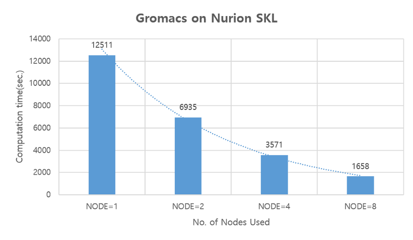

# 누리온 Gromacs 멀티노드 활용 (SKL)

다음은 누리온 SKL노드(norm\_skl 큐)을 활용한 Gromacs 테스트 샘플의 실행 방법 및 성능을 보여주는 예제이다.

**가. 테스트 계산 모델**

Gromacs (2018.6 버전)의 실행 테스트를 위하여, 프로틴을 모델 시스템으로 사용하여 성능을 테스트하였다.

 \\

****

**나. 실행 방법 및 성능 분석**

**\[Gromacs 실행 명령 부분]**

> $gmxBin grompp -f opls.mdp -c em20.gro -p topol.top -o md00.tpr
>
> mpirun $gmxBin mdrun -notunepme -ntomp 1 -dlb yes -v -nsteps 40000 -resethway -noconfout -s ${WorkloadPath}/md00.tpr

****

**1) 작업 스크립트 예제**

> \#!/bin/sh
>
> \#PBS -N 01N
>
> \#PBS -V
>
> <mark style="color:blue;">#PBS -l select=1:ncpus=40:mpiprocs=40:ompthreads=1</mark>
>
> <mark style="color:blue;">#PBS -q norm\_skl</mark>
>
> \#PBS -l walltime=06:00:00
>
> \#PBS -A gromacs
>
> \#PBS -W sandbox=PRIVATE
>
> &#x20;
>
> module purge
>
> module load craype-x86-skylake intel/18.0.3 impi/18.0.3 cmake/3.12.3
>
> &#x20;
>
> cd $PBS\_O\_WORKDIR
>
> &#x20;
>
> WorkloadPath=<mark style="color:red;">{작업 경로}</mark>
>
> InstallDir=<mark style="color:red;">{설치 경로}</mark>/bin
>
> gmxBin="${InstallDir}/gmx\_mpi"
>
> &#x20;
>
> $gmxBin grompp -f opls.mdp -c em20.gro -p topol.top -o md00.tpr
>
> \#$gmxBin grompp -f rf.mdp -c conf.gro -p topol.top -o topol\_rf.tpr
>
> &#x20;
>
> export I\_MPI\_DEBUG=5
>
> export I\_MPI\_PIN\_MODE=lib
>
> &#x20;
>
> time -p mpirun $gmxBin mdrun -notunepme -ntomp 1 -dlb yes -v -nsteps 40000 -resethway -noconfout -s ${WorkloadPath}/md00.tpr

\* 작업 스크립트는 이전의 KNL과 거의 동일, 차이점은 사용하는 큐가 normal 큐에서, norm\_skl로 바뀐 점, 그리고 KNL이 노드 당 코어를 68개인 것에 반해 SKL은 40개의 코어를 가지고 있기 때문에, 아래와 같이 가용 core수와 MPI 프로세스 수가 40이 넘을 수 없다는 점임.

\#PBS –l select=1:ncpus=40:mpiprocs=40:ompthreads=1

****

**2) 계산 성능 결과**

아래의 그림은 노드 당 40개의 core를 사용했을 때, 1, 2, 4, 8개의 노드를 사용했을 때의 결과임

그림에서 보듯이 노드 수가 증가함에 따라 계산 시간이 감소하고 있음을 확인할 수 있다.

※ 누리온 KNL 노드, GPU 시스템 뉴론과의 성능 비교는 "누리온 Gromacs 멀티노드 활용(KNL)" 참조 ([https://blog.ksc.re.kr/163?category=688349](https://blog.ksc.re.kr/163?category=688349))
