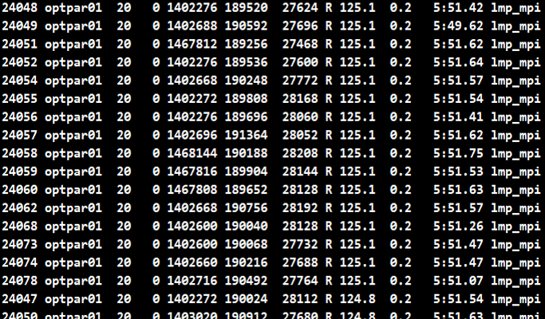
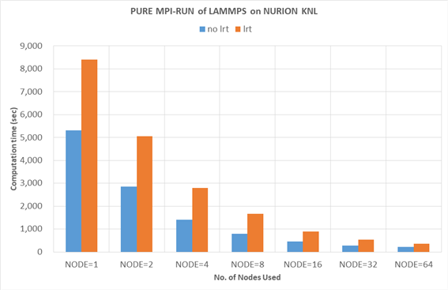
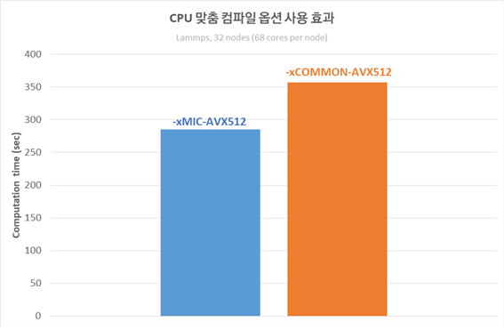
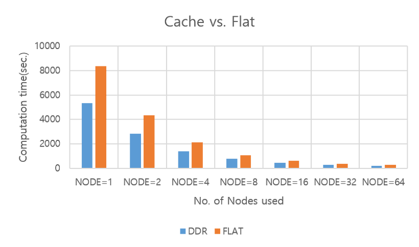
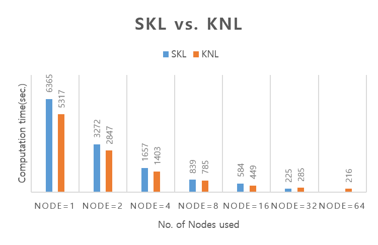
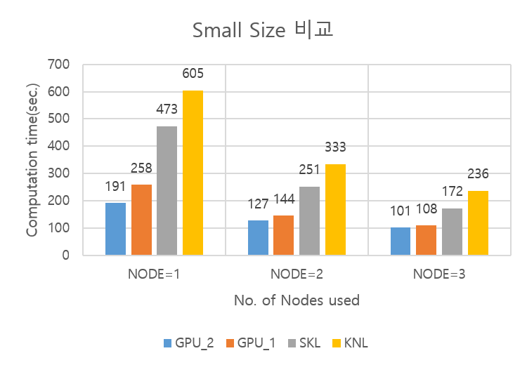

# 누리온 LAMMPS 멀티노드 활용(KNL)

다음은 누리온 KNL을 활용한 LAMMPS 테스트 샘플의 실행 방법 및 성능을 보여주는 예제이다.

&#x20;****&#x20;

**가. 테스트 계산 모델**

Rhodopsin 프로틴을 모델 시스템으로 사용하여 성능을 테스트하였다. input은 LAMMPS의 benchmark 디렉터리의 input 파일 중 하나이며, 병렬환경에서의 테스트를 위해 run을 2000으로 변경하였고, -var x 8 –var y 8 –var z 8로 변경 테스트를 하였다.&#x20;

\

\

\

**나. 실행 방법 및 성능 분석**

**1) 작업 스크립트 예제**

| 
#!/bin/sh

#PBS -N LAMMPS                                         # job의 이름(여러 개의 작업 제출 시 사용자가 구분하기 위한 목적)

#PBS -V                                                      # 작업 제출 노드(로그인 노드)에서 설정한 환경을 계산 노드에 적용하기 위해 사용

#PBS -l select=1:ncpus=68:mpiprocs=68:ompthreads=1     # 아래 참조

#PBS -l walltime=06:00:00                                           # 작업을 수행할 시간( normal 큐는 최대 48시간까지 가능)

#PBS -q normal                                                        # 사용 큐(일반 사용자는 normal 큐만 사용 가능)

#PBS -A LAMMPS                                                     # 자료 수집의 목적으로 프로그램 이름을 기입해야 함(의무 사항)

#PBS -W sandbox=PRIVATE                                        # 아래 참조       

 

module purge

module load craype-mic-knl intel/18.0.3 impi/18.0.3

 

cd $PBS_O_WORKDIR                                                # 작업 제출한 경로로 이동

export OMP_NUM_THREADS=1

export OMP_PLACES=cores

export OMP_PROC_BIND=true

 

SCALE="-var x 8 -var y 8 -var z 8"

#INTEL_ARGS="-pk intel 0 mode double omp 1 lrt yes -sf intel"

INTEL_ARGS="-pk intel 0 mode mixed omp 1 -sf intel"

EXEC="{설치 경로}/bin/lmp_mpi"

time -p mpirun $EXEC -in in.rhodo.scaled $SCALE -log LAMMPS.log $INTEL_ARGS

exit 0
 |
| ------------------------------------------------------------------------------------------------------------------------------------------------------------------------------------------------------------------------------------------------------------------------------------------------------------------------------------------------------------------------------------------------------------------------------------------------------------------------------------------------------------------------------------------------------------------------------------------------------------------------------------------------------------------------------------------------------------------------------------------------------------------------------------------------------------------------------------------------------------------------------------------------------------------------------------------------------------------------------------------------------------------------------------------------------------------------------------------------------------------------------------------------------------------------------------------------------------------------------------------------------------------------------------------------------------------------------------------- |

\

**\* #PBS –l select=1(A):ncpus=68(B):mpiprocs=68(C):ompthreads=1(D)**

A(예제에서는 1) : 사용할 노드 수를 의미. 만일 4개의 노드를 사용하려면 4를 지정하면 됨.

B(예제에서는 68) :한 노드에서 사용할 Core 수(한 노드에 있는 core수보다 작거나 같아야 함)

&#x20;                     (10월 PM 이후 지정한 값에 관계없이, 무조건 68로 적용됨)

C(예제에서는 68) : 한 노드에서 사용할 MPI 프로세스의 수

D(예제에서는 1) : 한 프로세스가 사용할 OpenMP스레드의 수

\

1\. 순수 MPI 실행에서는 D의 값은 1로 지정한다. Hybrid(MPI+OpenMP)일 때는 사용할 OpenMP 스레드의 개수로 지정한다. C\*D의 값이 68보다 크면 작업 제출이 안 됨.

2\. B, C, D의 값은 모두 한 노드 기준임

3\. 만일 2개의 노드를 사용하고 노드 당 프로세스의 수는 16, OpenMP 스레드의 수는 2로 지정하고 싶다면, 아래와 같이 지정한다.

| #PBS –l select=2:ncpus=68:mpiprocs=16:ompthreads=2 |
| -------------------------------------------------- |

\* #PBS –W sandbox=PRIVATE

PBS 배치 작업 수행하는 경우 작업 중 STDOUT과 STDERR을 시스템 디렉터리의 output에 저장하였다가 작업 완료 후 사용자 작업 제출 디렉터리로 복사한다. 그렇기 때문에 사용자는 작업 완료 시까지 작업 관련 내용을 볼 수 없다. 위의 키워드를 추가하면 PBS에의해 생성되는 STDOUT과 STDERR을 작업 실행 중 확인할 수 있다. 위치는 홈 디럭터리 아래 작업 아이디에 해당하는 임시 디렉터리가 생기고 그 디렉터리 안에서 확인 가능하다.

&#x20;

**2) 계산 성능 결과**

LAMMPS의 Benchmark 실험은 Intel에서 많이 일반화 되어있으며,  Intel 컴파일러를 사용할 때 사용하는 LAMMPS 실행 옵션은 아래의 형태이다. 여기서 lrt 옵션은 hybrid 옵션이 켜져있을 때 성능을 향상시키는 옵션이다.

| INTEL\_ARGS="-pk intel 0 mode double omp 1 lrt yes -sf intel" |
| ------------------------------------------------------------- |

&#x20;실제 코드 수행을 하였을 때 core를 적게 사용하고 위 lrt 옵션을 켜놓으면 아래와 같이 프로세스당 100%를 사용하는 것이 아닌 125%씩 사용하는 것을 확인할 수 있다.

\

KISTI의 누리온 시스템은 hybrid 옵션을 꺼놓고 있으므로 위 옵션을 사용할 때와 사용하지 않을 때의 성능 차이를 비교해보면, 옵션을 제외하였을 때 성능이 더 좋게 나온다.

\

**▶ 사용 코어 개수별 성능 비교**

Intel 컴파일러에서 일반적으로 많이 사용하는 아래의 옵션을 사용하여 실험을 하였으며, 실험 결과는 아래와 같다.

\

| INTEL\_ARGS="-pk intel 0 mode double omp 1 lrt yes -sf intel"  |
| -------------------------------------------------------------- |

※ 실험 데이터는 2018년 6월 누리온에서 4번의 반복 실험을 평균한 결과임

\- 노드당 최대 코어인 68개 코어를 모두 사용할 때 가장 좋은 성능을 나타냄 (LAMMPS는 통신과 계산수행에 있어서 통신성능보다 계산량이 더 많은 병렬성능을 나타내고 있음)

\- 코어수가 많을수록 성능향상이 꾸준히 이루어짐을 알 수 있음

\- Pure MPI가 아닌 hybrid (openMP + MPI) 설정으로 실험한 결과 pure MPI보다 더 나은 성능을 보여주지는 않았음

\- 이 결과는, 이 실험의 예제에 사용된 문제 크기에 종속되는 결과이므로 사용자는 각자 풀고자 하는 문제 크기에 따라 다량의 반복 실험 이전에 위와 같은 성능 테스트를 거치는 것이 시스템 활용에 유리함

&#x20;

▶ -xMIC-AVX512 vs. -xCOMMON-AVX512

또한 누리온에서는 CPU 맞춤 컴파일 옵션을 사용하도록 권장하고 있다. 즉, Intel compiler인 경우, KNL에서만 실행되는 바이너리 파일을 생성하기 위해서는 ‘-xMIC-AVX512’ 옵션을 사용하고, KNL과 SKL 모두에서 실행되는 바이너리 파일을 생성하기 위해서는 ‘-xCOMMON-AVX512’ 옵션을 사용하도록 권장하고 있다.(gcc나 pgi 등 그 외의 compiler 활용 시 compiler option은 KISTI 홈페이지 (https://www.ksc.re.kr)의 기술지원 > 지침서 > 누리온 > 사용자 프로그래밍 환경 > 프로그램 컴파일의 권장 옵션 참고)

아래의 그림은 두 가지 옵션을 사용하여 테스트한 성능 결과인데, ‘-xMIC-AVX512’ 옵션을 사용한 경우가 약 60초 정도 빠른 것을 확인할 수 있다.

&#x20;

\

\- KNL 노드를 사용할 때, -xMIC-AVX512 옵션을 사용하여 설치한 경우가 -xCOMMON-AVX512 옵션으로 설치한 경우에 비해 유의미한 속도 차이를 보이므로, 사용자가 직접 설치할 경우 KNL 노드에 맞는 컴파일러 옵션을 반드시 사용하기를 권장함

&#x20;

**▶ Memory mode(Cache vs. Flat)**

KNL은 MCDRAM의 사용 방식에 따라 Cache mode, Flat mode, Hybrid mode로 나누어진다. 누리온은 대부분의 계산 노드가 Cache mode로 설정되었고, 일부 노드만 Flat mode로 설정되었다. Hybrid mode는 사용하지 않는다. Cache mode는 MCDRAM을 L3 Cache처럼 사용하는 것이고, Flat mode는 MCDRAM을 main memory처럼 사용하는 것이다. Flat mode를 사용하는 경우, 프로그램 실행 시, 'numactl -p 1' 옵션을 사용하여 MCDRAM을 우선 사용하도록 하였다. 메모리 사용량이 작다면, MCDRAM을 우선 사용하는 방식의 코드가 성능이 우수할 것으로 예측이 가능하다.

&#x20;

| 　     | NODE=1 | NODE=2 | NODE=4 | NODE=8 | NODE=16 | NODE=32 | NODE=64 |
| ----- | ------ | ------ | ------ | ------ | ------- | ------- | ------- |
| Cache | 5317   | 2847   | 1403   | 785    | 449     | 285     | 216     |
| Flat  | 8374   | 4345   | 2125   | 1094   | 607     | 373     | 278     |

위 결과를 보면, 예상과는 달리 LAMMPS 경우 노드당 16GB이상을 사용하는 것으로 보이며 Flat 모드보다 cache모드가 더 좋은 성능을 보이고 있음을 확인할 수 있었다.

\

**3) 시스템 별 성능 비교**

**▶SKL vs. KNL**

누리온의 경우 SKL 노드와 KNL 노드가 있으며, 이 둘의 이론 성능은 거의 비슷하다. 하지만, 실제 LAMMPS 코드를 실행시켜보면&#x20;

성능면에서 차이가 있음을 알 수 있다.

\

| 　   | NODE=1 | NODE=2 | NODE=4 | NODE=8 | NODE=16 | NODE=32 |
| --- | ------ | ------ | ------ | ------ | ------- | ------- |
| SKL | 6365   | 3272   | 1657   | 839    | 584     | 320     |
| KNL | 5317   | 2847   | 1403   | 785    | 449     | 285     |

SKL 노드와 KNL 노드의 성능 비교를 보면, KNL 노드가 단일 노드에서는 20%의 성능 차이를 보이고 있으며, 노드 수를 다르게 했을 때도 KNL이 더 나은 성능을 보이고 있다.  실험에서 보듯이 KNL 노드의 성능이 더 좋을 뿐만 아니라 KNL노드는 SKL 노드의 수에 비해 월등히  많고 사용료도 2배 저렴하기 때문에 특별한 이유가 없는 한 KNL 노드를 사용하는 것이 유리하다.

&#x20;

**▶ 누리온(KNL, SKL), 뉴론 시스템 성능 비교**

GPU노드인 뉴론과 KNL, SKL 노드(CPU 노드)의 비교를 위해서 위에서 계산된 코드로 수행을 하면, GPU노드의 메모리 부족으로 수행이 안되는 현상이 발생한다. 이를 위해 위 테스트했던 코드의 사이즈를 줄여 최대 3개 노드까지（KISTI의 GPU정책) 비교를 해보았다.

\

| 　      | NODE=1 | NODE=2 | NODE=3 |
| ------ | ------ | ------ | ------ |
| GPU\_2 | 191    | 127    | 101    |
| GPU\_1 | 258    | 144    | 108    |
| SKL    | 473    | 251    | 172    |
| KNL    | 605    | 333    | 236    |

GPU\_1은 Tesla V100 카드가 1장 장착되어 있으며, 카드당 32GB의 메모리를 가지고 있고(gpu\[21-29]/ivy\_v100\_1), GPU\_2는 Tesla V100 카드가 2장이 장착되어 있으며, 카드당 16GB의 메모리를 가지고 있다(gpu\[09-16]/ivy\_v100\_2, gpu\[30-44]/skl\_v100\_2).

GPU슬롯에 따른 계산 시간의 차이를 확인해 보기 위해 각각 코드 수행을 하였고, 노드가 3개 이상이 되면 성능 차이가 거의 발생하지 않음을 알 수 있다.

단일 노드에서 계산을 수행하는 짧은 계산의 경우는 GPU 노드나 SKL 노드를 사용하는 것이 효율적인 면에서 좋을 수도 있지만, 크고 많은 계산을 수행하는 LAMMPS의 Input을 사용할 경우는 이전 실험에서 보았듯이 KNL 노드를 활용하는 것이 더 나은 선택이라고 생각된다.&#x20;

**※ ivy\_v100\_1 큐는 6월 정기점검 이후 v100 카드를 추가하여 ivy\_v100\_2 로 통합**
