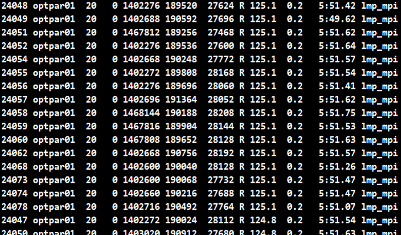

# 누리온 LAMMPS 멀티노드 활용(SKL)

다음은 누리온 SKL을 활용한 LAMMPS 테스트 샘플의 실행 방법 및 성능을 보여주는 예제이다.

**가. 테스트 계산 모델**

Rhodopsin 프로틴을 모델 시스템으로 사용하여 성능을 테스트하였다. input은 LAMMPS의 benchmark 디렉터리의 input 파일 중 하나이며, 병렬환경에서의 테스트를 위해 run을 2000으로 변경하였고, -var x 8 –var y 8 –var z 8로 변경 테스트를 하였다.&#x20;

**나. 실행 방법 및 성능 분석**

**1) 작업 스크립트 예제**

| 
!/bin/sh

#PBS -N LAMMPS

#PBS -V

#PBS -l select=1:ncpus=40:mpiprocs=40:ompthreads=1

#PBS -l walltime=06:00:00

#PBS -q norm_skl

#PBS -A LAMMPS

#PBS -W sandbox=PRIVATE

 

module purge

module load craype-x86-skylake intel/18.0.3 impi/18.0.3

 

cd $PBS_O_WORKDIR

export OMP_NUM_THREADS=1

export OMP_PLACES=cores

export OMP_PROC_BIND=true

 

SCALE="-var x 8 -var y 8 -var z 8"

#INTEL_ARGS="-pk intel 0 mode double omp 1 lrt yes -sf intel"

INTEL_ARGS="-pk intel 0 mode double omp 1 -sf intel"

EXEC="{설치 경로}/bin/lmp_mpi"

export APP="$EXEC -in in.rhodo.scaled $SCALE -log LAMMPS.log $INTEL_ARGS"

 

time -p mpirun $APP

exit 0
 |
| ------------------------------------------------------------------------------------------------------------------------------------------------------------------------------------------------------------------------------------------------------------------------------------------------------------------------------------------------------------------------------------------------------------------------------------------------------------------------------------------------------------------------------------------------------------------------------------------------------------------------------------------------------------------------------------------------------------------------------------------------------------------------------------------- |

\* 작업 스크립트는 이전의 KNL과 거의 동일, 차이점은 사용하는 큐가 normal 큐에서, norm\_skl로 바뀐 점, 그리고 KNL이 노드 당 코어를 68개인 것에 반해 SKL은 40개의 코어를 가지고 있기 때문에, 아래와 같이 가용 core수와 MPI 프로세스 수가 40이 넘을 수 없다는 점임.&#x20;

\#PBS –l select=1:ncpus=40:mpiprocs=40:ompthreads=1

**2) 계산 성능 결과**

LAMMPS의 Benchmark 실험은 Intel에서 많이 일반화 되어있으며,  Intel 컴파일러를 사용할 때 사용하는 LAMMPS 실행 옵션은 아래의 형태이다. 여기서 lrt 옵션은 hybrid 옵션이 켜져있을 때 성능을 향상시키는 옵션이다.

| INTEL\_ARGS="-pk intel 0 mode double omp 1 lrt yes -sf intel" |
| ------------------------------------------------------------- |

&#x20;실제 코드 수행을 하였을 때 core를 적게 사용하고 위 lrt 옵션을 켜놓으면 아래와 같이 프로세스당 100%를 사용하는 것이 아닌 125%씩 사용하는 것을 확인할 수 있다.

KISTI의 누리온 시스템은 hybrid 옵션을 꺼놓고 있으므로 위 옵션을 사용할 때와 사용하지 않을 때의 성능 차이를 비교해보면, 옵션을 제외하였을 때 성능이 더 좋게 나온다.

**▶ 사용 코어 개수별 성능 비교**

Intel 컴파일러에서 일반적으로 많이 사용하는 아래의 옵션을 사용하여 실험을 하였으며, 실험 결과는 아래와 같다.

| INTEL\_ARGS="-pk intel 0 mode double omp 1 lrt yes -sf intel"  |
| -------------------------------------------------------------- |

실험은 위의 옵션을 사용하여 Benchmark 실험을 수행하였으며 노드별로 ‘lrt’ 옵션 사용 유무에 따른 성능은 아래와 같다.

&#x20;

| 　           | NODE=1 | NODE=2 | NODE=4 | NODE=8 |
| ----------- | ------ | ------ | ------ | ------ |
| SEC(lrt)    | 6651   | 4006   | 2752   | 1395   |
| SEC(no lrt) | 6365   | 3272   | 1657   | 839    |

KISTI의 누리온 시스템은 Hybrid 옵션을 꺼놓고 있음으로 위 옵션을 넣고 뺐을 때의 성능 차이를 확인해보면, 옵션을 제외하였을 때 성능이 더 좋게 나오는 것을 확인 할 수 있다.

※ 누리온 KNL 노드, GPU 시스템 뉴론과의 성능 비교는 "[누리온 LAMMPS](https://blog.ksc.re.kr/169)[멀티노드 활용](https://blog.ksc.re.kr/169)[(](https://blog.ksc.re.kr/169)[KNL)](https://blog.ksc.re.kr/169)" 참조
