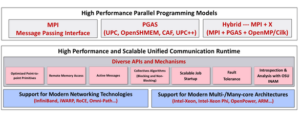
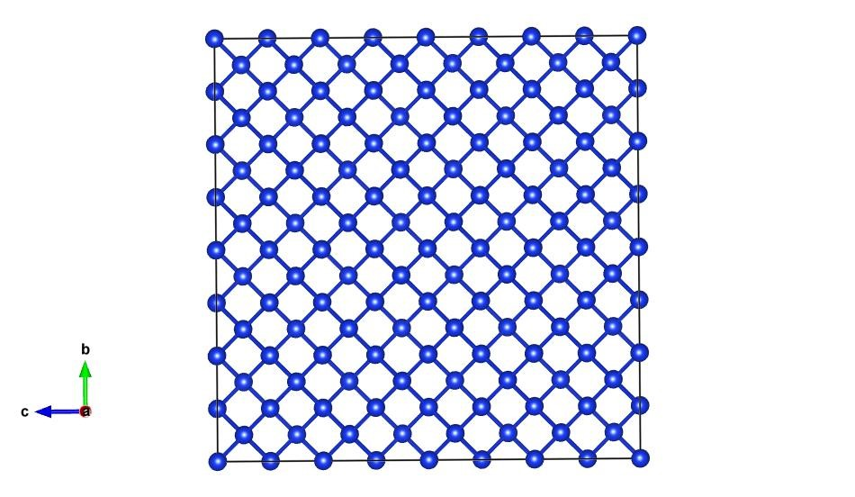
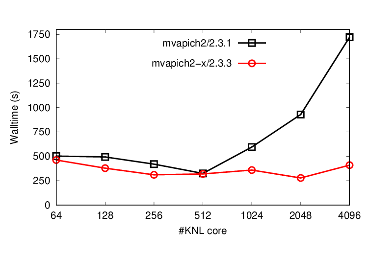

# 누리온 MVAPICH2/MVAPICH2-X 성능 비교(VASP)

**1. 개요**

MVAPICH2-X는 MVAPICH2를 기반으로 개발된 MPI 라이브러리로, 엑사스케일 컴퓨팅 환경에서의 통신 성능 최적화를 목표로 노드 간 통신 성능 및 노 내 통신 성능을 모두 고려하여 개발되었다.

MVAPICH2-X는 ‘Advanced MPI and Unified MPI+PGAS Communication Runtime for Exascale Systems’ 을 의미하며, 매니코어 CPU 기반의 슈퍼컴퓨터에서 많이 활용되고 있으며 최근 클라우드 컴퓨팅 산업의 발전에 따라 Microsoft Azure 및 Amazon Web Service (AWS) 등 여러 시스템에서도 활용되고 있다.

계산 과학에서 Message Passing Interface (MPI) 는 가장 많이 사용되는 프로그래밍 모델이며, Partitioned Global Address Space (PGAS) 는 주로 불규칙한 통신 패턴이 있는 프로그램을 위하여 사용된다.\
PGAS는 성능에 필요한 공유 메모리 추상화(abstraction) 및 지역성(locality) 통제를 제공한다.

MVAPICH2-X에서 활용되는 여러 feature 중 KISTI 5호기 Nurion에 활용 가능한 기술은 노드 내 collective 최적화를 제공하는 XPMEM 및 asynchronous progress 최적화 기술이 있다.

MVAPICH2-X는 MVAPICH2를 기반으로 개발하여 MPI-3 및 고급 MPI 기능을 모두 지원한다.

\- Dynamically Connected (DC) Transport Protocol

\- User Mode Memory Registration

\- On-Demand Paging (ODP)

\- Data Partitioning-based Multi-Leader Design (DPML)

\- Contention Aware Kernel-Assisted MPI collectives

\- Hybrid MPI+PGAS (UPC, OpenSHEME, CAF and UPC++)



따라서 이 라이브러리는 사용자가 통합 커뮤니케이션 런타임과 함께 MPI, MPI+OpenMP, UPC, OpenSHMEM, UPC++, CAF, hybrid MPI(+OpenMP) 모델 등을 사용하여 어플리케이션을 작성할 수 있는 유연성을 제공한다.

**※ 상세 내용은 아래 링크 참고**

[http://mvapich.cse.ohio-state.edu/overview/](http://mvapich.cse.ohio-state.edu/overview/)

****

**2. 환경설정 및 구성**

1\) 환경설정 방법

```
$ module load intel/19.0.5 mvapich2-x/2.3.3
```


2\) 상세 구성

누리온 시스템에 설치된 mvapich2-x/2.3.3모듈은 아래와 같은 옵션으로 설치되었다.

\- --disable-rdma-cm\
****- --without-hydra-ckpointlib\
\- --disable-mcast\
\- --with-device=ch3:psm\
\- --with-xpmem=/opt/xpmem/\
\- --with-ch3-rank-bits=32

64K 이상의 코어 수를 지원하기 위하여 –with-ch3-rank-bits 옵션이 사용되었으며, MVAPICH2 와는 달리 collective communication 을 위하여 xpmem 을 통하여 동작한다.

**※ xpmem 을 활용한 intra-socket 및 inter-socket 성능 참고**\
****[http://mvapich.cse.ohio-state.edu/performance/mv2x-pt\_to\_pt/](http://mvapich.cse.ohio-state.edu/performance/mv2x-pt\_to\_pt/)

MV2\_SHOW\_ENV\_INFO 환경변수를 2로 구성하여 Knights Landings(KNL) 최적화 설정으로 구성되었다.

```
 PROCESSOR ARCH NAME                     : MV2_ARCH_INTEL_XEON_PHI_7250
 PROCESSOR FAMILY NAME                   : MV2_CPU_FAMILY_INTEL
 PROCESSOR MODEL NUMBER                  : 87
 HCA NAME                                : MV2_HCA_INTEL_HFI1
 MV2_USE_CMA_COLL                        : 1
 - MV2_USE_CMA_COLL_ALLREDUCE            : 0
 - MV2_USE_CMA_COLL_REDUCE               : 0
 - MV2_USE_CMA_COLL_BCAST                : 0
 - MV2_USE_CMA_COLL_SCATTER              : 1
 - MV2_USE_CMA_COLL_GATHER               : 1
 - MV2_USE_CMA_COLL_ALLGATHER            : 1
 - MV2_USE_CMA_COLL_ALLTOALL             : 1
 MV2_USE_XPMEM_COLL                      : 1
 - MV2_USE_XPMEM_COLL_ALLREDUCE          : 1
 - MV2_USE_XPMEM_COLL_REDUCE             : 1
 - MV2_USE_XPMEM_COLL_BCAST              : 1
 - MV2_USE_XPMEM_COLL_SCATTER            : 1
 - MV2_USE_XPMEM_COLL_GATHER             : 1
 - MV2_USE_XPMEM_COLL_ALLGATHER          : 1
 - MV2_USE_XPMEM_COLL_ALLTOALL           : 0
 PSM2_MQ_RNDV_HFI_THRESH                 : 4194304
 PSM2_MQ_EAGER_SDMA_SZ                   : 4194304
 Heterogeneity                           : NO
 SMP Eagersize                           : 32768
 HFI Eagersize                           : 4194304
 Tuning Table:                           : MV2_ARCH_INTEL_XEON_PHI_7250 MV2_HCA_INTEL_HFI1
 MV2_ENABLE_SOCKET_AWARE_COLLECTIVES     : 1
 MV2_USE_SOCKET_AWARE_ALLREDUCE          : 1
 MV2_USE_SOCKET_AWARE_BARRIER            : 1
 MV2_USE_SOCKET_AWARE_SHARP_ALLREDUCE    : 0
 MV2_SOCKET_AWARE_ALLREDUCE_MIN_MSG      : 1
 MV2_SOCKET_AWARE_ALLREDUCE_MAX_MSG      : 2048
```

**3. 성능 비교**

누리온 시스템에서 'MVAPICH2/2.3.1 및 MVAPICH2-X/2.3.3 모듈을 활용한 VASP 테스트 샘플의 실행 방법 및 성능을 보여주는 예제이다. VASP (5.4.4.4 버전)의 실행 테스트를 위하여, 실리콘(Si512)을 모델 시스템으로 사용하여 PBE 구현의 성능을 테스트하였다. 병렬 설정에 따른 성능 차이를 가장 크게 보이는 변수가 NCORE값이므로, NCORE가 4, 8, 16, 32, 64일 때에 대하여 누리온 노드수를 조정하여 계산 속도를 측정하였다.





```
ISTART = 0
ICHARG = 2

PREC   = normal
ENCUT  = 300
LREAL  = auto

ALGO   = normal
NELMIN = 4
NELM   = 10
EDIFF  = 1e-6

ISMEAR = 0
SIGMA  = 0.1

KPAR   = 1
NCORE  = {4,8,16,32,64}
NSIM   = 4
LPLANE = .TRUE.

LWAVE  =.FALSE.
LCHARG =.FALSE.
```



```
#!/usr/bin/env bash

#PBS -V
#PBS -N bmt
#PBS -A vasp
#PBS -q normal
#PBS -l select=1:ncpus=64:mpiprocs=64:ompthreads=1
#PBS -l walltime=48:00:00
#PBS -W release_nodes_on_stageout=True 

module purge
module load intel/19.0.5 mvapich2/2.3.1

cd $PBS_O_WORKDIR

mpirun_rsh                                                 \
    -np $(wc -l $PBS_NODEFILE | awk '{print $1}') \
    -hostfile $PBS_NODEFILE                            \
    MV2_ENABLE_AFFINITY=1                          \
    MV2_CPU_BINDING_POLICY=bunch              \
    OMP_NUM_THREADS=1                             \
    {설치경로}/vasp_std
```



**4. NCORE값에 따른 성능최적화**

부표에서 가로축은 사용한 NCORE 수이고, 세로축은 사용한 KNL 노드 수이다. 각 시간(초) 3번의 반복 실험을 평균한 결과이다. Massive parallel limit에서 설정한 NCORE 수가 64일때 좋은 성능을 보였다. mvapich2에서는 8노드 이상에서는 노드를 늘이더라도 계산 시간이 줄어들지 않는 결과를 보였다.

| \*\*\*\* | **4**     | **8**  | **16**    | **32**    | **64**     |
| -------- | --------- | ------ | --------- | --------- | ---------- |
| **1**    | **502.6** | 804.8  | 719.0     | 783.8     | 967.4      |
| **2**    | **493.3** | 520.6  | 567.8     | 502.1     | 589.5      |
| **4**    | 487.3     | 452.3  | **419.8** | 459.9     | 401.4      |
| **8**    | 698.3     | 573.5  | 472.5     | 469.3     | **324.5**  |
| **16**   | 1515.2    | 858.9  | 664.0     | **594.7** | 608.7      |
| **32**   | 3500.5    | 1928.8 | 1169.9    | 953.6     | **928.3**  |
| **64**   | x         | 5248.0 | 3123.8    | 2057.2    | **1721.6** |

_mvapich2/2.3.1 성능_

| \*\*\*\* | **4**     | **8**     | **16**    | **32**    | **64**    |
| -------- | --------- | --------- | --------- | --------- | --------- |
| **1**    | **462.2** | 707.6     | 717.8     | 741.4     | 942.1     |
| **2**    | 385.4     | **378.6** | 506.7     | 457.1     | 575.6     |
| **4**    | 347.2     | **310.5** | 322.1     | 397.0     | 400.5     |
| **8**    | 461.6     | 366.5     | **319.4** | **319.7** | 400.8     |
| **16**   | 1041.5    | 530.6     | 412.5     | **359.3** | 385.2     |
| **32**   | 2354.1    | 686.1     | 379.7     | -         | **278.2** |
| **64**   | -         | 1866.8    | 859.0     | -         | **409.3** |

_mvapich2-x/2.3.3 성능_

**5. mvapich2/2.3.1 vs mvapich2-x/2.3.3**

다음은 두 가지 모듈을 사용하여 성능 테스트한 결과로, mvapich2-x/2.3.3 모듈을 사용한 경우가 더 빠르다는 것을 알 수 있다.


