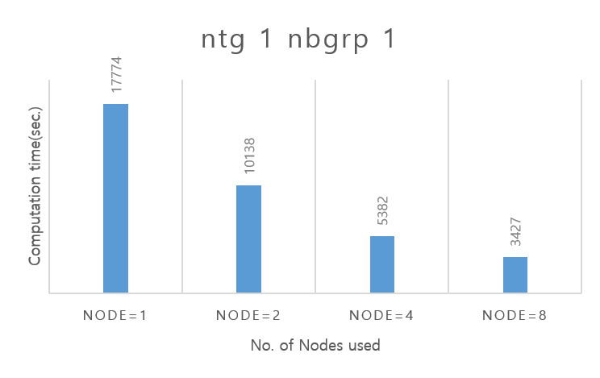
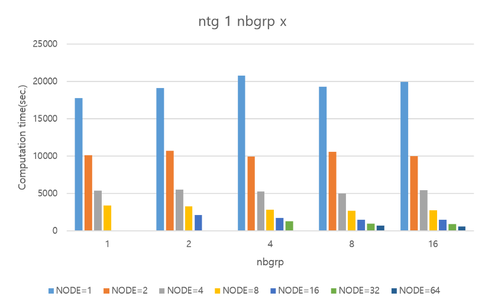
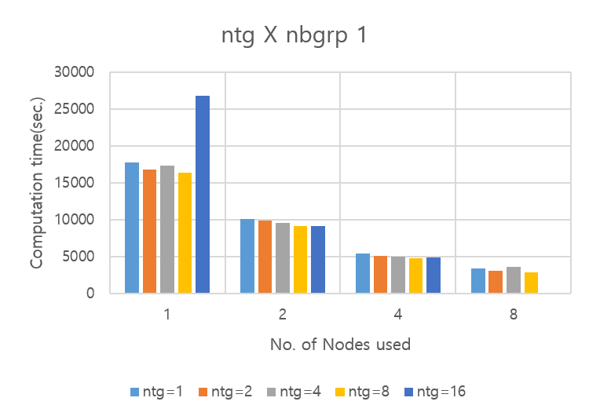
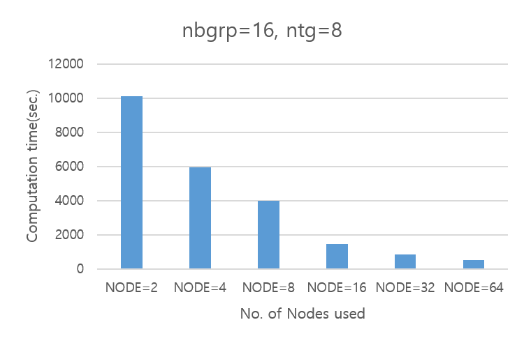
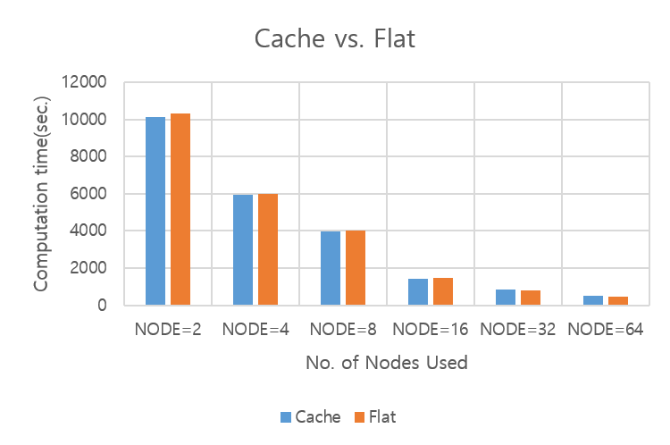
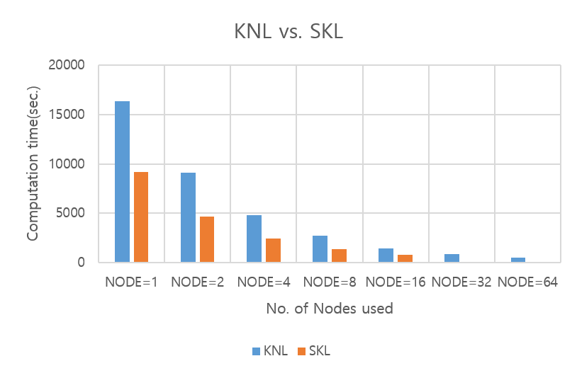
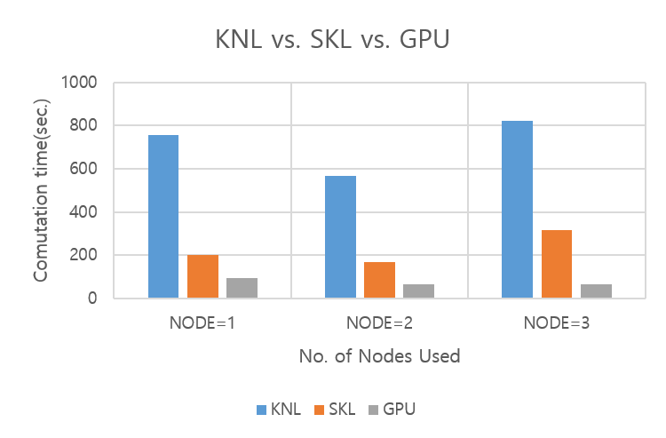

# 누리온 QE 멀티노드 활용(KNL)

다음은 누리온 KNL을 활용한 QE 테스트 샘플의 실행 방법 및 성능을 보여주는 예제이다.

**가. 테스트 계산 모델**

QE (6.4.1 버전)의 실행 테스트를 위하여, 실리콘 128개 원소로 테스트를 진행하였다.

****

**나. 실행 방법 및 성능 분석**

**1) 작업 스크립트 예제**

> \#!/bin/sh\
> \#PBS –N 1L01N64C64M01T           **** <mark style="color:blue;"># job의 이름(여러 개의 작업 제출 시 사용자가 구분하기 위한 목적)</mark>\
> \#PBS –V              <mark style="color:blue;"># 작업 제출 노드(로그인 노드)에서 설정한 환경을 계산 노드에 적용하기 위해 사용함</mark>\
> \#PBS –q normal                               <mark style="color:blue;"># 사용 큐(일반 사용자는 normal 큐만 사용 가능)</mark>\
> \#PBS –l select=1:ncpus=64:mpiprocs=64:ompthreads=1 <mark style="color:blue;"># 아래 참조</mark>\
> \#PBS –l walltime=06:00:00             <mark style="color:blue;"># 작업을 수행할 시간( normal 큐는 최대 48시간까지 가능)</mark>\
> \#PBS –A vasp <mark style="color:blue;"># 자료 수집의 목적으로 프로그램 이름을 기입해야 함(의무사항)</mark>\
> \
> cd <mark style="color:red;">{작업위치}</mark>\
> \
> time -p mpirun <mark style="color:red;">{설치 위치}</mark>/bin/pw.x -nimage 1 -npool 1 -ntg 1 -ndiag 1 -inp Si.in > ./Si.out\
> \
> exit 0

\#PBS –l select=<mark style="color:red;">1(A)</mark>:ncpus=<mark style="color:red;">64(B)</mark>:mpiprocs=<mark style="color:red;">64(C)</mark>:ompthreads=<mark style="color:red;">1(D)</mark>

A(예제에서는 1) : 사용할 노드 수를 의미. 만일 4개의 노드를 사용하려면 4를 지정하면 됨.

B(예제에서는 64) :한 노드에서 사용할 Core 수(한 노드에 있는 core수보다 작거나 같아야 함)

(10월 PM 이후 무조건 68로 적용됨)

C(예제에서는 64) : 한 노드에서 사용할 MPI 프로세스의 수

D(예제에서는 1) : 한 프로세스가 사용할 OpenMP스레드의 수

1\. 순수 MPI 실행에서는 D의 값은 1로 지정한다. Hybrid(MPI+OpenMP)일 때는 사용할 OpenMP 스레드의 개수로 지정한다. C\*D의 값이 68보다 크면 작업 제출이 안 됨.

2\. B, C, D의 값은 모두 한 노드 기준임

3\. 만일 2개의 노드를 사용하고 노드 당 프로세스의 수는 16, OpenMP 스레드의 수는 2로 지정하고 싶다면, 아래와 같이 지정한다.

> \#PBS –l select=2:ncpus=68:mpiprocs=16:ompthreads=2

****

**2) 계산 성능 결과**

테스트를 위해서 사용한 input의 경우 병렬 성능에 영향을 주는 input Argument는 –ntg, -nbgrp 두 개의 argument이다.

**▶ Argument –nbgrp 1 –ntg 1 실행 옵션을 사용**

이 두 argument의 조합을 찾기 위해 일단 이 argument의 값들을 1로 하여 default 성능을 체크하였다.

QE는 Output 파일에 Profiling 결과가 표시가 된다. 이 Profiling 결과를 바탕으로 hot-spot을 찾고 hot-spot에 따라 실행 옵션을 변경하여 성능향상을 볼 수 있다. 현재 수행중인 input 파일을 위와 같이 1개 노드로 수행하였을 때의 profile 정보 중 핵심 부분은 아래와 같다.

> #### Called by \*egterg:
>
> h\_psi : 24.97s CPU 27.26s WALL ( 74 calls)\
> s\_psi : 1.05s CPU 1.06s WALL ( 74 calls)\
> g\_psi : 0.02s CPU 0.02s WALL ( 55 calls)\
> rdiaghg : 42.92s CPU 43.58s WALL ( 69 calls)
>
>
>
> #### General routines
>
> calbec : 3.38s CPU 3.42s WALL ( 161 calls)\
> fft : 0.42s CPU 0.67s WALL ( 175 calls)\
> ffts : 0.05s CPU 0.05s WALL ( 18 calls)\
> fftw : 23.68s CPU 26.08s WALL ( 19072 calls)\
> fftc : 1347.69s CPU 1365.23s WALL ( 316210 calls)\
> fftcw : 2.87s CPU 3.17s WALL ( 2460 calls)
>
>
>
> #### EXX routines
>
> exx\_grid : 0.00s CPU 0.01s WALL ( 1 calls)\
> exxinit : 1.12s CPU 1.23s WALL ( 4 calls)\
> vexx : 17417.59s CPU 17466.89s WALL ( 4 calls)\
> matcalc : 0.60s CPU 0.61s WALL ( 61 calls)\
> aceupdate : 0.04s CPU 0.06s WALL ( 4 calls)\
> vexxace : 0.83s CPU 0.85s WALL ( 50 calls)\
> aceinit : 17417.73s CPU 17467.06s WALL ( 4 calls)

위 프로파일링 결과를 보면, General routines 부분은 ntg 값에 따라 성능이 달라지며, Call by \*egterg는 ndiag값, EXX routines는 nbgrp 값에 따라 성능 효율이 달라진다.\
****따라서 이 input의 경우 EXX routines에 hot-spot이며, nbgrp 옵션의 변경을 통해 성능을 올릴 수 있다.\
각 옵션에 대한 설명은 매뉴얼 상에 나와 있으며 현재 사용되는 옵션에 대한 설명은 아래와 같다.

\-nbgrp 플래그를 사용하면 대역 그룹 병렬 처리를 통해 병렬 스케일링 정확한 교환 계산을 향상시킬 수 있다. nbgrp의 작업 그룹 수는 MPI 순위 수의 제수이어야 한다. nbgrp의 기본값은 1이다. 선택한 값은 계산에 사용 된 총 MPI 작업 수를 균등하게 나뉘어져야 한다.

\-ndiag 플래그는 대각선 Ndiag에 사용되는 MPI 순위 수를 제곱 정수로 설정한다. Ndiag의 기본값은 그룹당 총 MPI 순위 수의 절반보다 작은 가장 큰 제곱 정수이다.

\-ntg 플래그를 사용하면 작업 그룹 병렬 처리를 통해 FFT의 병렬 스케일링을 향상이 된다. 작업 그룹 수는 MPI 순위 수의 제수이어야 한다. 기본 ntg의 값은 1이다.

위의 내용을 기반으로 벤치마크에 사용한 input의 경우 nbgrp와 ntg의 input에 따라 성능이 차이가 발생할 수 있음을 알 수 있다.\
노드수를 증가하면 오류가 발생하게 되는데, 이 오류는 계산량보다 코어수가 많을 경우 발생하는 오류이다.

> %%%%%%%%%%%%%%%%%%%%%%%%%%%%%%%%%%%%%\
> Error in routine n\_plane\_waves (1):\
> No plane waves found: running on too many processors?\
> %%%%%%%%%%%%%%%%%%%%%%%%%%%%%%%%%%%%

이와 같은 기본사항을 기반으로 하여 실험을 진행하였다.

****

**▶ Argument -ntg 1 –nbgrp X 실행 옵션을 사용**

ntg 값을 1로 고정하고 nbgrp값을 변화시키면서 실험을 진행하였다.

위의 결과에서 nbgrp의 값에 따라 결과가 나오지 않는 부분도 있었으며, 이 결과가 나오지 않는 부분의 경우는 Si.out 파일 내 R & G space division: proc/nbgrp/npool/nimage = 1024라는 값이 나올 때 마다 결과가 수행되지 않음을 알 수 있었다.

****

**▶ Argument -ntg X –nbgrp 1 실행 옵션을 사용**

profile 정보를 보면 EXX 루틴부분 외에도 FFT와 관련된 부분 역시도 시간 소요가 있는 것으로 확인이 되고 있다. 따라서 이와 관계된 값이 ntg 값을 변화시켜가면서 결과값을 확인하였다.

nbgrp의 값이 1로 고정이 되면서 노드가 16개 이상의 경우 즉 1024 이상의 process를 사용할 경우는 수행이 되지 않고 있으며, 8개 노드 ntg 8일 때 가장 좋은 성능을 보여줌을 확인할 수 있었다.

****

**▶ ntg, nbgrp argument의 조합 실행**

위 두 결과를 가지고 일반적으로 가장 빠르다고 예상되는 속도를 찾을 수 있다. nbgrp의 경우 16일 때 노드 16\~64일 때 가장 빠른 성능을 보여주고 있으며, ntg의 경우 ntg의 값이 8일 때 노드 1\~8까지 가장 빠른 성능을 보여주고 있다. 이 두 input 변수값을 합치면 아래와 같은 결과를 얻을 수 있다.(즉, nbgrp=16, ntg=8)

위는 16개 노드이상부터 ntg와 nbgrp의 조합이 더 좋은 성능을 보여줌을 알 수 있다.

****

**▶ Memory mode(Cache vs. Flat)**

KNL은 MCDRAM의 사용 방식에 따라 Cache mode, Flat mode, Hybrid mode로 나누어진다. 누리온은 대부분의 계산 노드가 Cache mode로 설정되었고, 일부 노드만 Flat mode로 설정되었다. Hybrid mode는 사용하지 않는다. Cache mode는 MCDRAM을 L3 Cache처럼 사용하는 것이고, Flat mode는 MCDRAM을 main memory처럼 사용하는 것이다. Flat mode를 사용하는 경우, 프로그램 실행 시, 'numactl -p 1' 옵션을 사용하여 MCDRAM을 우선 사용하도록 하였다. 메모리 사용량이 작다면, MCDRAM을 우선 사용하는 방식의 코드가 성능이 우수할 것으로 예측이 가능하다.

위의 결과를 보면, 노드수가 작을 경우는 Cache 모드가 빠른 성능을 보이고 있으나, 노드수가 많아지면서 Flat 모드의 MCDRAM만을 사용하는 것으로 보이고, 이로 인해 약간이지만 Flat 모드에서 빠른 성능을 보이고 있다.

**3) 시스템 별 성능 비교**

**▶SKL vs. KNL**

누리온의 경우 SKL 노드와 KNL 노드가 있으며, 이 둘의 이론 성능은 거의 비슷하다. 하지만, QE 코드를 실행해보면 이론 성능과는 많은 차이가 발생하는 것을 확인할 수 있다. input argument의 값을 고정하지 않고, 각 노드에서 최고의 성능을 보여주는 성능을 비교해보면 아래와 같다.

수행 결과를 확인해보면, SKL 노드의 경우 16개 이상의 결과를 확인하기가 현실적으로 어려운 상황이며, KNL의 경우 64개 노드까지도 꾸준히 Wall-Clock-Time이 감소함을 알 수 있다. SKL 노드의 수가 KNL 노드에 비해 많이 적기 때문에 현실적으로 KNL노드를 사용하는 것을 추천하며, 위의 결과에서도 KNL 노드 64개까지 성능이 계속 좋아지는 것을 확인할 수 있다.

**▶ 누리온(KNL, SKL), 뉴론 시스템 성능 비교**

GPU노드인 뉴론과 KNL, SKL 노드의 비교를 위해서 위에서 계산된 코드로 수행을 하면, GPU노드의 메모리 부족으로 수행이 되지 않는 현상이 발생한다. 이를 위해 위 테스트했던 코드의 사이즈를 줄여 최대 3개 노드까지（KISTI의 GPU정책) 비교를 해보았다. GPU 실행 시 사용한 Partition(누리온의 queue에 해당)은 skl\_v100\_2이며, 이는 V100 카드 2개를 사용한다.

QE의 경우 사이즈가 커질 경우 GPU 노드는 수행이 안 되는 문제가 있기는 하지만, 수행이 되는 코드의 경우는 GPU가 SKL에 비해 성능이 뛰어나며 KNL에 비해 월등히 뛰어남을 확인할 수 있다.
