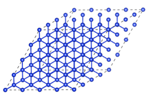
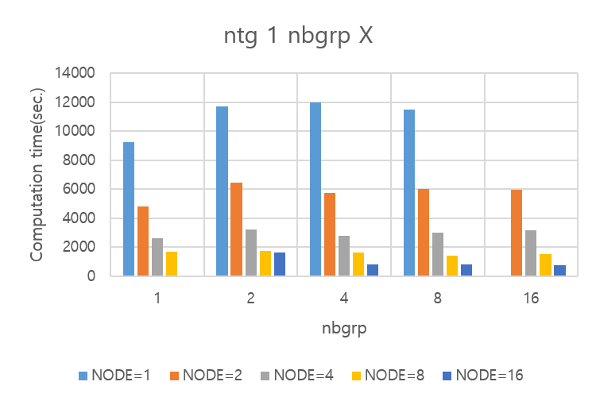
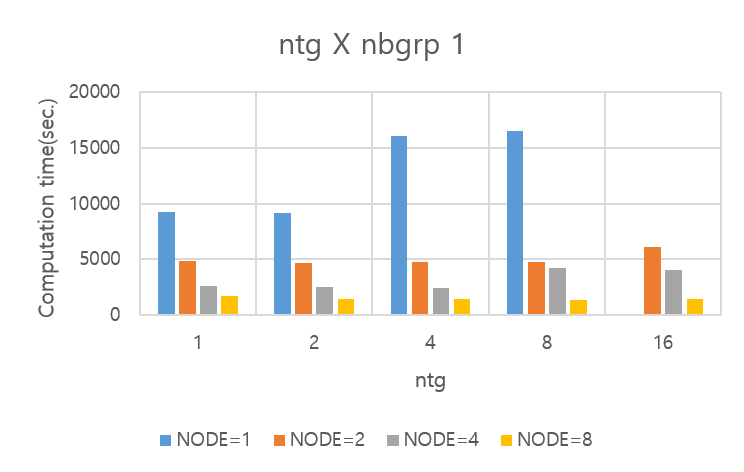

# 누리온 QE 멀티노드 활용(SKL)

다음은 누리온 SKL을 활용한 QE 테스트 샘플의 실행 방법 및 성능을 보여주는 예제이다.

**가. 테스트 계산 모델**

QE (6.4.1 버전)의 실행 테스트를 위하여, 실리콘 128개 원소로 테스트를 진행하였다.

****

**나. 실행 방법 및 성능 분석**

**1) 작업 스크립트 예제**

> \#!/bin/sh
>
> \#PBS –N 1L01N40C40M01T         <mark style="color:blue;"># job의 이름(여러 개의 작업 제출 시 사용자가 구분하기 위한 목적)</mark>
>
> \#PBS –V              <mark style="color:blue;"># 작업 제출 노드(로그인 노드)에서 설정한 환경을 계산 노드에 적용하기 위해 사용함</mark>
>
> \#PBS –q norm\_skl                                      <mark style="color:blue;"># 사용 큐</mark>
>
> \#PBS –l select=1:ncpus=40:mpiprocs=40:ompthreads=1 <mark style="color:blue;"># 아래 참조</mark>
>
> \#PBS –l walltime=06:00:00                        <mark style="color:blue;"># 작업을 수행할 시간( normal 큐는 최대 48시간까지 가능)</mark>
>
> \#PBS –A qe                                          <mark style="color:blue;"># 자료 수집의 목적으로 프로그램 이름을 기입해야 함(의무사항)</mark>
>
> &#x20;
>
> cd <mark style="color:red;">{작업 위치}</mark>
>
> &#x20;
>
> time -p mpirun <mark style="color:red;">{설치 위치}</mark>/pw.x -nimage 1 -npool 1 -ntg 1 -ndiag 1 -inp Si.in > ./Si.out

\* 작업 스크립트는 이전의 KNL과 거의 동일, 차이점은 사용하는 큐가 normal 큐에서, norm\_skl로 바뀐 점, 그리고 KNL이 노드 당 코어를 68개인 것에 반해 SKL은 40개의 코어를 가지고 있기 때문에, 아래와 같이 가용 core수와 MPI 프로세스 수가 40이 넘을 수 없다는 점임.

> \#PBS –l select=1:ncpus=40:mpiprocs=40:ompthreads=1

**2) 계산 성능 결과**

테스트를 위해서 사용한 input의 경우 병렬 성능에 영향을 주는 input Argument는 –ntg, -nbgrp 두 개의 argument이다. 실험 방식은 KNL의 경우와 같다. 자세한 내용은 "[누리온 QE 멀티노드 활용(KNL)](https://blog.ksc.re.kr/172)" 참조 ****&#x20;

****

**▶ -ntg 1 –nbgrp X 조합 실행**

****

**▶ -ntg X –nbgrp 1 조합 실행**

ntg의 값을 1로 고정하고 nbgrp 값의 변화에 따라 노드별 성능을 표시하고 반대로 nbgrp 값을 1로 고정한 후 ntg값을 노드별 성능을 확인하였다. 실험 결과는 KNL과 유사한 패턴을 보여주고 있으며, 각각 nbgrp=16, node=16일 때 가장 좋은 성능을 보여주고 있으며, ntg=8, node=8일 때 가장 좋은 성능을 보여주고 있다.\
****위 패턴은 KNL과 동일한 패턴이므로, 동일하게 ntg의 값 8일 때와 nbgrp 16일 때 가장 좋은 성능이 나올 것이라 예상할 수 있다.

**▶ ntg, nbgrp argument의 조합 실행**

아래는 ngt=8, nbgrp=16으로 실행했을 때의 결과이다.

예상과 달리 node=16일 때 결과가 나오지 않고 오류가 발생하면서 수행이 되지 않는다. 또한 8개 노드일 때 역시도 ntg=1 일 때보다 성능이 좋지 않다. ntg와 nbgrp의 조합으로 성능이 좋아지는 것이 아닌 성능이 오히려 떨어지는 현상에 대한 원인을 찾기 위해 여러 가지 조합식을 대응시켜 코드 수행을 해본 결과 ‘-ntg 1 –nbgrp 16’일 때 16개 노드를 사용하는 것보다 빠른 성능을 보여주는 결과는 없었다.\
ntg와 nbgrp와 관계된 계산식은 QE가 core와 관계된 계산식을 따로 가지고 있는 것으로 보이며, SKL 노드는 40개 코어로 2의 제곱승의 방식으로 계산이 되지 않기에 수행이 되지 않는 현상이 발생하는 것으로 예상할 수 있다.

※ 누리온 KNL 노드, GPU 시스템 뉴론과의 성능 비교는 "[누리온 QE 멀티노드 활용(KNL)](https://blog.ksc.re.kr/172)" 참조
