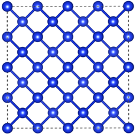
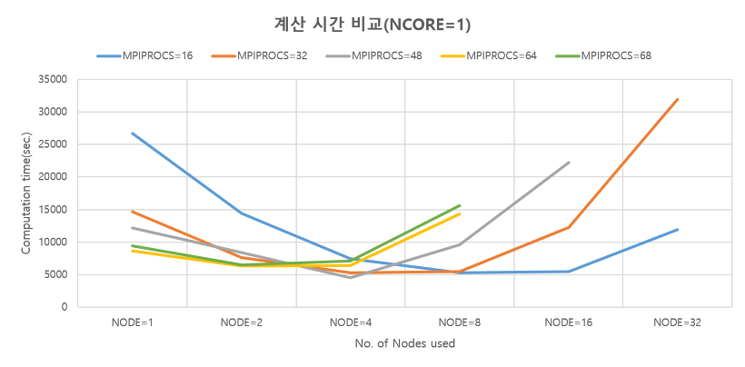
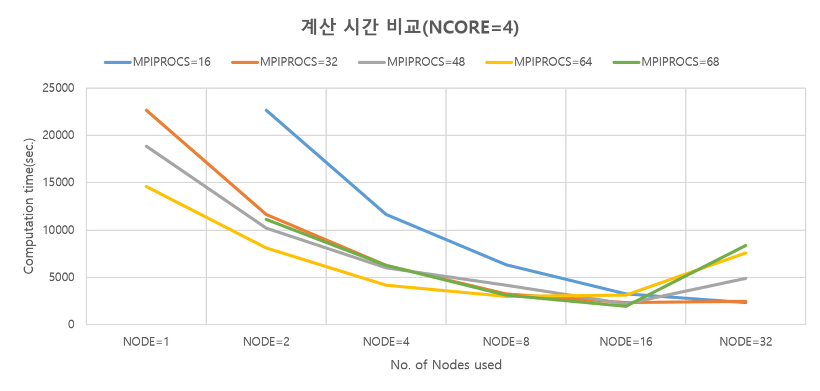
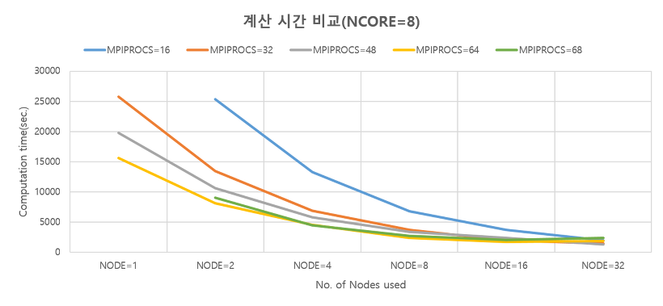
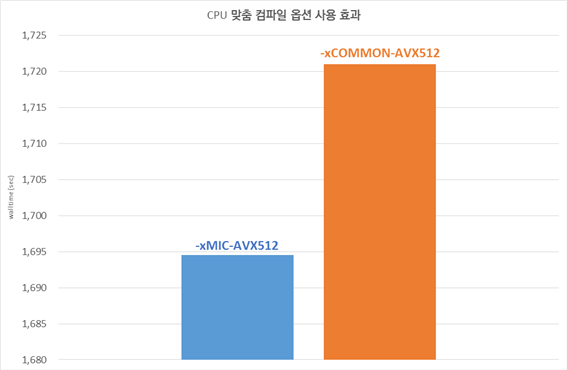
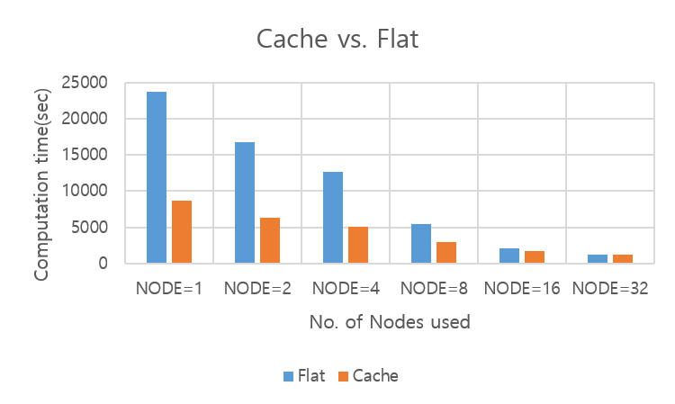
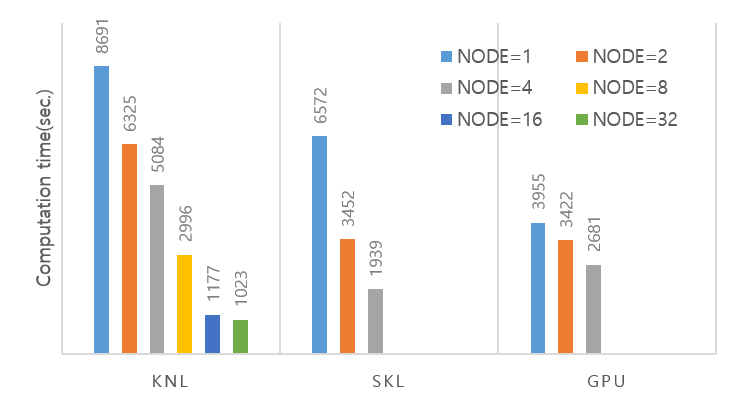

# 누리온 VASP 멀티노드 활용(KNL)

다음은 누리온 KNL을 활용한 VASP 테스트 샘플의 실행 방법 및 성능을 보여주는 예제이다.

&#x20;****&#x20;

**가. 테스트 계산 모델**

VASP (5.4.4.4 버전)의 실행 테스트를 위하여, 실리콘(Si64)을 모델 시스템으로 사용하여 HSE06 구현의 성능을 테스트하였다.

| ISTART | ICHARG | PREC   | ENCUT   | LREAL   | ALGO    | NELM    | EDIFF | ISMEAR | SIGMA    |
| ------ | ------ | ------ | ------- | ------- | ------- | ------- | ----- | ------ | -------- |
| 0      | 2      | single | 250     | Auto    | damped  | 20      | 1e-6  | 0      | 0.1      |
| KPAR   | NCORE  | LPLANE | LWARE   | LCHARG  | LHFCALC | PREFOCK | NKRED | AEXX   | HFSCREEN |
| 1      | ?      | .TRUE. | .FALSE. | .FLASE. | T       | Fast    | 1     | 0.25   | 2        |

VASP 입력값 중 병렬계산과 관련된 설정들이 있는데, 이 중 병렬 설정에 따른 성능 차이를 가장 크게 보이는 변수가 NCORE 값이므로, NCORE가 1, 4, 8일 때에 대하여 누리온 노드와 코어수를 조정하여 계산 속도를 측정하였다.

**나. 실행 방법 및 성능 분석**

**1) 작업 스크립트 예제**

| 
#!/bin/sh

#PBS –N vasp_knl                                       # job의 이름(여러 개의 작업 제출 시 사용자가 구분하기 위한 목적)

#PBS –V                                                   # 작업 제출 노드(로그인 노드)에서 설정한 환경을 계산 노드에 적용하기 위해 사용함

#PBS –l select=1:ncpus=64:mpiprocs=64:ompthreads=1 #아래 참조

#PBS –q normal                                         # 사용 큐(일반 사용자는 normal 큐만 사용 가능)

#PBS –l walltime=06:00:00                            # 작업을 수행할 시간( normal 큐는 최대 48시간까지 가능)

#PBS –A vasp                                            # 자료 수집의 목적으로 프로그램 이름을 기입해야 함(의무사항)

 

cd $PBS_O_WORKDIR                                  # 작업 제출한 경로로 이동

module purge

module load craype-mic-knl intel/18.0.3 impi/18.0.3

 

mpirun {설치경로}/vasp_std

 

exit 0
 |
| ------------------------------------------------------------------------------------------------------------------------------------------------------------------------------------------------------------------------------------------------------------------------------------------------------------------------------------------------------------------------------------------------------------------------------------------------------------------------------------------------------------------------------------------------------------------------------------------------------------------------------------------------------------------------------------------------------------------------------------------------------------------------------------------------------------------------------ |

\

\* #PBS –l select=1(A):ncpus=64(B):mpiprocs=64(C):ompthreads=1(D)

A(예제에서는 1) : 사용할 노드 수를 의미. 만일 4개의 노드를 사용하려면 4를 지정하면 됨.

B(예제에서는 64) :한 노드에서 사용할 Core 수(한 노드에 있는 core수보다 작거나 같아야 함)

(10월 PM 이후 무조건 68로 적용됨)

C(예제에서는 64) : 한 노드에서 사용할 MPI 프로세스의 수

D(예제에서는 1) : 한 프로세스가 사용할 OpenMP스레드의 수

1\. 순수 MPI 실행에서는 D의 값은 1로 지정한다. Hybrid(MPI+OpenMP)일 때는 사용할 OpenMP 스레드의 개수로 지정한다. C\*D의 값이 68보다 크면 작업 제출이 안 됨.

2\. B, C, D의 값은 모두 한 노드 기준임

3\. 만일 2개의 노드를 사용하고 노드 당 프로세스의 수는 16, OpenMP 스레드의 수는 2로 지정하고 싶다면, 아래와 같이 지정한다.

| #PBS –l select=2:ncpus=68:mpiprocs=16:ompthreads=2 |
| -------------------------------------------------- |

&#x20;

**2) 계산 성능 결과**

**▶ NCORE값에 따른 성능 변화**

병렬 성능에 영향을 가장 많이 주는 변수가 NCORE값이므로, NCORE가 1, 4, 8일 때에 대하여 누리온 노드와 코어수를 조정하여 계산 속도를 측정하였다.

그림에서 가로축은 사용한 KNL 노드 수이고, 세로축은 계산에 걸린 시간(초)이다. 각 직선은 노드 당 코어 수(MPIPROCS)를 달리 설정한 실험 결과이다.

※ 실험 데이터는 2018년 5월 누리온에서 4번의 반복 실험을 평균한 결과임

**1) NCORE=1일 때**

&#x20;

**2) NCORE=4일 때**

&#x20;****&#x20;

**3) NCORE=8일 때**

\- 노드 당 코어(MPIPROCS)를 64 코어 정도로 사용할 때 일반적으로 효율적인 성능을 보여준다. 노드 당 코어를 모두 점유하여 사용할 경우(즉 MPIPROCS=68) 성능이 가장 좋을 것 같으나 실행 프로그램에 따라서 최고 성능을 보일 때도 있고 지금 보는 것과 같이 그렇지 않은 경우도 있다.

\- NCORE(≥4)를 크게 하고 노드를 8개 이상 사용할 때 2000초 이내에 계산이 완료되고, 16노드 이상에서는 노드를 늘이더라도 계산 시간이 줄어들지 않는 결과를 보였다.

\- 위의 예시 문제에 대하여, 병렬확장성을 기대할 수 있는 계산 환경은 NCORE를 충분히 설정하고 노드 당 코어 수는 64개 정도를 할당하여 노드 수를 증가시킨 경우이다.

\- 그리고, 설정한 NCORE 수의 2배수로 노드를 잡았을 때 가장 좋은 성능을 보이는 것도 확인하였다.

\

| 　노드 당 64 코어 | NCORE=1 | NCORE=2 | NCORE=4 | NCORE=8 | NCORE=16 | NCORE=32 |
| ----------- | ------- | ------- | ------- | ------- | -------- | -------- |
| NODE=1      | 8691    | 13812   | 14633   | 14317   | 20113    |          |
| NODE=2      | 6325    | 7223    | 8101    | 8136    | 10699    |          |
| NODE=4      | 6400    | 5084    | 4199    | 4483    | 5413     |          |
| NODE=8      | 14287   | 5285    | 2996    | 2335    | 2962     |          |
| NODE=16     | 　-      | 11832   | 3164    | 1695    | 1571     |          |
| NODE=32     |         |         |         |         | 1177     | 1302     |
| NODE=64     |         |         |         |         |          | 1023     |

\

위 64core에서 가장 빠른 Wall-Clock-Time을 나타낸 1개노드 64코어, 2개노드 즉 128개의 의미는 VASP에서는 아래와 같은 형식으로 표기하고 있다.

(one band on NCORES\_PER\_BAND= 2 cores, 64 groups)

&#x20;\- 이 결과는, 이 실험의 예제에 사용된 문제 크기에 종속되는 결과이므로 사용자는 각자 풀고자 하는 문제 크기에 따라 다량의 반복 실험 이전에 위와 같은 성능 테스트를 거치는 것이 시스템 활용에 유리하다.

\

▶ -xMIC-AVX512 vs. -xCOMMON-AVX512

또한 누리온에서는 CPU 맞춤 컴파일 옵션을 사용하도록 권장하고 있다. 즉, Intel compiler인 경우, KNL에서만 실행되는 바이너리 파일을 생성하기 위해서는 ‘-xMIC-AVX512’ 옵션을 사용하고, KNL과 SKL 모두에서 실행되는 바이너리 파일을 생성하기 위해서는 ‘-xCOMMON-AVX512’ 옵션을 사용하도록 권장하고 있다.(gcc나 pgi 등 그 외의 compiler 활용 시 compiler option은 KISTI 홈페이지 (https://www.ksc.re.kr)의 기술지원 > 지침서 > 누리온 > 사용자 프로그래밍 환경 > 프로그램 컴파일의 권장 옵션 참고)

아래의 그림은 두 가지 옵션을 사용하여 테스트한 성능 결과인데, ‘-xMIC-AVX512’ 옵션을 사용한 경우가 약 30초가량 빠르다는 것을 알 수 있다.

\

\

※ 위 예제는 일반 사용자에게 배포되는 VASP 테스트 결과이며, 누리온 KNL에 최적화된 VASP(버전 5.4.4)은 VASP 라이센스를 보유하신 사용자에 한하여 KISTI 홈페이지 (https://www.ksc.re.kr)의 기술지원 > 상담을 통하여 배포해드립니다.

&#x20;

**▶ Memory mode(Cache vs. Flat)**

KNL은 MCDRAM의 사용 방식에 따라 Cache mode, Flat mode, Hybrid mode로 나누어진다. 누리온은 대부분의 계산 노드가 Cache mode로 설정되었고, 일부 노드만 Flat mode로 설정되었다. Hybrid mode는 사용하지 않는다. Cache mode는 MCDRAM을 L3 Cache처럼 사용하는 것이고, Flat mode는 MCDRAM을 main memory처럼 사용하는 것이다. Flat mode를 사용하는 경우, 프로그램 실행 시, 'numactl -p 1' 옵션을 사용하여 MCDRAM을 우선 사용하도록 하였다. 사용량이 작다면, MCDRAM을 우선 사용하는 방식의 코드가 성능이 우수할 것으로 예측이 가능하다.

다음 표와 그래프는 데이터를 적재하는 방식에 따른 성능을 비교하였다.

\

| 　     | NODE=1 | NODE=2 | NODE=4 | NODE=8 | NODE=16 | NODE=32 |
| ----- | ------ | ------ | ------ | ------ | ------- | ------- |
| Flat  | 23760  | 16732  | 12630  | 5497   | 2106    | 1183    |
| Cache | 8691   | 6325   | 5084   | 2996   | 1695    | 1177    |
| NCORE | 1      | 1      | 2      | 4      | 8       | 16      |

NCORE값은 각 노드에서 가장 빠른 성능을 보이고 있는 값으로 (노드 수)/2의 값을 가지고 비교를 하였다. 위 형태를 보면, 기대와는 달리 VASP의 경우 노드당 16GB이상을 사용하는 것으로 보이며 Flat 모드보다 Cache 모드가 더 좋은 성능을 보이고 있음을 확인할 수 있었다.

&#x20;

\

**3) 시스템 별 성능 비교**

**▶ 누리온(KNL, SKL), 뉴론 시스템 성능 비교**

누리온 시스템과 뉴론 시스템에서 노드당 Rpeak값을 비교해보면, GPU > CPU > KNL 노드 순이다.&#x20;

\

| 종류     | 소켓/카드 | core 개수 | Hz   | Rpeak        |
| ------ | ----- | ------- | ---- | ------------ |
| SKL 노드 | 2     | 20      | 2.4  | 3.072 Tflops |
| KNL 노드 | 1     | 68      | 1.4  | 3.046 Tflops |
| GPU 노드 | 2     | 2048    | 1.38 | 7.8 Tflops   |

&#x20;

실제 VASP을 실행시켜보면 단일 노드인 경우, 위 이론 성능과 비슷한 경향성을 보이고 있다. 하지만, 멀티노드로 확장이 되면 결과가 달라짐을 알 수 있다.

위 그래프를 보면 1개 노드에서는 뉴론 시스템의 GPU노드 성능이 좋지만, 2개 이상의 노드를 사용할 경우 GPU 노드의 성능 향상이 그리 좋지 않다는 것을 알 수 있다. 오히려 4개 노드를 사용할 경우 SKL 노드가 GPU 노드보다 성능이 좋아짐을 확인할 수 있다. 다만, SKL 노드는 8개 노드, GPU 노드에서는 4개 노드이상을 사용하는 것은 현실적으로 상당히 어려운 상황이기 때문에, KNL 노드를 사용하는 것이 현실적이며, 성능적인 면에서도 유리함을 확인할 수 있다. 그러므로 단일 노드에서 계산을 수행하는 짧은 계산의 경우는 GPU 노드나 SKL 노드를 사용하는 것이 효율적인 면에서 좋을 수도 있지만, 크고 많은 계산을 수행하는 VASP의 Input을 사용할 경우는 KNL 노드를 활용하는 것이 올바른 선택이라고 할 수 있다.
