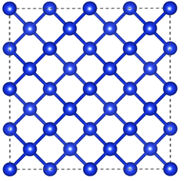

# 누리온 VASP 멀티노드 활용(SKL)

다음은 누리온 SKL을 활용한 VASP 테스트 샘플의 실행 방법 및 성능을 보여주는 예제이다.

****

**가. 테스트 계산 모델**

VASP (5.4.4.4 버전)의 실행 테스트를 위하여, 실리콘(Si64)을 모델 시스템으로 사용하여 HSE06 구현의 성능을 테스트하였다.

VASP 입력값 중 병렬계산과 관련된 설정들이 있는데, 이 중 병렬 설정에 따른 성능 차이를 가장 크게 보이는 변수가 NCORE 값이므로, NCORE가 1, 4, 8일 때에 대하여 누리온 노드와 코어수를 조정하여 계산 속도를 측정하였다.

**나. 실행 방법 및 성능 분석**

**1) 작업 스크립트 예제**

> \#!/bin/sh
>
> \#PBS -N vasp\_skl
>
> \#PBS -V
>
> <mark style="color:blue;">#PBS -l select=1:ncpus=40:mpiprocs=40:ompthreads=1</mark>
>
> <mark style="color:blue;">#PBS –q norm\_skl</mark>
>
> \#PBS –l walltime=06:00:00 #　작업 수행 시간(최대 48시간)
>
> \#PBS –A vasp # Application 별 PBS옵션 이름표.
>
> &#x20;
>
> cd $PBS\_O\_WORKDIR
>
> module purge
>
> module load craype-x86-skylake
>
> module load intel/18.0.3 impi/18.0.3
>
> &#x20;
>
> mpirun {<mark style="color:red;">설치 경로</mark>}/vasp\_std
>
> &#x20;
>
> exit 0

\* 작업 스크립트는 이전의 KNL과 거의 동일, 차이점은 사용하는 큐가 normal 큐에서, norm\_skl로 바뀐 점, 그리고 KNL이 노드 당 코어를 68개인 것에 반해 SKL은 40개의 코어를 가지고 있기 때문에, 아래와 같이 가용 core수와 MPI 프로세스 수가 40이 넘을 수 없다는 점임.

> \#PBS –l select=1:ncpus=40:mpiprocs=40:ompthreads=1

**2) 계산 성능 결과**

SKL 노드의 경우 노드의 수가 많지 않기 때문에, 4개 노드까지만 테스트를 수행하였다. 이 때, 1\~4개 노드 모두 NCORE=8 일 때 가장 좋은 성능을 보이고 있다.

여기에서는 NCORE당 128개 코어를 썼을 때 가장 좋은 성능을 보였던 KNL과 같은 성향은 보이지 않았으며, NCORE가 8일 때 모든 노드에서 가장 좋은 성능을 보이고 있다.

※ 누리온 KNL 노드, GPU 시스템 뉴론과의 성능 비교는 "[누리온 VASP 멀티노드 활용(KNL)](https://blog.ksc.re.kr/175)" 참조
