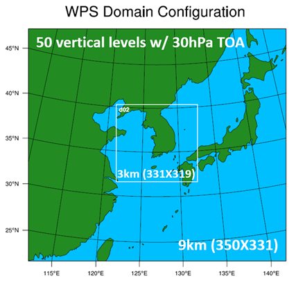
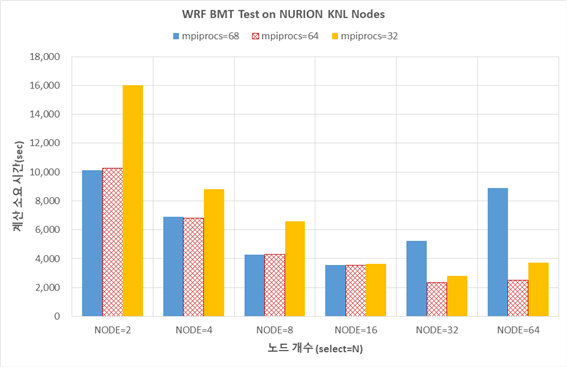
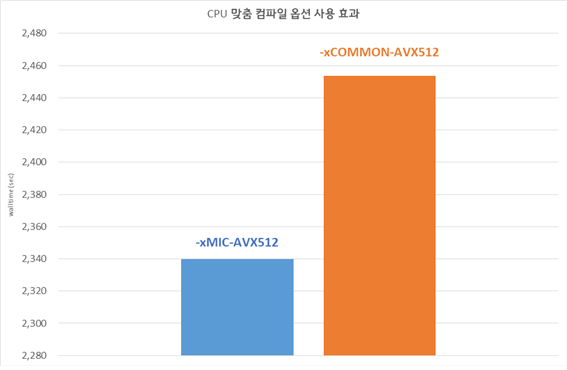
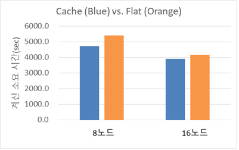
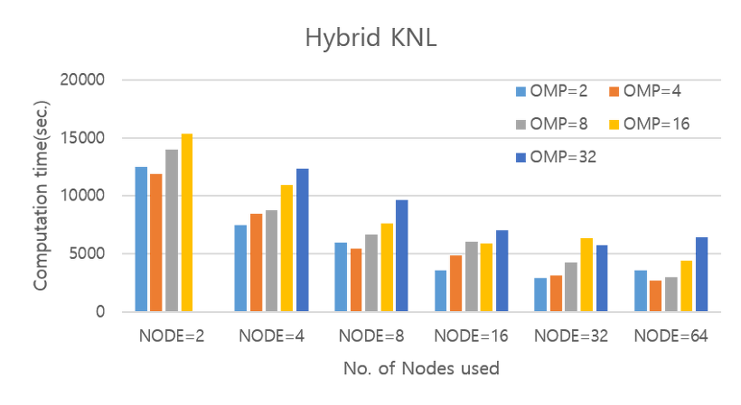
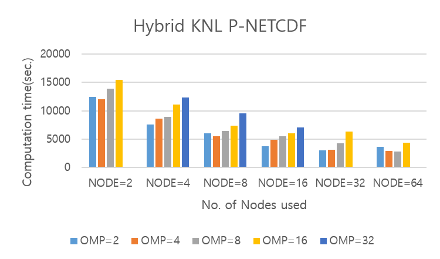
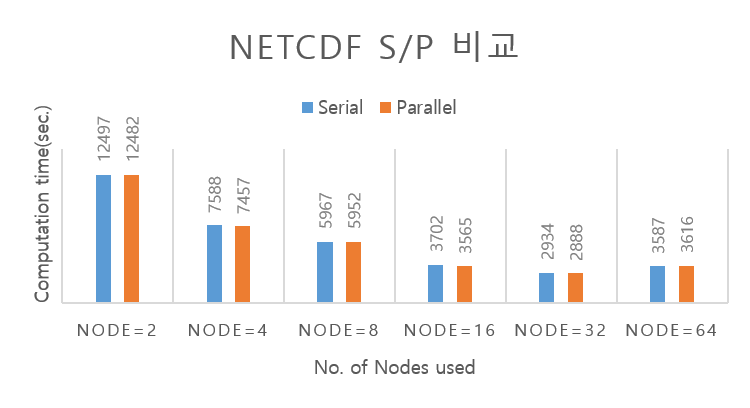
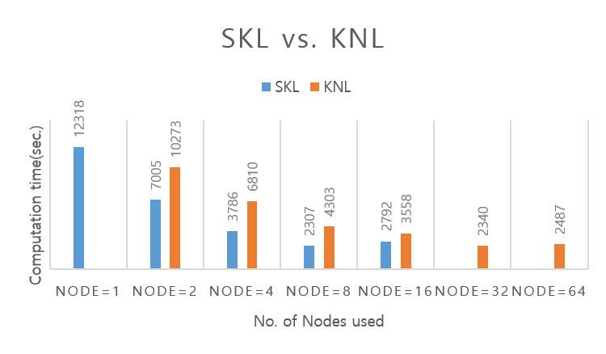

# 누리온 WRF 멀티노드 활용(KNL)

다음은 누리온 KNL을 활용한 WRF 테스트 샘플의 실행 방법 및 성능을 보여주는 예제이다.

****

**가. 테스트 계산 모델**

WRF의 실행 테스트를 위하여, 아래의 환경으로 2018년 10월 16일 06UTC부터 2018년 10월 17일 06UTC까지 24시간 적분을 수행하였다.

**나. 실행 방법 및 성능 분석**

**1) 작업 스크립트 예제**

> \#!/bin/sh
>
> \#PBS -N comp\_WRFv3                  <mark style="color:blue;"># job의 이름(여러 개의 작업 제출 시 사용자가 구분하기 위한 목적)</mark>
>
> \#PBS -V                  <mark style="color:blue;"># 작업 제출 노드(로그인 노드)에서 설정한 환경을 계산 노드에 적용하기 위해 사용</mark>
>
> \#PBS -q normal                              <mark style="color:blue;"># 사용 큐(일반 사용자는 normal 큐만 사용 가능)</mark>
>
> \#PBS -l select=1:ncpus=64:mpiprocs=64:ompthreads=1   <mark style="color:blue;"># 아래 참조</mark>
>
> \#PBS -l walltime=06:00:00               <mark style="color:blue;"># 작업을 수행할 시간( normal 큐는 최대 48시간까지 가능)</mark>
>
> \#PBS –A wrf                                       <mark style="color:blue;"># 자료 수집의 목적으로 프로그램 이름을 기입해야 함(의무사항)</mark>
>
> &#x20;
>
> cd $PBS\_O\_WORKDIR
>
> module load craype-mic-knl intel/18.0.3 impi/18.0.3
>
> module load hdf4/4.2.13 hdf5/1.10.2 netcdf/4.6.1 ncl/6.5.0
>
> export JASPERLIB=/apps/common/jasper/1.900.29/lib
>
> export JASPERINC=/apps/common/jasper/1.900.29/include
>
> ulimit –s unlimited
>
> mpirun {설치 경로}/main/wrf.exe

\#PBS –l select=1(A):ncpus=64(B):mpiprocs=64(C):ompthreads=1(D)

A(예제에서는 1) : 사용할 노드 수를 의미. 만일 4개의 노드를 사용하려면 4를 지정하면 됨.

B(예제에서는 64) :한 노드에서 사용할 Core 수(한 노드에 있는 core수보다 작거나 같아야 함)

(10월 PM 이후 무조건 68로 적용됨)

C(예제에서는 64) : 한 노드에서 사용할 MPI 프로세스의 수

D(예제에서는 1) : 한 프로세스가 사용할 OpenMP스레드의 수

1\. 순수 MPI 실행에서는 D의 값은 1로 지정한다. Hybrid(MPI+OpenMP)일 때는 사용할 OpenMP 스레드의 개수로 지정한다. C\*D의 값이 68보다 크면 작업 제출이 안 됨.

2\. B, C, D의 값은 모두 한 노드 기준임

3\. 만일 2개의 노드를 사용하고 노드 당 프로세스의 수는 16, OpenMP 스레드의 수는 2로 지정하고 싶다면, 아래와 같이 지정한다.

> \#PBS –l select=2:ncpus=68:mpiprocs=16:ompthreads=2

**2) 계산 성능 결과**

**▶ 노드 당 코어를 모두 다 사용해야 가장 빠른 결과를 얻을 수 있을까?**

아래의 그림은 노드당 64, 68, 32개를 사용할 때의 성능 그래프이다. 가로축은 사용한 KNL 노드 수이고, 세로축은 계산 소요 시간(초)이다.

※ 실험 데이터는 2018년 6월 누리온에서 각각 4번의 반복 실험을 평균한 결과임

\- 일반적으로 노드 당 코어를 68개로 모두 계산에 사용한다고 해서 빠른 계산이 수행되는 것은 아니며, 노드 당 64개 코어로 **** 설정했을 경우, 노드를 늘려가면서 가장 안정적으로 계산소요 시간이 줄어드는 것을 확인할 수 있음

\- 위 예제의 경우 노드 당 64개 코어로 32개 노드까지 늘렸을 때 가장 좋은 계산 성능을 보였음

\- 예제보다 더 큰 문제의 경우 더 많은 노드 수로 더 빠른 계산 성능을 얻을 수 있고, 문제 크기가 작은 경우, 32개보다 작은 노드수로도 가장 빠른 계산 성능을 얻을 수 있음

<mark style="color:blue;">- 즉, 이 실험의 예제에 사용된 문제 크기에 종속되는 결과이므로 사용자는 각자 풀고자 하는 문제 크기에 따라 다량의 반복 실험 이전에 위와 같은 성능 테스트를 거치는 것이 시스템 활용에 유리함.</mark>

<mark style="color:blue;">****</mark>

**▶ -xMIC-AVX512 vs. -xCOMMON-AVX512**

누리온에서는 CPU 맞춤 컴파일 옵션을 사용하도록 권장하고 있다. 즉, Intel compiler인 경우, KNL에서만 실행되는 바이너리 파일을 생성하기 위해서는 ‘-xMIC-AVX512’ 옵션을 사용하고, KNL과 SKL 모두에서 실행되는 바이너리 파일을 생성하기 위해서는 ‘-xCOMMON-AVX512’ 옵션을 사용하도록 권장하고 있다.

※ 컴파일 옵션에 따른 성능 차이가 있으므로, 블로그의 WRF 설치 지침에 따라 사용하시는 노드에 맞는 컴파일하시기를 권장함 (KNL 노드 사용의 경우, -xMIC-AVX512 사용 권장)

▶ Memory mode(Cache vs. Flat)

KNL은 MCDRAM의 사용 방식에 따라 Cache mode, Flat mode, Hybrid mode로 나누어진다. 누리온은 대부분의 계산 노드가 Cache mode로 설정되었고, 일부 노드만 Flat mode로 설정되었다. Hybrid mode는 사용하지 않는다. Cache mode는 MCDRAM을 L3 Cache처럼 사용하는 것이고, Flat mode는 MCDRAM을 main memory처럼 사용하는 것이다. 참고로 이전의 결과는 cache 모드로 수행한 결과이다.

Flat mode를 사용하는 경우, 프로그램 실행 시 ‘numactl -p 1’옵션을 사용하여 MCDRAM을 우선 사용하도록 하였다.

아래의 그림은 노드당 68 코어를 사용하고, 8노드/16노드를 사용한 경우의 Cache mode와 Flat mode의 성능 차이를 보여주고 있다. Flat mode인 경우 계산 시간이 약 7\~15% 증가하는 것을 확인할 수 있다.

\\

****

**3) 시스템 별 성능 비교**

▶ Hybrid OMP+MPI 계산

WFR를 MPI와 OpenMP를 함께 사용하는 Hybird 방식으로 빌드한 후 테스트를 진행하였다.\
****Cache mode의 실험 결과에서 노드당 코어를 64개를 사용할 때 가장 좋은 성능을 보임을 확인하였기 때문에, 이번 실험에서는 (프로세스의 개수)\*(OpenMP thread의 개수)=64가 되도록 하여 한 노드당 64개의 코어를 사용하도록 하였다.

전체적으로 스레드이 개수가 증가할수록 성능이 좋아지지 않음을 알 수 있다. 오히려 DMPAR 즉 MPI 코드가 많을수록 성능이 좋아지고 있다. 즉, 스레드 기반의 코드가 WRF의 성능에 좋지 않다는 것을 확인할 수 있는 결과이다. 단적인 예로 DMPAR로 계산을 수행하였을 때 (이전의 실험 결과) 64Core의 계산 시간은 32개 노드일 때 2340sec인 반면, Hybrid에서 가장 빠른 결과를 보인 32개 노드 2Threads, 16MPI를 사용하였을 때 2888sec 보다 빠름을 확인할 수 있다. 문제의 크기 더 크게하여 실험을 하였으나 Hybrid 결과가 DMPR결과보다 성능이 더 좋지 않음을 확인하였다.

▶ Parallel NetCDF vs. Serial NetCDF

WRF의 경우 input, output의 파일 사이즈가 크기 때문에 이 파일을 처리하기 위해 WRF에서 사용하는 파일 포맷인 NC 파일의 병렬버전인 Parallel NETCDF를 사용하여 Hybrid(MPI+OpenMP)로 빌드하여 실험하였다.

수행되는 input의 사이즈가 그리 크지 않기 때문일 수도 있지만, 현재 Parallel NETCDF의 효과는 보이는 것처럼 높지 않은 것으로 나오고 있다.

▶ KNL vs. SKL

SKL과 KNL의 노드 별 이론 성능은 거의 비슷하지만 실제 실험을 해보면 일반적으로 SKL의 성능이 더 좋다. WRF를 수행했을 때 결과는 아래와 같다.

수행 결과를 확인해보면 SKL 노드에서 8개의 노드를 사용할 때 가장 빠른 시간으로 계산이 소요된 것을 확인할 수 있고, 반면 KNL 노드에서는 32개를 사용할 때 가장 빠른 시간이 소요되었음을 확인할 수 있다. 이와 같은 현상은 WRF 뿐 아니라 격자류의 무거운 계산을 수행하는 유체, 기계등의 코드에서도 동일한 현상을 보이고 있다.\
SRU Time, Wall-Clock-Time의 차이를 보더라도 WRF는 CPU기반의 코드가 성능이 좋음을 알 수 있다. KISTI의 경우 SKL 노드의 대수가 현실적으로 작기 때문에, 대용량의 계산을 수행하기 위해서는 KNL 노드를 사용하여야 하며, 이용 요금이 2배 비싼 SKL에 비해 가격 대비 KNL 성능은 우월하다고 해석할 수 있다.
