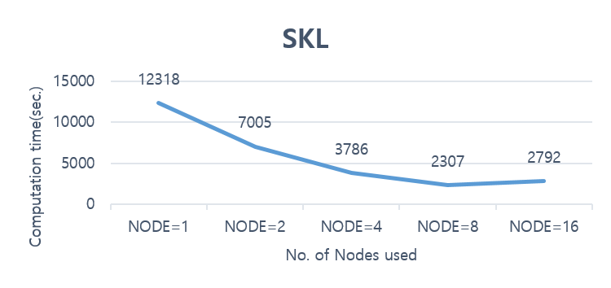

# 누리온 WRF 멀티노드 활용(SKL)

다음은 누리온 SKL을 활용한 WRF 테스트 샘플의 실행 방법 및 성능을 보여주는 예제이다.

****

**가. 테스트 계산 모델**

WRF의 실행 테스트를 위하여, 아래의 환경으로 2018년 10월 16일 06UTC부터 2018년 10월 17일 06UTC까지 24시간 적분을 수행하였다.

****

**나. 실행 방법 및 성능 분석**

**1) 작업 스크립트 예제**

> &#x20;**** #!/bin/sh
>
> \#PBS -N comp\_WRFv3
>
> \#PBS -V
>
> <mark style="color:blue;">#PBS -q normal\_skl</mark>
>
> <mark style="color:blue;">#PBS -l select=1:ncpus=40:mpiprocs=40:ompthreads=1</mark>
>
> \#PBS -l walltime=06:00:00
>
>
>
> cd $PBS\_O\_WORKDIR
>
> module load craype-x86-skylake intel/18.0.3 impi/18.0.3
>
> module load hdf4/4.2.13 hdf5/1.10.2 netcdf/4.6.1 ncl/6.5.0
>
> export JASPERLIB=/apps/common/jasper/1.900.29/lib
>
> export JASPERINC=/apps/common/jasper/1.900.29/include
>
>
>
> mpirun {설치 경로}/main/wrf.exe

\* 작업 스크립트는 이전의 KNL과 거의 동일, 차이점은 사용하는 큐가 normal 큐에서, norm\_skl로 바뀐 점, 그리고 KNL이 노드 당 코어를 68개인 것에 반해 SKL은 40개의 코어를 가지고 있기 때문에, 아래와 같이 가용 core수와 MPI 프로세스 수가 40이 넘을 수 없다는 점임.

> \#PBS –l select=1:ncpus=40:mpiprocs=40:ompthreads=1

****

**2) 계산 성능 결과**

input 파일의 크기가 클 경우는 파일 처리를 수행하는 NETCDF를 병렬 처리하여 Parallel NETCDF를 사용하지만, 여기서는 파일 처리는 Serial NETCDF를 사용하여 수행 테스트를 하였다.

위 그래프를 보면, 사용하고 있는 입력 파일은 SKL 노드에서 8개의 노드 320개 이상의 CPU를 사용하면 병렬성능이 떨어지는 것을 확인할 수 있다. 이는 계산에 사용된 예제가 그 이상의 cpu를 필요로 하지 않은 정도의 계산 크기이기 때문일 수도 있고, WRF 자체의 병렬확장성의 한계일 수도 있다.

※ 누리온 KNL 노드와의 성능 비교는 "[누리온 WRF 멀티노드 활용(KNL)](https://ksctech.tistory.com/178)" 참조
