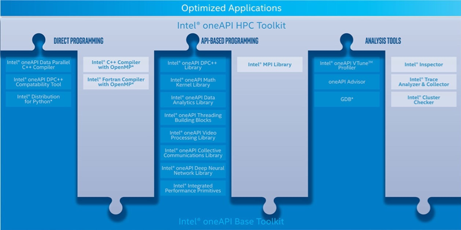
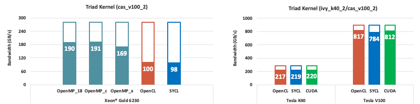
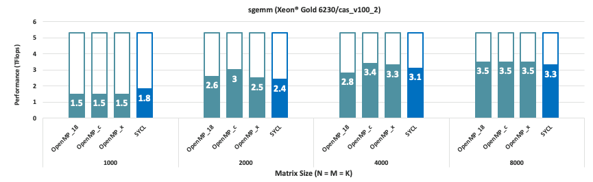

# oneAPI 소개

1\. oneAPI Base ToolKit - 특징 및 장점

1\) oneAPI - Base Toolkit

oneAPI와 인텔 oneAPI 툴킷은 함께 생산적이고 성능 기준에 맞는 이기종 프로그래밍을 개발자들에게 제공합니다.

ㅇ 하드웨어의 가치를 모두 실현

최신 하드웨어의 모든 최첨단 기능을 도입하고 이용합니다. 예를 들어, AI 가속을 위한 인텔 딥러닝 부스트를 포함해 인텔 어드밴스드 익스텐션 512(인텔 AVX-512)를 지원하는 3세대 인텔 제온 스케일러블 프로세서를 최대한 활용할 수 있습니다. 또한 인텔 CPU, GPU, FPGA에서 성능을 극대화하여 가속 컴퓨팅을 충분히 활용할 수 있습니다.

ㅇ 성능 기준에 맞는 코드를 빠르고 자신감 있게 개발 가능

아키텍처 간 라이브러리와 고급 도구 세트 전체를 사용하여 빠르고 효율적으로 개발할 수 있으며 CUDA 코드를 DPC++로 마이그레이션하는 등 레거시 코드와 쉽게 통합할 수 있습니다.

ㅇ 미래에 대비하는 프로그래밍 모델로 선택의 자유 제공

간편한 아키텍처 리타깃팅을 위해 단일 벤더/독점 종속에 대한 개방형 대안을 확보할 수 있습니다.

2\) 주요사항

ㅇ 인텔 다이렉트 프로그래밍용 oneAPI DPC++/C++ 컴파일러

ㅇ API 기반 프로그램의 라이브러리

ㅇ 고급 분석 및 디버그 도구

인텔 oneAPI DPC++/C++ 컴파일러, 인텔 DPC++ 호환성 툴, 인텔 oneAPI DPC++ 라이브러리, 인텔 oneAPI 스레딩 빌딩 블록, 인텔 oneAPI 매스 커널 라이브러리, 인텔 oneAPI 데이터 애널리틱스 라이브러리, oneAPI 비디오 프로세싱 라이브러리, 인텔 어드바이저, 인텔 파이썬용 디스트리뷰션, 인텔 통합 퍼포먼스 프리미티브, 인텔 VTune™ 프로파일러, 인텔 GDB용 디스트리뷰션, 인텔 oneAPI 베이스 툴킷용 FPGA 애드온(옵션), 인텔 oneAPI 딥 뉴럴 네트워크 라이브러리, 인텔 oneAPI 공동 통신 라이브러리

2\. oneAPI HPC ToolKit - 특징 및 장점

1\) oneAPI - HPC Toolkit

인텔 oneAPI 베이스 및 HPC 툴킷은 고성능 컴퓨팅(HPC) 플랫폼에서 최신 인텔®프로세서의 성능을 최대한 활용한 현대식 코드를 빠르고 간편하게 빌드할 수 있는 광범위한 개발 도구 세트입니다.

ㅇ 빠른 병렬 코드를 작성

업계 최고의 컴파일러, 성능 라이브러리, 성능 프로파일러, 코드 및 클러스터 분석 도구를 사용하여 현행 및 향후 인텔 플랫폼에서 확장 가능한 애플리케이션 성능을 강화할 수 있습니다.

ㅇ 코드를 더 빠르게 빌드

빠르고 확장 가능하고 신뢰할 수 있는 병렬 코드의 작성 절차를 간소화 할 수 있습니다.

ㅇ 우선 지원을 제공

인텔 엔지니어와 직접 연결하여 기술 문제에 대한 비공개 답변을 신속하게 받을 수 있습니다.

2\) 주요사항

ㅇ 단일 노드 또는 멀티 노드 선택

인텔 oneAPI HPC 툴킷은 공유 메모리 시스템을 구동하든, 분산 메모리 시스템을 구동하든, 아키텍처 간에 공략하는 데 필요한 모든 도구를 제공합니다. 각기 다른 지원이 필요한 워크스테이션부터 멀티 노드 클러스터까지 다양한 타겟 플랫폼에서 개발 및 배포가 가능합니다.

ㅇ 아키텍처 간 고성능 컴퓨팅을 위한 강력한 도구

인텔 oneAPI DPC++/C++ 컴파일러, 인텔 C++ 컴파일러 클래식, XPU 개발을 위한 인텔 포트란 컴파일러(베타), 인텔 포트란 컴파일러 클래식, 인텔 클러스터 체커, 인텔 인스펙터, 인텔 MPI 라이브러리, 인텔 트레이스 애널라이저 앤 컬렉터, 인텔 oneAPI DPC++ 라이브러리, 인텔 oneAPI 스레딩 빌딩 블록, 인텔 oneAPI 매스 커널 라이브러리, 인텔 oneAPI 데이터 애널리틱스 라이브러리, 인텔 oneAPI 비디오 프로세싱 라이브러리, 인텔 어드바이저, 인텔 파이썬용 디스트리뷰션, 인텔 DPC++ 호환성 툴, 인텔 통합 퍼포먼스 프리미티브, 인텔 VTune™ 프로파일러, 인텔 GDB 디스트리뷰션, 인텔 FPGA oneAPI 베이스 툴킷용 애드온(옵션l)

3\. oneAPI: STREAM 벤치마크

ㅇ Triad 커널은 1차원 벡터에 대한 계산과 관련된 메모리 대역폭을 측정합니다 : a=b+ γc

ㅇ Intel CPU 테스트 (Xeon Gold 6230/cas\_v100\_2): OpenMP에서 최고 성능을 보여줍니다.

\- 이론상 대역폭 : 281 GB/s ([https://en.wikichip.org/wiki/intel/xeon\_gold/6230](https://en.wikichip.org/wiki/intel/xeon\_gold/6230))

\- OpenMP\_18: intel/18.0.2 (icc), OpenMP\_c: oneAPI-2021.3 (icc), OpenMP\_x (icx), OpenCL (icx), SYCL (dpcpp)

\- Clang 기반 icx는 기존 icc보다 10% 낮은 대역폭을 제공

\- OpenCL 런타임은 OpenMP에서 낮은 성능을 제공

ㅇ NVIDIA GPU 테스트 : 모든 프로그래밍 모델 간의 일관된 성능:

\- 이론상 대역폭: 288 GB/s (K40), 900 GB/s (V100)

\- OpenCL: oneAPI-2021.3 (icx), SYCL (intel-llvm), CUDA: cuda/10.1 (nvcc)

4\. oneMKL: SGEMM 벤치마크

ㅇ 단일 정밀도 BLAS3 행렬 곱셈:

\- 2 x Xeon Gold 6230의 이론상 성능 : 5.3 TFlops\
\- 100번의 cblas\_sgemm() 호출에 대한 평균 결과

ㅇ 2018.2 vs openAPI 2021.3

\- N=M=K=4000의 경우 : 2021.3 MKL은 2018.2보다 15% 빠릅니다.\
\- N=M=K=8000의 경우 : OpenMP(icc/icx)와 SYCL(dpcpp) 간의 일관된 성능: \~ 3.5GFlops(65%)

출처 : [https://www.intel.com/content/www/us/en/developer/tools/oneapi/base-toolkit.html#gs.ekh8n6](http:/%20https/www.intel.com/content/www/us/en/developer/tools/oneapi/base-toolkit.html#gs.ekh8n6)\
[https://www.intel.com/content/www/us/en/developer/tools/oneapi/hpc-toolkit.html#gs.ekh9l4](https://www.intel.com/content/www/us/en/developer/tools/oneapi/hpc-toolkit.html#gs.ekh9l4)
