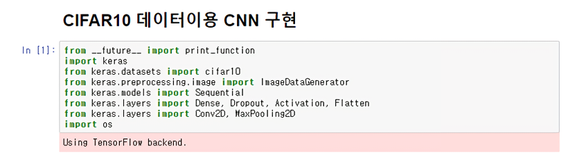
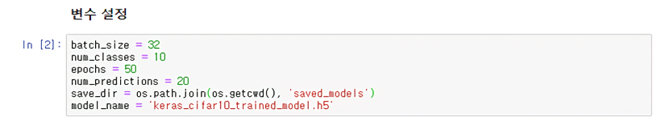
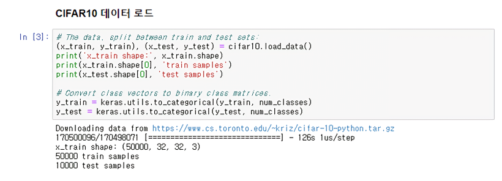
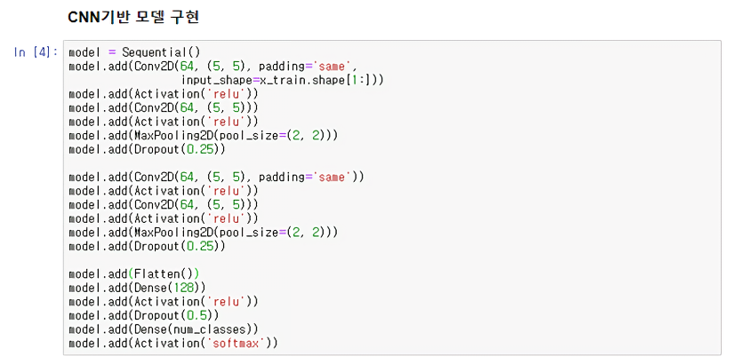
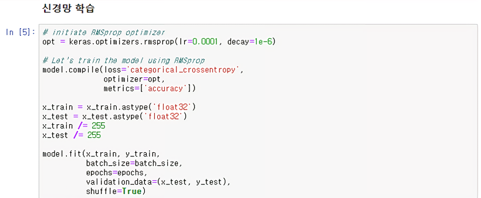
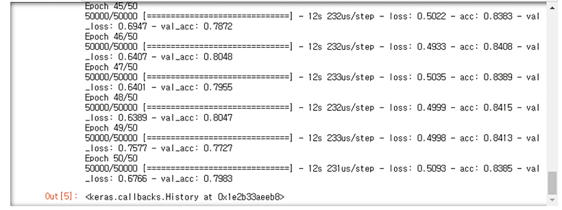
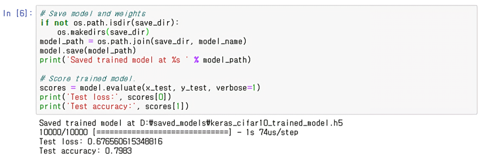
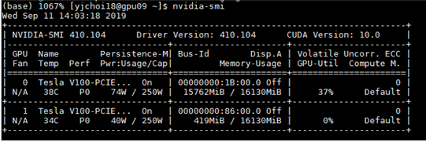
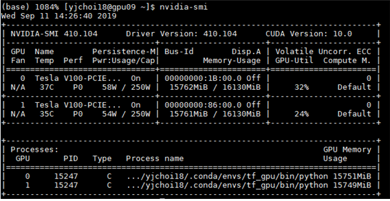

# 뉴론 Keras 기반 Multi GPU 사용 방법 (2020.10)

Keras(케라스)는 파이썬으로 작성된 오픈 소스 신경망 라이브러리로, MXNet, Deeplearning4j, 텐서플로, Microsoft Cognitive Toolkit 또는 Theano 위에서 수행할 수 있는 High-level Neural Network API이다. 케라스의 특징은 User friendliness, Modularity, Easy Extensibility로 Multi-GPU를 사용하고자 하는 사용자도 코드를 최소한으로 수정하여 쉽게 Multi-GPU를 사용할 수 있도록 하고 있다.

KISTI GPU 클러스터인 NEURON의 큐 구성은 다음과 같으며, ivy\_k40\_2, ivy\_v100\_2, cas\_v100\_2, cas32c\_v100\_2, cas\_v100nv\_4 큐에는 한 노드에 2, 4개의 GPU가 장착되어 있어, 단일노드를 이용할 때에도 GPU를 여러 대 사용하여 신경망 학습을 할 수 있는 환경이 구축되어 있다.


**※ 노드 구성은 시스템 부하에 따라 시스템 운영 중에 조정될 수 있음.**

**※ cas32c\_v100\_2 파티션 계산노드는 Xeon Gold 6242 CPU 2ea 탑재 (총 32코어)**

****

****

본 Multi-GPU 사용 방법 설명서에서는 CNN기반 신경망을 cifar10 데이터를 이용하여 학습하는 예제를 이용하였다.

**1.학습에 사용된 신경망 코드 (cifar10.py)**















**2. 단일 GPU 사용 작업 제출 방법**

※작업제출 스크립트

```
#!/bin/sh
#SBATCH -J keras
#SBATCH --time=24:00:00
#SBATCH -o %x_%j.out
#SBATCH -e %x_%j.err
#SBATCH -p cas_v100_2
#SBATCH --comment tensorflow
#SBATCH --gres=gpu:2
#SBATCH -N 1

module load python/3.7.1
source activate tf_gpu

srun python cifar10.py
```

\- Conda를 이용하여 Keras 패키지가 설치된 tf\_gpu 가상환경을 구축하고 tf\_gpu 환경에서 수행하는 방법임. (Conda의 활용은 ‘KISTI 홈페이지 > 기술지원 > 지침서 > 소프트웨어 > Conda의 활용’ 참고.)

\- Keras는 tensorflow 위에서 동작하기 때문에 application명으로 tensorflow 사용.

\- ivy\_v100\_2노드에는 GPU가 2개 장착되어 있기 때문에 2개 GPU를 모두 사용할 수 있지만, 코드에 Multi-GPU를 사용한다고 명시하지 않았기 때문에 —gres옵션으로 gpu를 2개 사용한다고 하여도 하나의 gpu만을 사용한다는 것을 확인할 수 있음.



****

**3. Multi-GPU 사용을 위한 코드 변경 및 작업 제출 방법**

1\) \[from keras.utils import multi\_gpu\_model] 모듈 추가

| <p>from __feature__ import print_function</p><p>import keras</p><p>from keras.datasets import cifar10</p><p>from keras.preprocessing.image import ImageDataGenerator</p><p>from keras.models import Sequential</p><p>from keras.layers import Dense, Dropout, Activation, Flatten</p><p>from keras.layers import Conv2D, MaxPooling2D</p><p><mark style="color:red;">from keras.utils import multi_gpu_model</mark></p><p>import os</p> |
| --------------------------------------------------------------------------------------------------------------------------------------------------------------------------------------------------------------------------------------------------------------------------------------------------------------------------------------------------------------------------------------------------------------------------------------- |

2\) 코드 내 multi-gpu사용 선언

| <p># initiate RMSprop optimizer</p><p>opt = keras.optimizers.rmsprop(lr=0.0001, decay=1e-6)</p><p></p><p>#multi-gpu</p><p><mark style="color:red;">model = multi_gpu_model(model, gpus=2)</mark></p><p></p><p># Let's train the model using RMSprop</p><p>model.compile(loss='categorical_crossentropy',</p><p>optimizer=opt,</p><p>metrics=['accuracy'])</p> |
| ------------------------------------------------------------------------------------------------------------------------------------------------------------------------------------------------------------------------------------------------------------------------------------------------------------------------------------------------------------- |

\-사용하고자하는 GPU 개수만큼 gpus를 설정.\
(ex. skl\_v100nv\_4노드의 경우에는 gpus=4라고 설정)


3\) Multi-GPU 사용 작업 제출 방법

※작업제출 스크립트 (단일 GPU 사용과 동일)

```
#!/bin/sh
#SBATCH -J keras
#SBATCH --time=24:00:00
#SBATCH -o %x_%j.out
#SBATCH -e %x_%j.err
#SBATCH -p cas_v100_2
#SBATCH --comment tensorflow
#SBATCH --gres=gpu:2
#SBATCH -N 1
 
module load python/3.7.1
source activate tf_gpu
 
srun python cifar10.py
```


