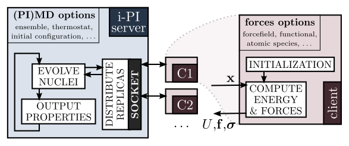

# 누리온 i-PI 사용법 (LAMMPS)

본 문서는 누리온 시스템에서 i-PI 소프트웨어 사용을 위한 기초적인 정보를 제공하고 있습니다.

따라서, i-PI 소프트웨어 사용법과 누리온/리눅스 사용법 등은 포함되어 있지 않습니다.

누리온/리눅스 사용법에 대한 정보는 KISTI 홈페이지 (https://www.ksc.re.kr)의 기술지원 > 지침서 내 누리온 사용자 지침서 등을 참고하시기 바랍니다.

## **1. i-PI 소개**

\- i-PI는 Python으로 작성된 Universal force engine 인터페이스입니다.

\- 원자간 상호작용에 대한 제일원리 평가 소프트웨어와 함께 사용하도록 설계되어 있습니다.

\- 본 문서는 i-PI와 LAMMPS를 같이 사용하는 경우에 대해 서술합니다.

\- LAMMPS 등 타 소프트웨어와 연동하여 계산을 수행하는 경우 상호간 통신에 Socket을 사용합니다.(Unix Domain Socket, Internet Socket)

(출처: http://ipi-code.org/about/interface/)

\\

\- 자세한 사항은 i-PI 홈페이지를 방문하시기 바랍니다. (http://ipi-code.org)

\\

## **2. 소프트웨어 설치 정보**

\- i-PI는 별도의 설치가 필요하지 않으며, 배포처(https://github.com/i-pi/i-pi)에서 소스코드를 내려받아 바로 사용하실 수 있습니다.

\- LAMMPS는 누리온 시스템에 기설치된 12Dec18 버전을 모듈 환경설정하여 사용합니다.

\\

## **3. 소프트웨어 실행 방법 - Unix Domain Socket 방식 (Single node only)**

i-PI와 타 소프트웨어를 연동하여 사용할 경우 Socket으로 통신을 수행합니다.

Unix Domain Socket 방식은 오직 한 노드 내에서만 사용할 수 있으며, 파일시스템을 거쳐 통신이 이루어지기 때문에 전체 네트워크 프로토콜 스택을 거쳐 통신이 이루어지는 Internet Socket(TCP/IP) 대비 오버헤드가 적어 성능상 유리합니다.

\\

**(1) 환경 설정**

| 
$ module load intel/18.0.3 impi/18.0.3 craype-mic-knl

$ module load lammps/12Dec18 python/3.7
 |
| ---------------------------------------------------------------------------------------------------------- |

**(2) 입력 파일 설정**

실행 전 입력 파일의 일부를 수정할 필요가 있습니다.

\- i-PI 입력파일: input.xml

| 
...

&#x3C;ffsocket name='lmpserial' mode='unix'>

&#x3C;address> ipi-lmp_unix &#x3C;/address>

&#x3C;/ffsocket>

...
 |
| ------------------------------------------------------------------------------------------------------------------------------------------------ |

※ ffsocket 블록에서 mode는 'unix'로 설정하고, address는 임의의 문자열을 사용하시면 됩니다.

\\

\- LAMMPS 입력파일: in.lmp

| 
...

fix 1 all ipi ipi-lmp_unix 34567 unix

...
 |
| ---------------------------------------------------------------- |

※ 4번째 필드는 LAMMPS와 함께 동작할 외부 코드를 지정합니다: ipi

※ 5번째 필드는 input.xml에서 설정한 address와 동일한 문자열을 입력해야 합니다: ipi-lmp\_unix

※ 7번째 필드는 Unix Domain Socket 사용 여부를 결정합니다: unix

\\

**(3) 스케줄러 작업 스크립트 파일 작성**

※ 아래는 누리온 시스템에서의 작업 제출 예제입니다.

| 
#!/bin/sh

#PBS -V

#PBS -N i-PI_test

#PBS -q normal

#PBS -l select=1:ncpus=68:mpiprocs=68:ompthreads=1

#PBS -l walltime=12:00:00

#PBS -A etc

cd $PBS_O_WORKDIR

source {i-PI 설치 경로}/env.sh

 

rm -fv EXIT

 

OMP_NUM_THREADS=4 # i-PI 실행 스레드 수 지정

 

if [ -f "RESTART" ]; then

i-pi RESTART >&#x26; log.i-pi &#x26;

else

i-pi input.xml >&#x26; log.i-pi &#x26;

fi

 

OMP_NUM_THREADS=1 # LAMMPS 실행 스레드 수 지정

 

sleep 10

 

mpirun -n 64 lmp_mpi -in in.lmp # 실행할 MPI 프로세스 수 명시적으로 지정

 

touch EXIT

 
 |
| --------------------------------------------------------------------------------------------------------------------------------------------------------------------------------------------------------------------------------------------------------------------------------------------------------------------------------------------------------------------------------------------------------------------------------------------------------------------------------------------------------------------------------------------------------------------------------------------------------------------------------------------------------------------------------------------- |

※ 위에서 파란색으로 표기된 부분은 사용자가 적절히 수정해야 합니다.

※ Queue 종류(-q) : queue는 KNL(68 cores)을 사용할 경우 normal, SKL(40 cores)을 사용할 경우 norm\_skl을 사용합니다.

※ 기타 PBS에 관련된 명령어 및 사용법은 누리온 사용자 지침서를 참조하시면 됩니다.

\\

## **4. 소프트웨어 실행 방법 - Internet Socket mode (Multi node 대응)**

**(1) 환경 설정**

| 
$ module load intel/18.0.3 impi/18.0.3 craype-mic-knl

$ module load lammps/12Dec18 python/3.7
 |
| ---------------------------------------------------------------------------------------------------------- |

**(2) 입력 파일 설정**

실행 전 입력 파일의 일부를 수정할 필요가 있습니다.

\- i-PI 입력파일: input.xml

| 
...

&#x3C;ffsocket name='lmpserial' mode='inet'>

&#x3C;address> 172.31.27.3 &#x3C;/address>

&#x3C;port> 34567 &#x3C;/port> # port 주소 지정

&#x3C;/ffsocket>

...
 |
| ------------------------------------------------------------------------------------------------------------------------------------------------------------------------------------------------- |

※ ffsocket 블록에서 mode는 'inet'으로 설정하고, address(IP 주소) 및 port(포트 주소)를 설정하시면 됩니다.

\\

\- LAMMPS 입력파일: in.lmp

| 
...

fix 1 all ipi 172.31.27.3 34567

...
 |
| ---------------------------------------------------------- |

※ 4번째 필드는 LAMMPS와 함께 동작할 외부 코드를 지정합니다: ipi

※ 5번째 필드는 input.xml에서 설정한 address와 동일한 IP 주소를 입력해야 합니다: i-PI가 실행될 노드의 IP 주소

※ 6번째 필드는 input.xml에서 설정한 port와 동일한 포트 주소를 입력해야 합니다: i-PI에서 사용할 임의의 포트 주소

※ 7번째 필드는 Internet socket mode에서는 사용되지 않습니다.

\\

**(3) 스케줄러 작업 스크립트 파일 작성**

작업이 실행될 계산노드를 명시적으로 지정하지 않을 경우 시스템 사용 상황에 따라 작업을 제출할 때마다 다른 계산노드를 할당받을 가능성이 높습니다.

따라서 작업 스크립트에서 input.xml, in.lmp의 address 필드 값을 실제 할당받은 계산노드의 주소로 업데이트하는 과정이 필요합니다.

\\

※ 아래는 누리온 시스템에서의 작업 제출 예제입니다.

|

\#!/bin/sh

\#PBS -V

\#PBS -N i-PI\_test

\#PBS -q normal

\#PBS -l select=1:ncpus=68:mpiprocs=68:ompthreads=1

\#PBS -l walltime=12:00:00

\#PBS -A etc

cd $PBS\_O\_WORKDIR

source {i-PI 설치 경로}/env.sh

\

rm -fv EXIT

\

OMP\_NUM\_THREADS=4 # i-PI 실행 스레드 수 지정

\

IPINODE=`grep "${HOSTNAME} " /etc/hosts | awk '{print $1}'` # 현재 i-PI가 실행중인 노드의 IP 주소

\

if \[ -f "RESTART" ]; then

sed -i "s:fix 1 all ipi .\* :fix 1 all ipi ${IPINODE} :g" in.lmp

sed -i "s:address>._<:address>${IPINODE}<:g" RESTART_

_sed -i "s:port>._<:port>34567<:g" RESTART

i-pi RESTART >& log.i-pi &

else

sed -i "s:fix 1 all ipi .\* :fix 1 all ipi ${IPINODE} :g" in.lmp

sed -i "s:address>._<:address>${IPINODE}<:g" input.xml_

_sed -i "s:port>._<:port>34567<:g" input.xml

i-pi input.xml >& log.i-pi &

fi

\

OMP\_NUM\_THREADS=1 # LAMMPS 실행 스레드 수 지정

\

sleep 10

\

mpirun -n 64 lmp\_mpi -in in.lmp # 실행할 MPI 프로세스 수 명시적으로 지정

\

touch EXIT

\

\| | ----------------------------------------------------------------------------------------------------------------------------------------------------------------------------------------------------------------------------------------------------------------------------------------------------------------------------------------------------------------------------------------------------------------------------------------------------------------------------------------------------------------------------------------------------------------------------------------------------------------------------------------------------------------------------------------------------------------------------------------------------------------------------------------------------------------------------------------------------------------------------------------------------------------------------------------------------------------------------------------------------------------------------------------------------------------------------------------------------------------------------------------------------------------------------------------------------------------------------------- |

※ 위에서 파란색으로 표기된 부분은 사용자가 적절히 수정해야 합니다.

※ Queue 종류(-q) : queue는 KNL(68 cores)을 사용할 경우 normal, SKL(40 cores)을 사용할 경우 norm\_skl을 사용합니다.

※ 기타 PBS에 관련된 명령어 및 사용법은 누리온 사용자 지침서를 참조하시면 됩니다.
