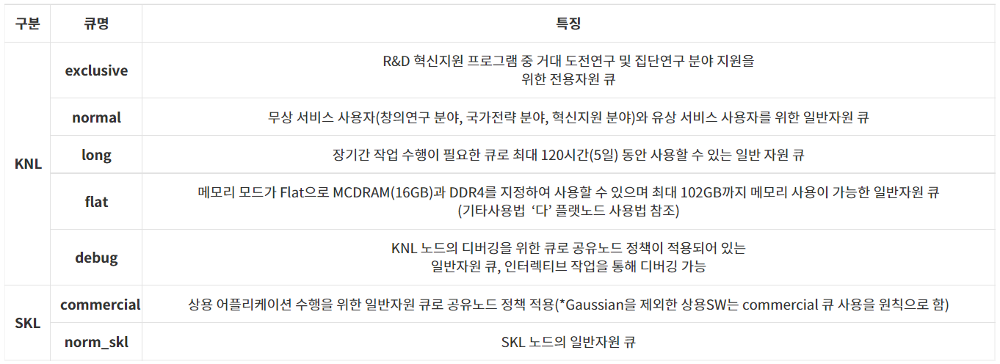

# 가. 큐 구성

ㅇCommercial 큐 (상용SW 수행을 위한 큐)와 디버깅을 위한 debug큐는 공유 노드 정책이 적용되어 가용 자원(CPU core) 범위 내에서 노드 당 여러개의 작업이 배치되며, 나머지 큐에서는 배타적 노드 정책으로 노드 당 하나의 작업만이 배치된다.

ㅇ 작업 큐

&#x20;\- 일반사용자가 사용할 수 있는 큐와 사용자별 제출 가능 작업 개수는 다음 표와 같다. (2021년 4월 기준)

| **큐 구분**                                                      | **큐 이름**                                                      | 
<strong>할당</strong>

<strong>노드 수</strong>
     | 
<strong>Total CPU</strong>

<strong>core 수</strong>
 | 
<strong>Wall</strong>

<strong>Clock</strong>

<strong>Limit</strong>

<strong>(시간)</strong>
 | **작업제출개수제한 \*** | 
<strong>리소스</strong>

<strong>점유제한 **</strong>
 |      |   |
| ------------------------------------------------------------- | ------------------------------------------------------------- | ---------------------------------------------------------- | --------------------------------------------------------------- | ------------------------------------------------------------------------------------------------------------------ | --------------- | ---------------------------------------------------------- | ---- | - |
| 
<strong>사용자별</strong>

<strong>최대제출 작업개수</strong>
 | 
<strong>사용자별</strong>

<strong>최대실행 작업개수</strong>
 | 
<strong>작업별</strong>

<strong>노드 점유개수</strong>
 |                                                                 |                                                                                                                    |                 |                                                            |      |   |
| **최대**                                                        | **최소**                                                        |                                                            |                                                                 |                                                                                                                    |                 |                                                            |      |   |
| **KNL**                                                       | **exclusive**                                                 | 2600                                                       | 176,800                                                         | unlimited                                                                                                          | 100             | 100                                                        | 2600 | 1 |
| **normal**                                                    | 4970                                                          | 337,960                                                    | 48                                                              | 40                                                                                                                 | 20              | 4970                                                       |      |   |
| **long**                                                      | 300                                                           | 20,400                                                     | 120                                                             | 20                                                                                                                 | 10              | 300                                                        |      |   |
| **flat**                                                      | 180                                                           | 12,240                                                     | 48                                                              | 20                                                                                                                 | 10              | 180                                                        |      |   |
| **debug**                                                     | 20                                                            | 1,360                                                      | 12                                                              | 2                                                                                                                  | 2               | 2                                                          |      |   |
| **SKL**                                                       | **commercial**                                                | 118                                                        | 4,720                                                           | 48                                                                                                                 | 6               | 2                                                          | 118  |   |
| **norm\_skl**                                                 | 118                                                           | 4,720                                                      | 10                                                              | 5                                                                                                                  |                 |                                                            |      |   |

**※ 노드 구성은 시스템 부하에 따라 시스템 운영 중에 조정될 수 있음.** (showq 명령어와 motd를 통해 노드 구성과 최대 작업가능개수를 수시로 확인할 수 있음)

&#x20;

① 큐별 설명

② 작업 제출 개수 제한

\- 사용자별 최대 제출 작업 개수 : 초과하여 작업을 제출한 경우 제출 시점에 오류가 발생함.

\- 사용자별 최대 실행 작업 개수 : 초과하여 작업을 제출한 경우 이전 작업이 끝날 때까지 기다려야 함.

③ 리소스 점유 제한

\- 작업별 노드 점유 개수 (최대|최소) : 단일 작업에서 점유 노드 수가 최소\~최대 범위를 벗어나는 경우 제출 시점에 오류가 발생한다. 사용자의 대기 및 실행 중인 작업의 점유 노드 개수와는 무관함.

④ KNL 메모리 모드에 따른 큐 구분(Cluster 모드는 전부 Quadrant)

\- exclusive, normal, long, debug 큐는 Cache 모드(MCDRAM을 L3캐시로 사용), flat큐는 Flat 모드(MCDRAM을 DDR4와 같이 RAM으로 사용)로 설정되어 있음.

\- 시스템 보호를 위해 Cache 모드는 최대 가용 메모리 82GB, Flat 모드는 102GB 제한

⑤ Hyperthread off 설정으로 KNL 사용시 노드 당 최대 68 스레드, SKL 사용시 노드 당 최대 40 스레드 사용 가능

&#x20;
