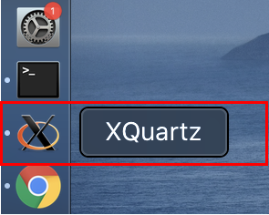
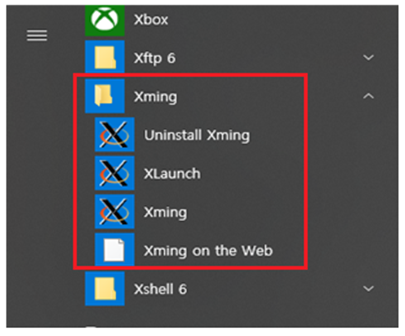
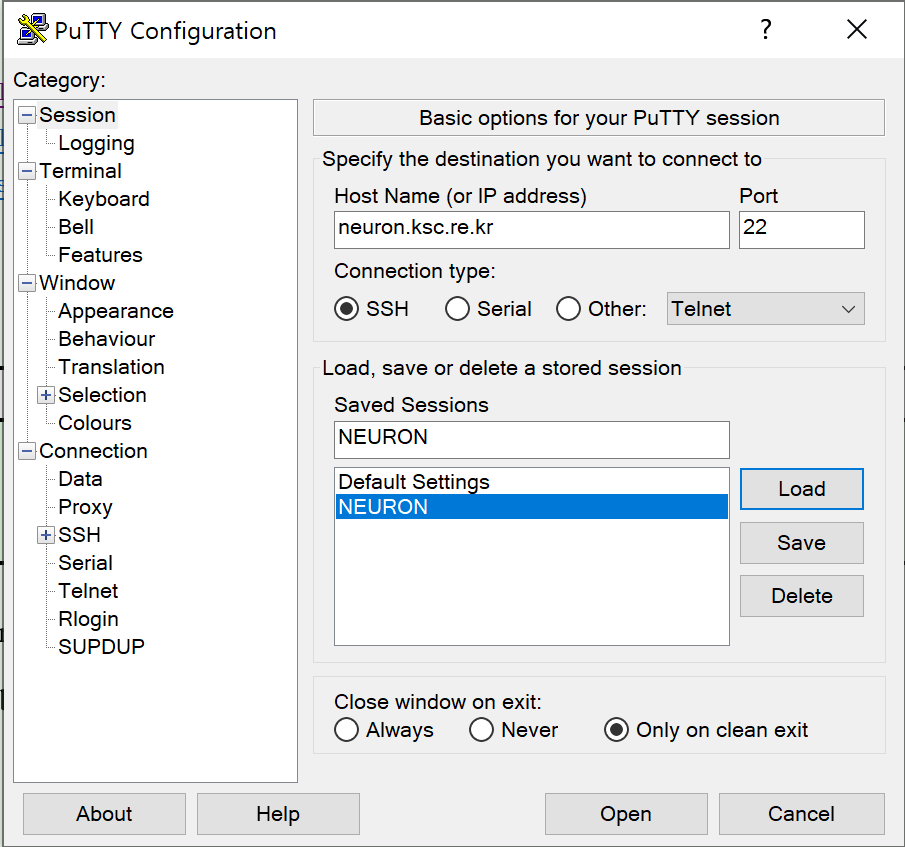
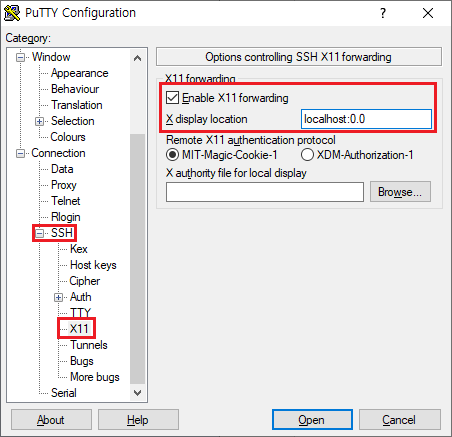

# User Environment

## A. Account Issuance

① Researchers who are authorized to use the Neuron system can apply for an account via the KISTI homepage ([**https://www.ksc.re.kr**](https://www.ksc.re.kr/)) web service.

\* Application method: Go to the homepage of the KISTI website. (Top) Apply for an account -> (Top) Apply -> Select an application

\- Free account: Nurion system innovation support program, novice users

\- Paid account: general users, student users

\- After the account is created, account-related information will be sent to the e-mail address provided in the application form.

&#x20;

② OTP (One-Time Password) authentication code issuance

\- **Compose an email, as shown below, by referring to the email you received about the account information, and send it to account@ksc.re.kr to receive an authentication code.**

&#x20;

| Email subject           | <p>Request for an OTP authentication code - user ID</p><p>(example) Request for an OTP authentication code - x123abc</p>              |
| ----------------------- | ------------------------------------------------------------------------------------------------------------------------------------- |
| Recipient               | [account@ksc.re.kr](mailto:account@ksc.re.kr)                                                                                         |
| Email content (example) | <p>Login ID: x123abc</p><p>Mobile phone number: 010-1234-5678</p><p>Name: Hong Gil-dong</p><p>Network provider: LG U+ (or SKT/KT)</p> |

&#x20;

③ Install the OTP app

\- The OTP smartphone app is provided for secure access to supercomputing resources.

\- To use the OTP smartphone app, search for "Any OTP" in the Android app store (Google Play) or iPhone app store (App Store), and install the app developed by mirae-tech.

\- When logging in to the supercomputer, you must enter the OTP security numbers from the “Any OTP” app.

&#x20;

※ For users who do not use smartphones, please contact the account administrator (account@ksc.re.kr).

※ Refer to the “OTP User Manual” at the KISTI homepage > Technical support > Guidelines for detailed method on how to install and use the OTP.

※ In the case of LG U+, text messages are processed as spam messages. Hence, information will be sent via email.

&#x20;

## B. Login

\- Users can gain access via the Neuron system’s login node (neuron01.ksc.re.kr, neuron02.ksc.re.kr). (refer to the node configuration below)

\- The default character set (encoding) is Unicode (UTF-8).

\- The login node can only be accessed using ssh, scp, sftp, or X11.

&#x20;

① Unix or Linux environment

```
$ ssh -l neuron01.ksc.re.kr -p 22
```

\- \[-p 22]: specifies the port number and can be omitted

\- Use the XQuartx terminal to run the X environment.

※ Download the program from the Internet for free, and then install it.



&#x20;

② Windows environment

\- Open Xming to run in the X environment.

※ Download the program from the Internet for free, and then install it.



\- Use ssh connection programs, such as putty, Mobaxterm, or SSH Secure Shell Client.

※ The programs can be downloaded from the Internet for free.

※ Host Name: neuron.ksc.re.kr, Port: 22, Connection type: SSH &#x20;



※ ssh -> X11 tap -> check “Enable X11 forwarding”

※ X display location: localhost:0.0



&#x20;

※ If you cannot connect owing to a DNS caching problem, clear the cache (run the ipconfig /flushdns command from the command prompt). Then, try to connect again.

```
C:￦> ipconfig /flushdns
```

&#x20;

③ Sending and receiving files

\- Connect via ftp (can connect without OTP) or sftp using an FTP client, and send and receive files.

```
$ ftp neuron-dm.ksc.re.kror$ sftp [user ID@]neuron-dm.ksc.re.kr [-P 22]
```

&#x20;

\- Use a freely distributed FTP/SFTP client program, such as WinSCP, to connect in the Windows environment.


\* Files can be sent without entering the OTP when using FTP (File Transfer Protocol).

&#x20;\* When using SFTP (Secure-FTP), the OTP must be entered to send files (a safer transmission method than FTP).

&#x20;

④ Node configuration

|                | **Host Name**                                                                                          | **CPU Limit** | **Note**                                                                                                                                                  |
| -------------- | ------------------------------------------------------------------------------------------------------ | ------------- | --------------------------------------------------------------------------------------------------------------------------------------------------------- |
| **Login node** | <p><strong>neuron.ksc.re.kr</strong></p><p><em><strong>: Node with one V100 GPU card</strong></em></p> | 120 minutes   | <p><strong>• Can connect via ssh/scp</strong></p><p><strong>• To compile and submit batch jobs</strong></p><p><strong>• FTP/sftp not allowed</strong></p> |
| **DM node**    | **neuron-dm.ksc.re.kr**                                                                                | -             | **• Can connect via ftp**                                                                                                                                 |

&#x20;**** \
\


&#x20;

## C. Changing User Shell

\- The default shell provided by the login node of the Neuron system is the bash shell. To change to a different shell, use the chsh command.

```
$ chsh
```

&#x20;

&#x20;\- Use the echo $SHELL command to check the current shell being used.

```
$ echo $SHELL
```

&#x20;\- The shell environment can be configured by modifying the environment configuration file (e.g., .bashrc and .cshrc) in the user's home directory.

&#x20;\
\


## D. Changing User Password

\- Use the passwd command from the login node to change the user password.

```
$ passwd
```

&#x20;

※ Password-related security policy

ㅇ The user password must be at least nine characters long and should consist of a combination of English alphabet letters, numbers, and special characters. The user password must not contain words from the English dictionary.

ㅇ The user password should be changed every 2 months (60 days).

ㅇ The new password cannot be similar to any of the most recent five passwords.

ㅇ Maximum number of login failures allowed: 5 times

&#x20; \- If an incorrect password is entered more than five times, the ID associated with this account becomes locked. To unlock the account, the user needs to contact the account administrator (account@ksc.re.kr).

&#x20; \- If the user tries to connect from the same PC and enters an incorrect password more than five times, the IP address of the PC becomes temporarily blocked. In this case, the user needs to contact the account administrator (account@ksc.re.kr).

ㅇ Number of OTP authentication failures allowed: 5 times

&#x20; \- If the OTP authentication fails more than five times, the user needs to inquire with the account administrator (account@ksc.re.kr).

&#x20;

## E. Time Allotted

| Queue name (CPU type\_GPU type\_Number of GPUs) | Node name   | Time allotted on the node per account | Hourly fee for using 1 node |
| ----------------------------------------------- | ----------- | ------------------------------------- | --------------------------- |
| ivy\_v100\_2                                    | gpu\[08-28] | 1200                                  | 832 KRW                     |
| cas\_v100\_2                                    | gpu\[30-44] | 1000                                  | 1000 KRW                    |
| cas\_v100nv\_4                                  | gpu\[45-48] | 600                                   | 1664 KRW                    |
| cas\_v100nv\_8                                  | gpu\[49-53] | 300                                   | 3331 KRW                    |
| skl                                             | skl\[01-10] | 4200                                  | 238 KRW                     |
| bigmem                                          | bigmem01    | 7600                                  | 128 KRW                     |
| bigmem02                                        | 2200        | 454 KRW                               |                             |
| amd                                             | amd\[01-02] | 2500                                  | 397 KRW                     |
| optane                                          | optane01    | 1000                                  | 998 KRW                     |

**※ Owing to the exclusive node policy, fees are charged for the total number of cores in at least one node.**

&#x20;

## F. Work Directory and Quota Policy

\- The following is information about the home directory and scratch directory.

| **Category**          | **Directory path** | **Capacity limit** | **Limit on the number of files** | **File deletion policy**                                        | **Backup support** |
| --------------------- | ------------------ | ------------------ | -------------------------------- | --------------------------------------------------------------- | ------------------ |
| **Home directory**    | **/home01**        | **64GB**           | **100K**                         | **-**                                                           | **X**              |
| **Scratch directory** | **/scratch**       |  **100TB**         | **4M**                           | **Files not accessed in 15 days will be automatically deleted** | **X**              |

\* The Neuron system does not support backup.

\- Because the home directory has limited capacity and I/O performance, all computing jobs must be performed in the user workspace of the scratch directory (/scratch).

&#x20;

\- Check the capacity of the user directory (run from the login node).

```
$ neuroninfo
```

&#x20;
