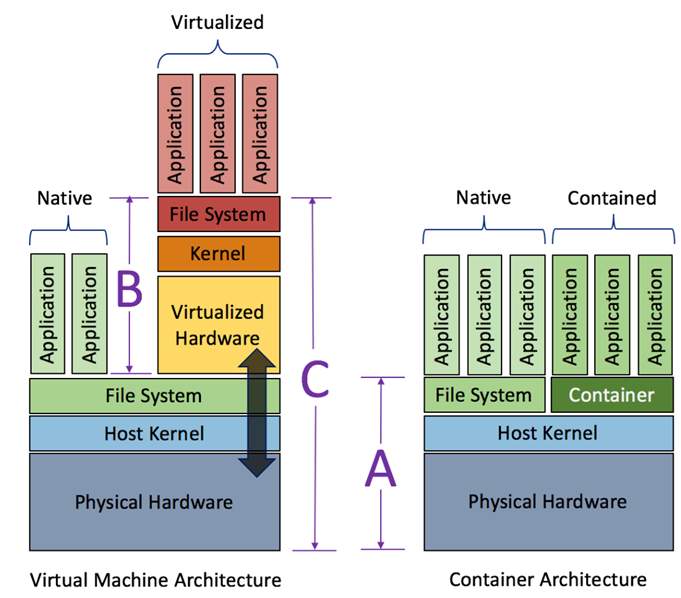
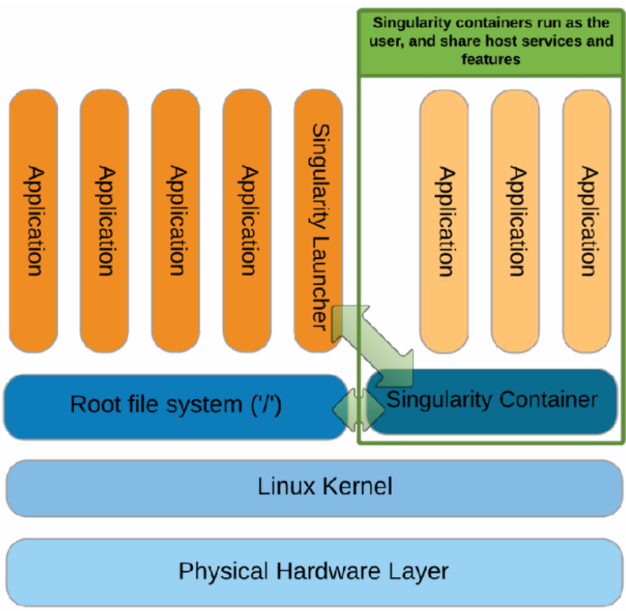
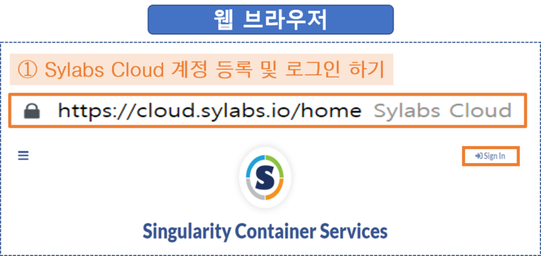
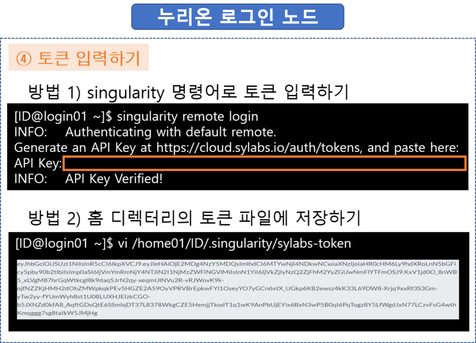
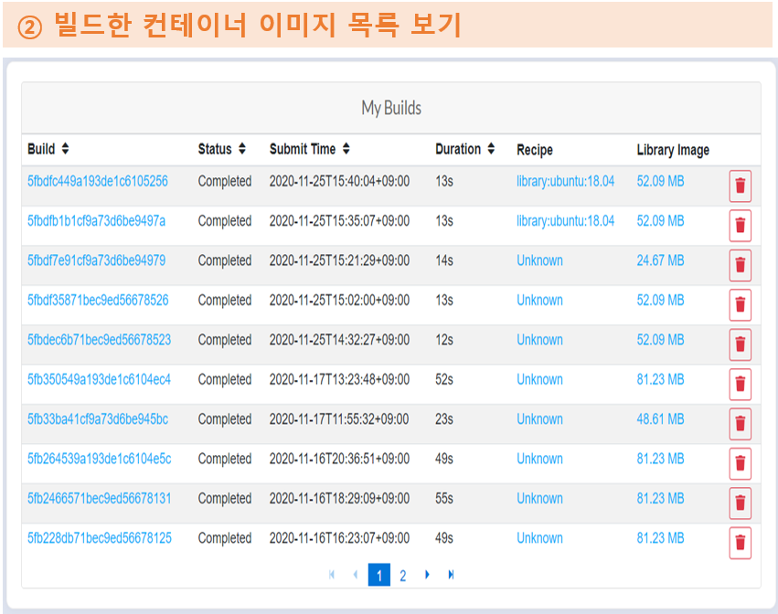

# \[별첨3] Singularity 컨테이너 사용법

싱귤레러티(Singularity)는 도커(Docker)와 같이 OS 가상화를 구현하기 위한 HPC 환경에 적합한 컨테이너 플랫폼이다. 사용자 작업 환경에 적합한 리눅스 배포판, 컴파일러, 라이브러리, 애플리케이션 등을 포함하는 컨테이너 이미지를 빌드하고 빌드된 컨테이너 이미지를 구동하여 사용자 프로그램을 실행할 수 있다.

Tensorflow, Caffe, Pytorch와 같은 딥러닝 프레임워크와 Quantum Espresso, Lammps, Gromacs, Paraview 등을 지원하는 빌드된 **컨테이너 이미지는** **/apps/applications/singularity\_images/ngc 디렉터리**에서 액세스 할 수 있다.

&#x20;

 

&#x20;< 가상머신과 컨테이너 아키텍처 비교 >                                                 < 싱귤레러티 컨테이너 아키텍처 >

※ 가상머신은 애플리케이션이 하이퍼바이저와 게스트 OS를 거쳐 올라가는 구조이나, 컨테이너는 물리적인 하드웨어에 더 가까우며 별도의 게스트 OS가 아닌 호스트 OS를 공유하기 때문에 오버헤드가 더 작음. 최근 클라우드 서비스에서 컨테이너의 활용이 증가하고 있음

&#x20;

## 가. 컨테이너 이미지 빌드하기

&#x20;

**1) 싱귤레러티 모듈 적재 혹은 경로 설정**

```
$ module load singularity/3.9.7
or
$ $HOME/.bash_profileexport PATH=$PATH:/apps/applications/singularity/3.9.7/bin/
```

&#x20;

**2) 로컬 빌드**

•  뉴론 시스템의 로그인 노드에서 컨테이너 이미지를  로컬 빌드하기  위해서는, 먼저 [**KISTI 홈페이지 > 기술지원 > 상담신청**을](https://www.ksc.re.kr/gsjw/gsjw/qna/edit) 통해 아래와 같은 내용으로 fakeroot 사용 신청을 해야함

&#x20;   \- 시스템명 : 뉴론\
&#x20;   \- 사용자 ID : a000abc\
&#x20;   \- 요청사항 : 싱귤레러티 fakeroot 사용 설정  &#x20;

• [**NGC(Nvidia GPU Cloud)에서 배포하는 도커 컨테이너**](https://catalog.ngc.nvidia.com/containers)로 부터 뉴론 시스템의 Nvidia GPU에 최적화된 딥러닝 프레임워크 및 HPC 애플리케이션 관련 싱규레러티 컨테이너 이미지를 빌드할 수 있음&#x20;

• 생성된 싱귤레러티 이미지 파일(\*.sif)을 수정하기 위해서는 root 권한이 필요하며, 샌드박스(쓰기 가능 chroot 디렉터리)로 변환해야 함.

&#x20;

**`[이미지 빌드 명령어]`**

```
$ singularity [global options...] build [local options...] ＜IMAGE PATH＞ ＜BUILD SPEC＞[주요 global options]    -d : 디버깅 정보를 출력함    -v : 추가 정보를 출력함    --version : 싱귤레러티 버전 정보를 출력함[관련 주요 local options]    --fakeroot : roor 권한 없이 일반사용자가 가짜 root 사용자로 이미지 빌드     --remote : 외부 싱귤레러티 클라우드(Sylabs Cloud)를 통한 원격 빌드(root 권한 필요 없음)    --sandbox : 샌드박스 형태의 쓰기 가능한 이미지 디렉터리 빌드＜IMAGE PATH＞   default : 읽기만 가능한 기본 이미지 파일(예시 : ubuntu1.sif)   sandbox : 읽기 및 쓰기 가능한 디렉터리 구조의 컨테이너(예시 : ubuntu4) ＜BUILD SPEC＞definition file : 컨테이너를 빌드하기 위한 recipe 파일(예시 : ubuntu.def)local image : 싱귤레러티 이미지 파일 혹은 샌드박스 디렉터리(IMAGE PATH 참조)URI library:// 컨테이너 라이브러리 (default https://cloud.sylabs.io/library) docker:// 도커 레지스트리 (default 도커 허브)shub:// 싱규레러티 레지스트리 (default 싱귤레러티 허브)oras:// OCI 레지스트리
```

&#x20;

**\[예제]**

```
① recipe 파일로부터 ubuntu1.sif 이미지 빌드하기 $ singularity build --fakeroot ubuntu1.sif ubuntu.def* ② 싱규레러티 라이브러리로부터 ubuntu2.sif 이미지 빌드하기 $ singularity build --fakeroot ubuntu2.sif library://ubuntu:18.04 ③ 도커 허브로부터 ubuntu3.sif 이미지 빌드하기 $ singularity build --fakeroot ubuntu3.sif docker://ubuntu:18.04 ④ 도커 허브로부터 샌드박스 형태의 ubuntu4 이미지 디렉터리 빌드하기 $ singularity build --fakeroot --sandbox ubuntu4 docker://ubuntu:18.04 ⑤ NGC(Nvidia GPU Cloud) 도커 레지스트리로부터 '22년 03월 배포 pytorch 이미지 빌드하기 $ singularity build --fakeroot pytorch1.sif docker://nvcr.io/nvidia/pytorch:22.03-py3⑥ recipe 파일로부터 pytorch.sif 이미지 빌드하기 $ singularity build --fakeroot pytorch2.sif pytorch.def*** ) ubuntu.def 예시 bootstrap: library from: ubuntu:18.04 %post apt-get update apt-get install -y wget git bash gcc gfortran g++ make file %runscript echo "hello world from ubuntu container!"** ) pytorch.def 예시- 로컬 이미지 파일로부터 콘다를 사용하여 새로운 패키지 설치를 포함한 이미지 빌드 bootstrap: localimage from: /apps/applications/singularity_images/ngc/pytorch:22.03-py3.sif %post conda install matplotlib -y- 외부 NGC 도커 이미지로부터 콘다를 사용하여 새로운 패키지 설치를 포함한 이미지 빌드 bootstrap: docker from: nvcr.io/nvidia/pytorch:22.03-py3 %post conda install matplotlib -y
```

&#x20;****&#x20;

**3) 원격빌드**

```
① Sylabs Cloud에서 제공하는 원격 빌드 서비스를 이용하여 recipe 파일로부터 ubuntu4.sif 이미지 빌드하기   $ singularity build --remote ubuntu4.sif ubuntu.def 
```

※ Sylabs Cloud(https://cloud.sylabs.io)에서 제공하는 원격빌드 서비스를 이용하려면 액세스 토큰을 생성하여 뉴론 시스템에 등록해야 함 [**\[참조 1\]**](https://www.ksc.re.kr/gsjw/jcs/hd#h\_7595929387701647407267724)\
※ 또한, Sylabs Cloud에 웹 브라우저 접속을 통해서 싱귤레러티 컨테이너 이미지의 생성∙관리가 가능함 **** [**\[참조 2\]**](https://www.ksc.re.kr/gsjw/jcs/hd#h\_6582700487751647407356239)

&#x20;

**4) 컨테이너 이미지 가져오기/내보내기**

```
① Sylabs cloud 라이브러리에서 컨테이너 이미지 가져오기  $ singularity pull tensorflow.sif library://dxtr/default/hpc-tensorflow:0.1 ② 도커 허브에서 이미지를 가져와서 싱귤레러티 이미지로 변환 $ singularity pull tensorflow.sif docker://tensorflow/tensorflow:latest③ Sylabs Cloud 라이브러리에 싱귤레러티 이미지 내보내기(업로드) $ singularity push -U tensorflow.sif library://ID/default/tensorflow.sif 
```

※ Sylabs Cloud 라이브러리에 컨테이너 이미지를 내보내기(업로드) 위해서는 먼저 액세스 토큰을 생성하여 뉴론 시스템에 등록해야 함 [**\[참조 1\]**](https://www.ksc.re.kr/gsjw/jcs/hd#h\_7595929387701647407267724)

&#x20;

**5) 컨테이너 이미지에서 제공되지 않는 파이썬 패키지 등을 사용자 홈 디렉터리에 설치하는 방법**

```
① pip install --user [파이썬 패키지 이름/버전], 사용자의 /home01/ID/.local 디렉터리에 설치됨  $ module load ngc/tensorflow:20.09-tf1-py3 (텐서플로우 컨테이너 모듈 로드) $ pip install --user keras==2.1.2  $ pip list --user Package Version ----------- ------- Keras 2.1.2② conda install —use-local [콘다 패키지 이름/버전], 사용자의 /home01/ID/.conda/pkgs 디렉터리에 설치됨 $ module load ngc/pytorch:20.09-py3 (파이토치 컨테이너 모듈 로드) $ conda install --use-local matplotlib -y  $ conda list matplotlib # Name Version Build Channel matplotlib 3.3.3 pypi_0 pypi
```

※ 단, 여러 가지 컨테이너 이미지를 사용하는 경우 사용자 프로그램 실행 시 사용자 홈 디렉터리에 추가로 설치한 패키지를 먼저 찾기 때문에 다른 컨테이너 이미지에서 요구하는 패키지와 충돌이 발생하여 정상적으로 동작하지 않을 수 있음

&#x20;

## 나. 싱귤레러티 컨테이너에서 사용자 프로그램 실행

&#x20;

**1) 싱귤레러티 모듈 적재 혹은 경로 설정**

```
$ module load singularity/3.9.7
or
$ $HOME/.bash_profileexport PATH=$PATH:/apps/applications/singularity/3.9.7/bin/
```

&#x20;

**2) 싱귤레러티 컨테이너에서 프로그램 실행 명령어**

```
$ singularity [global options...] shell [shell options...] ＜container＞$ singularity [global options...] exec [exec options...] ＜container＞ ＜command＞$ singularity [global options...] run [run options...] ＜container＞
```

&#x20;

**\[예제]**

```
① Nvidia GPU 장착 계산 노드의 싱귤레러티 컨테이너에서 쉘 실행 후 사용자 프로그램 실행 $ singularity shell --nv＊ tensorflow_22.03-tf1-keras-py3.sifSingularity> python test.py② Nvidia GPU 장착 계산 노드의 싱귤레러티 컨테이너에서 사용자 프로그램 실행$ singularity exec --nv tensorflow_22.03-tf1-keras-py3.sif python test.py $ singularity exec --nv docker://tensorflow/tensorflow:latest python test.py$ singularity exec --nv library://dxtr/default/hpc-tensorflow:0.1 python test.py③ Nvidia GPU 장착 계산 노드의 싱귤레러티 컨테이너에서 runscript(이미지 빌드 시 생성)가 존재하면 이 스크립트를 먼저 실행한 후, 사용자 명령어(아래 예제에서 python --version)가 존재하면 이어서 실행됨 $ singularity run --nv /apps/applications/singularity_images/ngc/tensorflow_22.03-tf1-keras-py3.sif ＼ python --version ================== TensorFlow ==================NVIDIA Release 22.03-tf1 (build 33659237)TensorFlow Version 1.15.5Container image Copyright (c) 2022, NVIDIA CORPORATION & AFFILIATES. All rights reserved.Copyright 2017-2022 The TensorFlow Authors. All rights reserved.Various files include modifications (c) NVIDIA CORPORATION & AFFILIATES. All rights reserved.This container image and its contents are governed by the NVIDIA Deep Learning Container License.By pulling and using the container, you accept the terms and conditions of this license:https://developer.nvidia.com/ngc/nvidia-deep-learning-container-licenseNOTE: CUDA Forward Compatibility mode ENABLED. Using CUDA 11.6 driver version 510.47.03 with kernel driver version 460.32.03. See https://docs.nvidia.com/deploy/cuda-compatibility/ for details.NOTE: Mellanox network driver detected, but NVIDIA peer memory driver not detected. Multi-node communication performance may be reduced.Python 3.8.10 (default, Nov 26 2021, 20:14:08)
```

※ 싱귤레러티의 명령어\[shell | exec | run | pull ...] 별 도움말을 보려면 “singularity help \[command]”를 실행함\
\* ) 계산/로그인 노드에서 Nvidia GPU를 사용하기 위해서는 --nv 옵션을 사용해야 함

&#x20;

**3) NGC 컨테이너 모듈을 사용하여 사용자 프로그램 실행**&#x20;

모듈 명령어를 사용하여 NGC 싱규레러티 컨테이너 이미지와 관련된 모듈을 로드하면 싱귤레러티 명령어를 입력하지 않아도 자동으로 컨테이너 이미지가 구동되어 좀 더 쉽게 싱귤레러티 컨테이너에서 사용자 프로그램을 실행할 수 있음

&#x20;

■ NGC 컨테이너 모듈을 로드하여 컨테이너에서 사용자 프로그램 실행하기

```
① tensorflow 1.15.5 지원 싱규레러티 컨테이너 이미지(tensorflow_22.03-tf1-keras-py3.sif)를 자동으로 구동하여 사용자 프로그램 실행 $ module load singularity/3.9.7 ngc/tensorflow:22.03-tf1-py3  $ mpirun -H gpu39:2,gpu44:2 –n 4 python keras_imagenet_resnet50.py② lammps 지원 싱규레러티 컨테이너 이미지(lammps:15Jun2020-x86_64.sif)를 자동으로 구동하여 lammps 실행 $ module load singularity/3.6.4 ngc/lammps:15Jun2020  $ mpirun –H gpu39:2,gpu44:2 -n 4 lmp -in in.lj.txt -var x 8 -var y 8 -var z 8 -k on g 2 \ -sf kk -pk kokkos cuda/aware on neigh full comm device binsize 2.8③ gromacs 지원 싱규레러티 컨테이너 이미지(gromacs:2020.2-x86_64.sif)를 자동으로 구동하여 gromacs 실행 $ module load singularity/3.6.4 ngc/gromacs:2020.2  $ gmx mdrun -ntmpi 2 -nb gpu -ntomp 1 -pin on -v -noconfout –nsteps 5000 \ –s topol.tpr singularity shell --nv＊ tensorflow:20.09-tf1-py3.sif 
```

※ 컨네이너 이미지 모듈 로드 후 실행명령어 입력만으로 “singularity run --nv <컨테이너> \[실행명령어]”가 자동 실행됨

&#x20;

■ NGC 컨테이너 모듈 리스트

| 모듈명                          | 구동 컨테이너 이미지 파일                      | 컨테이너 이미지 주요 구성 요소                              |
| ---------------------------- | ----------------------------------- | ---------------------------------------------- |
| ngc/tensorflow:22.03-tf1-py3 | tensorflow\_22.03-tf1-keras-py3.sif | TensorFlow 1.15.5, Horovod 0.23.0, Keras 2.1.2 |
| ngc/tensorflow:22.03-tf2-py3 | tensorflow\_22.03-tf2-keras-py3.sif | TensorFlow 2.8.0, Horovod 0.23.0, Keras 2.8.0  |
| ngc/pytorch:22.03-py3        | pytorch\_22.03-hd-py3.sif           | PyTorch 1.12.0a0, Horovod 0.24.2               |
| ngc/caffe:20.03-py3          | caffe:20.03-py3.sif                 | NVCaffe 0.17.3, OpenMPI 3.1.4                  |
| ngc/gromacs:2020.2           | gromacs:2020.2-x86\_64.sif          | GROMACS 2020.2                                 |
| ngc/lammps:15Jun2020         | lammps:15Jun2020-x86\_64.sif        | LAMMPS 15 Jun 2020                             |
| ngc/qe:6.7                   | quantum\_espresso:v6.7.sif          | Quantum\_espresso v6.7                         |
| ngc/paraview:5.9.0-py3       | paraview\_egl-py3-5.9.0.sif         | Paraview 5.9.0                                 |

▸NGC(https://ngc.nvidia.com)에서 Nvidia GPU에 최적화하여 빌드 배포한 도커 컨테이너 이미지를 싱귤레러티로 변환함\
▸컨테이너 이미지 파일 경로 : /apps/applications/singularity\_images/ngc

&#x20;

```
1009% [a123a01@glogin01 ngc]$ module av-- [중략] ---- [중략] --
```

&#x20;

**4) 스케줄러(SLURM)를 통한 컨테이너 실행 방법**

&#x20;

**■ GPU 싱귤레러티 컨테이너 작업 실행**

&#x20;

**① 작업 스크립트를 작성하여 배치 형태 작업 실행**\
\# 실행 명령어 : sbatch＜작업 스크립트 파일＞

```
[id@glogin01]$ sbatch job_script.shSubmitted batch job 12345
```

※ 자세한 스케줄러(SLURM) 사용 방법은  "뉴론 지침서-스케줄러(SLURM)를 통한 작업실행" 참조

※ [**\[참조 3\]**](https://www.ksc.re.kr/gsjw/jcs/hd#h\_9146219267821647408138749)를 통해 병렬 학습 실행 예제 프로그램을 따라해 볼 수 있음

&#x20;

**② 스케줄러가 할당한 계산 노드에서 인터랙티브 작업 실행**\
\# 스케줄러를 통해 계산노드를 할당받아 첫번째 계산노드에 쉘 접속 후 인터렉티브 모드로 사용자 프로그램 실행

```
[id@glogin01]$ srun --partition=cas_v100_4 --nodes=1 --ntasks-per-node=2 --cpus-per-task=10 --gres=gpu:2 --comment=pytorch --pty bash [id@gpu10]$ [id@gpu10]$ module load singularity/3.9.7 [id@gpu10]$ singularity run --nv /apps/applications/singularity_images/ngc/pytorch_22.03-hd-py3.sif python test.py
```

※ 1노드 점유, 노드 당 2  타스크, 타스크 당 10 CPUs, 노드 당 2GPU 사용 예제

&#x20;

**■ GPU 싱귤레러티 컨테이너 작업 스크립트 예시**

**① 단일 노드**\
\# 실행 명령어 : singularity run --nv <컨테이너> \[사용자 프로그램 실행 명령어]

```
#!/bin/sh#SBATCH –J pytorch # job name#SBATCH --time=1:00:00 # wall_time#SBATCH -p cas_v100_4#SBATCH --comment pytorch # application name#SBATCH --nodes=1 #SBATCH --ntasks-per-node=2 #SBATCH --cpus-per-task=10 #SBATCH –o %x_%j.out#SBATCH -e %x_%j.err#SBATCH —gres=gpu:2 # number of GPUs per nodemodule load singularity/3.9.7 singularity run --nv /apps/applications/singularity_images/ngc/pytorch_22.03-hd-py3.sif python test.py
```

※ 1노드 점유, 노드 당 2 타스크, 타스크 당 10 CPUs, 노드 당 2GPU 사용 예제

&#x20;

**② 멀티 노드-1**\
\# 실행 명령어 : srun singularity run --nv <컨테이너> \[사용자 프로그램 실행 명령어]

```
#!/bin/sh#SBATCH –J pytorch_horovod # job name#SBATCH --time=1:00:00 # wall_time#SBATCH –p cas_v100_4 # partition name#SBATCH --comment pytorch # application name#SBATCH --nodes=2 #SBATCH --ntasks-per-node=2 #SBATCH --cpus-per-task=10 #SBATCH –o %x_%j.out#SBATCH -e %x_%j.err#SBATCH --gres=gpu:2 # number of GPUs per nodemodule load singularity/3.9.7 gcc/4.8.5 mpi/openmpi-3.1.5srun singularity run --nv /apps/applications/singularity_images/ngc/pytorch_22.03-hd-py3.sif \python pytorch_imagenet_resnet50.py 
```

※ 2노드 점유, 노드 당 2 타스크(총 4개 MPI 프로세스-horovod 사용), 타스크 당 10CPUs, 노드 당 2GPU 사용 예제

&#x20;

**③ 멀티 노드-2**\
\# NGC 컨테이너 모듈을 로드하면 사용자 프로그램 실행 시 지정된 싱귤레러티 컨테이너를 자동으로 구동함\
\# 실행 명령어 : mpirun\_wrapper \[사용자 프로그램 실행 명령어]

```
#!/bin/sh#SBATCH –J pytorch_horovod # job name#SBATCH --time=1:00:00 # wall_time#SBATCH –p cas_v100_4 # partition name#SBATCH --comment pytorch # application name#SBATCH --nodes=2 #SBATCH --ntasks-per-node=2#SBATCH --cpus-per-task=10 #SBATCH –o %x_%j.out#SBATCH -e %x_%j.err#SBATCH --gres=gpu:2 # number of GPUs per nodemodule load singularity/3.9.7  ngc/pytorch:22.03-py3mpirun_wrapper python pytorch_imagenet_resnet50.py 
```

※ 2노드 점유, 노드 당 2 타스크(총 4개 MPI 프로세스-horovod 사용), 타스크 당 10CPUs, 노드 당 2GPU 사용 예제

&#x20;

## \[참조1] Sylabs Cloud 액세스 토큰 생성 및 뉴론 시스템에 토큰 등록하기 <a href="#h_7595929387701647407267724" id="h_7595929387701647407267724"></a>

[**\[Sylabs Cloud 바로가기\]**](https://cloud.sylabs.io/)




&#x20;



&#x20;

&#x20;

## \[참조2] 웹 브라우저에서 리모트 빌더에 의한 싱귤레러티 컨테이너 빌드하기 <a href="#h_6582700487751647407356239" id="h_6582700487751647407356239"></a>

[**\[Sylabs Cloud 바로가기\]**](https://cloud.sylabs.io/)




&#x20;

## \[참조3] 병렬 학습 프로그램 실행 예제 <a href="#h_9146219267821647408138749" id="h_9146219267821647408138749"></a>

\# 아래 예제는 싱귤레러티 컨테이너에서 pytorch 혹은 keras(tensorflow)로 작성된 resnet50 모델을 사용하여 imagenet\
이미지 분류를 위한 병렬 학습 실행을 사용자가 직접 따라해 볼 수 있도록 구성됨

```
▪ 병렬 학습 작업 스크립트 경로 : /apps/applications/singularity_images/examples▪ 컨테이너 이미지 디렉터리 경로 : /apps/applications/singularity_images/ngc▪ 병렬 학습 예제 프로그램 경로   - pytorch 프로그램    (단일노드) /apps/applications/singularity_images/examples/pytorch/resnet50v1.5    (멀티노드-horovod) /apps/applications/singularity_images/examples/horovod/examples/pytorch  - keras(Tensorflow) 프로그램    (멀티노드-horovod) /apps/applications/singularity_images/examples/horovod/examples/keras▪ imagent 이미지 데이터 경로  - (학습 데이터) /apps/applications/singularity_images/imagenet/train  - (검증 데이터) /apps/applications/singularity_images/imagenet/val
```

&#x20;

**1) /apps/applications/singularity\_images/examples 디렉터리에서 아래 작업 스크립트 파일을 사용자 작업 디렉터리로 복사함**

```
[a1234b5@glogin01]$ cp /apps/applications/singularity_images/examples/*.sh /scratch/ID/work/
```

&#x20;

**2) STATE가 idle 상태인 계산 노드가 있는 파티션을 확인함**\
아래 예제에서는 cas\_v100nv\_8, cas\_v100nv\_4, cas\_v100\_4, cas\_v100\_2 등의 파티션에 가용 계산노드가 존재함

```
[a1234b5@glogin01]$ sinfo
```

&#x20;

**3) 작업 스크립트 파일에서 작업명(-J), wall\_time(--time), 작업 큐(-p), Application이름(--comment), 계산노드 자원 요구량(--nodes, --ntasks-per-node, --gres) 등의 스케줄러 옵션과 학습 프로그램의 파라미터를 변경함**

```
[a1234b5@glogin01]$ vi 01.pytorch.sh#!/bin/sh#SBATCH -J pytorch #job name#SBATCH --time=24:00:00 # walltime#SBATCH --comment=pytorch # application name#SBATCH -p cas_v100_4 # partition name (queue or class)#SBATCH --nodes=1 # number of nodes#SBATCH --ntasks-per-node=2 # number of tasks per node#SBATCH --cpus-per-task=10 # number of cpus per task#SBATCH -o %x_%j.out#SBATCH -e %x_%j.err#SBATCH --gres=gpu:2 # number of GPUs per node## Training Resnet-50(Pytorch) for image classification on single node & multi GPUsBase=/apps/applications/singularity_imagesmodule load ngc/pytorch:22.03-py3python $Base/examples/pytorch/resnet50v1.5/multiproc.py --nproc_per_node 2 $Base/examples/pytorch/resnet50v1.5/main.py $Base/imagenet \--data-backend dali-gpu --raport-file report.json -j2 --arch resnet50 -c fanin --label-smoothing 0.1 -b 128 --epochs 50
```

```
 
```

&#x20;

**4) 스케줄러에 작업을 제출함**

```
[a1234b5@glogin01]$ sbatch 01.pytorch.shSubmitted batch job 99982
```

&#x20;

**5) 스케줄러에 의해 할당된 계산 노드를 확인함**

```
[a1234b5@glogin01]$ squque –u a1234b5 JOBID PARTITION NAME USER STATE TIME TIME_LIMI NODES NODELIST(REASON) 99982 cas_v100_2 pytorch a1234b5 RUNNING 10:13 24:00:00 1 gpu41
```

&#x20;

**6) 스케줄러에 의해 생성되는 로그 파일을 모니터링함**

```
[a1234b5@glogin01]$ tail –f pytorch_99982.out or [a1234b5@glogin01]$ tail –f pytorch_99982.err  
```

&#x20;

**7) 스케줄러에 의해 할당된 계산 노드에서 학습 프로세스 및 GPU 활용 현황을 모니터링 함**

```
[a1234b5@glogin01]$ ssh gpu41[a1234b5@gpu41]$ module load nvtop[a1234b5@gpu41]$ nvtop 
```

&#x20;

**■ 작업 스크립트**

**① pytorch 단일 노드 병렬 학습(01.pytorch.sh)**

```
#!/bin/sh#SBATCH -J pytorch #job name#SBATCH --time=24:00:00 # walltime#SBATCH --comment=pytorch # application name#SBATCH -p cas_v100_4 # partition name (queue or class)#SBATCH --nodes=1 # number of nodes#SBATCH --ntasks-per-node=2 # number of tasks per node#SBATCH --cpus-per-task=10 # number of cpus per task#SBATCH -o %x_%j.out#SBATCH -e %x_%j.err#SBATCH --gres=gpu:2 # number of GPUs per node## Training Resnet-50(Pytorch) for image classification on single node & multi GPUsBase=/apps/applications/singularity_imagesmodule load ngc/pytorch:22.03-py3python $Base/examples/pytorch/resnet50v1.5/multiproc.py --nproc_per_node 2 $Base/examples/pytorch/resnet50v1.5/main.py $Base/imagenet \--data-backend dali-gpu --raport-file report.json -j2 --arch resnet50 -c fanin --label-smoothing 0.1 -b 128 --epochs 50
```

※ 1노드 점유, 노드 당 2 타스크, 타스크 당 10 CPUs, 노드 당 2GPU 사용

&#x20;

**② pytorch\_horovod 멀티 노드 병렬 학습(02.pytorch\_horovod.sh)**

```
#!/bin/sh#SBATCH -J pytorch_horovod # job name#SBATCH --time=24:00:00 # walltime#SBATCH --comment=pytorch # application name#SBATCH -p cas_v100_4 # partition name (queue or class)#SBATCH --nodes=2 # the number of nodes#SBATCH --ntasks-per-node=2 # number of tasks per node#SBATCH --cpus-per-task=10 # number of cpus per task#SBATCH -o %x_%j.out#SBATCH -e %x_%j.err#SBATCH --gres=gpu:2 # number of GPUs per node## Training Resnet-50(Pytorch horovod) for image classification on multi nodes & multi GPUsBase=/apps/applications/singularity_imagesmodule load ngc/pytorch:22.03-py3mpirun_wrapper \python $Base/examples/horovod/examples/pytorch/pytorch_imagenet_resnet50.py \--batch-size=128 --epochs=50
```

※ 2노드 점유, 노드 당 2  MPI 타스크, 타스크 당 10 CPUs, 노드 당 2GPU 사용

&#x20;

**③ keras(tensorflow)\_horovod 멀티 노드 병렬 학습(03.keras\_horovod.sh)**

```
#!/bin/sh#SBATCH -J keras_horovod # job name#SBATCH --time=24:00:00 # walltime#SBATCH --comment=tensorflow # application name#SBATCH -p cas_v100_4 # partition name (queue or class)#SBATCH --nodes=2 # the number of nodes#SBATCH --ntasks-per-node=2 # number of tasks per node#SBATCH --cpus-per-task=10 # number of cpus per task#SBATCH -o %x_%j.out#SBATCH -e %x_%j.err#SBATCH --gres=gpu:2 # number of GPUs per node## Training Resnet-50(Keras horovod) for image classification on multi nodes & multi GPUSBase=/apps/applications/singularity_images/examplesmodule load ngc/tensorflow:22.03-tf1-py3mpirun_wrapper python $Base/horovod/examples/keras/keras_imagenet_resnet50.py \--batch-size=128 --epochs=50
```

※ 2노드 점유, 노드 당 2  MPI 타스크, 타스크 당 10 CPUs, 노드 당 2GPU 사용

&#x20;

2022년 4월 13일에 마지막으로 업데이트되었습니다.
