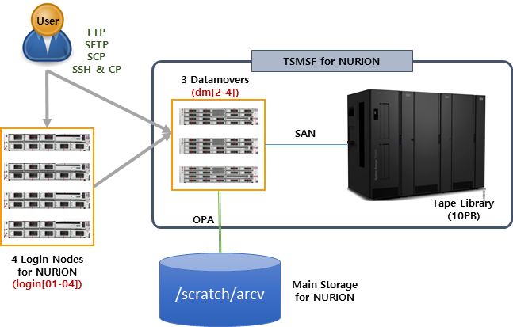
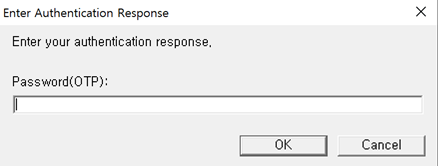

# \[Appendix 3] TSMSF User Guidelines

## Method for Archiving Data Using TSMSF

&#x20;****&#x20;

\

## A. System Environment and How to Use the System

 

The Nurion system operates a Tape Library (IBM TS4500) with a capacity of 10 PBytes to support the long-term (1 year after the contract expires) storage of users' important files and large files.

&#x20;

Tiered storage management script facility (TSMSF) is a software tool that supports the backup and archiving of users' data, and it is installed and operated on the Datamover node of the Nurion system. TSMSF supports the automatic archiving of user data and the manual restoration of data when the user needs the data. Unlike the home directory (/home01) backup, which is performed regularly by the administrator, the user has to upload files to a specific directory (/scratch/arcv/\[$USER]). As shown in the figure, TSMSF currently consists of a tape library and Datamover (DM) nodes.

&#x20;

**o Nurion system TSMSF: Tape (10PB)**

**o Nurion system Datamover Node: nurion-dm.ksc.re.kr**

&#x20;

\[TSMSF System Configuration Diagram ]

Data are automatically archived 7 days (this may be changed later) after the user uploads files from Datamover to the specified directory (/scratch/arcv/$USER). When uploading files to Datamover, the user can use FTP, SCP, SSH, SFTP, etc. to upload files directly from the outside. The user can also upload files through the Nurion login node (but FTP cannot be used for the login node). Here, services other than FTP require the user to enter a one-time password (OTP). Furthermore, services other than FTP automatically stop uploading files if the limited resource (10 min of CPU time) is used up. Hence, we recommend that you use FTP to upload files.

&#x20;

&#x20;

## B. User Policy and Application Method

&#x20;

The amount of data that can be stored in TSMSF per account (ID) is 100 TB (a maximum of 1,000,000 files). The data are retained up to 1 year after the user account expires.

&#x20;

Because TSMSF uses tape media, **it may be difficult to recover the data in the event of a tape media failure.** Therefore, **it is better to keep important data on the user's local system.**

&#x20;

In addition, it is generally time consuming to load tape media into the tape library for access. Therefore, if there are many small files to backup or archive, such as source files, it is better to archive the files after compressing them using tar or gzip.

&#x20;

**To use TSMSF, a separate user environment needs to be configured. Therefore, please send an email to account@ksc.re.kr to request authorization to use TSMSF. (A separate form is not required, and you only need to send your account information (ID).)**

&#x20;

For other inquiries related to general technical support, please send an email to consult@ksc.re.kr.

&#x20;

&#x20;

## C. Archiving Method

**3.1 Connecting to a login node and a Datamover node**

&#x20;

To archive the user data, please use the Nurion system's login node or Datamover node. When you first log in, the directory location is “/home01/$USER.” Note that this directory is the general home directory of the Nurion system, and not the home directory of TSMSF. Therefore, change the path using the cd command (cd /scratch/arcv/$USER) to move to the user directory for TSMSF.

&#x20;

&#x20;

&#x20;

&#x20;

(Method1) Connect (ssh) to the login node (nurion.ksc.re.kr) or the Datamover node (nurion-dm.ksc.re.kr), and use the cp command.

| 
[user01@dm2:/home01/user01 ]$ <strong>ssh $USER@nurion-dm.ksc.re.kr (또는 ssh $USER@nurion.ksc.re.kr)</strong>

  Password(OTP):

  Password:

 

[user01@dm02:/home01/user01 ]$ <strong>cp –r [mydir | myfile] /scratch/arcv/$USER/</strong>
 |
| ---------------------------------------------------------------------------------------------------------------------------------------------------------------------------------------------------------------------------------------------------------------------- |

&#x20;

&#x20;

(Method 2) Use the scp command remotely.

| 
[user01@login01:/home01/user01 ]$ <strong>scp –r [mydir | myfile] $USER@nurion-dm.ksc.re.kr:/scratch/arcv/$USER/</strong>

  Password(OTP):

  Password:
 |
| ------------------------------------------------------------------------------------------------------------------------------------------------------------------------- |

&#x20;

&#x20;

&#x20;

&#x20;

(Method 3) Upload files by connecting to the Datamover node (nurion-dm.ksc.re.kr) using an FTP / SFTP client program.

&#x20;****&#x20;

① Example of using the FileZilla client (FTP)

\- Enter the information to connect to the Datamover node, and click the “Quick connect” button.

| Host                | User name              | Password      | Port |
| ------------------- | ---------------------- | ------------- | ---- |
| nurion-dm.ksc.re.kr | USER ID (user account) | User password | 21   |

&#x20;

&#x20;

\- Because the path of the remote site is the user home directory (/home01/$USER), move to the specified directory (/scratch/arcv/$USER).

※ You can move easily by directly entering the absolute path in the remote site path.

&#x20;

&#x20;

\- Upload files by selecting files or directories in the local site on the left.

※ Refer to (https://filezilla-project.org/) for a more detailed FileZilla manual.

&#x20;

&#x20;

② Example of using the SSH Secure Shell Client (SFTP)

\- Click the “Quick Connect” button to connect to the Datamover node.

&#x20;

\- Enter the information to connect to the Datamover node, and click the “Connect” button.

| Host                | User name              | Port | Authentication method |
| ------------------- | ---------------------- | ---- | --------------------- |
| nurion-dm.ksc.re.kr | USER ID (user account) | 22   | Keyboard Interactive  |

&#x20;

&#x20;

\- Enter the one-time password (OTP) and the password sequentially, and then click the “OK” button.

&#x20;

&#x20;

\- Because the path of the site on the right is the user home directory (/home01/$USER), move to the specified directory (/scratch/arcv/$USER).

※ You can move easily by directly entering the absolute path in the site path.

&#x20;

&#x20;

\- Upload files by selecting files or directories in the local site on the left.

&#x20;**** 

&#x20;

&#x20;

**3.2 Data archiving**

&#x20;

Among the files in the specified directory (/scratch/arcv/$USER), the files that are larger than 10 Mbytes and have not been accessed for 3 days (to be changed later) are automatically archived. For the archived files, only the temporary files (chunk files) with a file size of 0 bytes remain in that directory, as shown below, and the actual data exists in the tape library. If the number of files increases, it takes longer to archive the files to the tape library or restore the files to the disk for use. Hence, if possible, it is recommended that the number of files be reduced by compressing (e.g., tar) them.

| 
[user01@dm2 ~] <strong>ls –lh /scratch/arcv/$USER/*</strong>

... omitted ...

-rw-r--r-- 1 root root 0 Feb 5 18:51 2019-2-19-18-51.[File Name].archived

... omitted ...
 |
| ----------------------------------------------------------------------------------------------------------------------------------------------------------------------------------------------- |

&#x20;

&#x20;

&#x20;o Example

| 
# ls -l <strong>/scratch/arcv/testdir/</strong>

total 2744320

-rw-r--r-- 1 root root         0 Feb 25 20:48 2019-2-25-20-48.test.220M.archived

-rw-r--r-- 1 root root         0 Feb 25 20:48 2019-2-25-20-48.test.230M.archived

-rw-r--r-- 1 root root 104857600 Sep 27 14:54 test.100M

-rw-r--r-- 1 root root  10485760 Sep 27 14:54 test.10M

-rw-r--r-- 1 root root 115343360 Sep 27 14:54 test.110M

... omitted ...
 |
| ----------------------------------------------------------------------------------------------------------------------------------------------------------------------------------------------------------------------------------------------------------------------------------------------------------------------------------------------------------------------------------------------------------------------------------------------------------------------- |

&#x20;

&#x20;

&#x20;**3.3 Checking the detailed information about the archived files**

&#x20;

For the archived data, the arc\_ls command can be used to check the detailed information about the files, as shown below.

| 
# arc_ls <strong>/scratch/arcv/testdir/</strong>

DIR: /scratch/arcv/testdir

ARC: /scratch/arcv/testdir/2019-2-25-20-48.test.460M.archived

      - File to restore    : /scratch/arcv/testdir/test.460M

      - File owner         : 0

      - File group         : 0

      - File size          : 482344960

      - Archived Name      : 3_7_4_6_scratcharcvtestdirtest.460M

      - Archived time      : 1551095210

NRM: /scratch/arcv/testdir/test.10M

... omitted ...
 |
| ------------------------------------------------------------------------------------------------------------------------------------------------------------------------------------------------------------------------------------------------------------------------------------------------------------------------------------------------------------------------------------------------------------------------------------------------------------------------------------------------------------------------------------------- |

&#x20;

The arc\_ls command can take the relative or absolute path of a directory or file as an argument. It can also search the subdirectories of the specified directory through the -r option when needed. In the output result, DIR denotes a directory, NRM a regular file, and ARC an archived file.

&#x20;****&#x20;

&#x20;

## D. Restore Method

&#x20;

To use the archived data, the files need to be restored. The command used to restore files is arc\_restore. **This command is time consuming to process because the data files are retrieved from the tape library.** Archived files can be restored as follows: &#x20;

&#x20;

| 
[user01@dm2 ~] <strong>arc_restore /scratch/arcv/$USER/[*.archived]</strong>

... omitted ...

-rw-r--r-- 1 root root 200M Feb 5 18:51 <strong>[original file]</strong>

... omitted ...
 |
| -------------------------------------------------------------------------------------------------------------------------------------------------------------------------------------------------------------- |

&#x20;

&#x20;o Example

| 
# arc_restore arc_restore /scratch/arcv/testdir/2019-2-25-20-49.test.580M.archived

ARCRESTORE : start to find archived files.

 

Processing restore queue...

 

[207249:207265] resRunner : filecheck : ADD : 1/0/0 : /scratch/arcv/testdir/test.580M

 

[207265:207269] Process ID 207269 started for restoring...

[207265:207269] File to restore    : /scratch/arcv/testdir/test.580M

[207265:207269] File owner         : 0

[207265:207269] File group         : 0

[207265:207269] File size          : 608174080

[207265:207269] Archived Name      : 3_7_4_6_scratcharcvtestdirtest.580M

[207265:207269] Archived time      : 1551095339

[207265:207269] Restore started at : Thu Feb 28 12:16:43 2019

[207265:207269] restoreFile : sh PTLGet -p 3_7_4_8_scratcharcvtestdirtest.580M -d /scratch/arcv/testdir -t 1551095339

[207265:207269] restoreFile : move /scratch/arcv/testdir/.working/3_7_4_6_scratcharcvtestdirtest.580M to /scratch/arcv/testdir/test.580M

[207265:207269] restoreFile : unlink /scratch/arcv/testdir/2019-2-25-20-49.test.580M.archived

[207265:207269] restoreFile : dbupdate( ARCHIVED_FILES / last_mod=1551323868,restore_count=1,status_id=1,result_id=1 Where file_id=341 )

[207265:207269] Restoring was done : /scratch/arcv/testdir/test.580M

[207249:207265] resRunner : CProc was forked : CProc count=1, CProc tCount=1

[207249:207265] resRunner : [ success=1 / fail=0 ] 207269 was finished : Success

resRunner : REPORT : resresult : Success=1 / Fail=0

Main thread runtime = 00:01:05
 |
| -------------------------------------------------------------------------------------------------------------------------------------------------------------------------------------------------------------------------------------------------------------------------------------------------------------------------------------------------------------------------------------------------------------------------------------------------------------------------------------------------------------------------------------------------------------------------------------------------------------------------------------------------------------------------------------------------------------------------------------------------------------------------------------------------------------------------------------------------------------------------------------------------------------------------------------------------------------------------------------------------------------------------------------------------------------------------------------------------------------------------------------------------------------------------------------------------------------------------------------------------------------------------------------------------------------------------------------------------------------------------------------------------------------------------------------------------------------------------------------------------------------------------------------------------------------------------------------------------------------------------------------------------------------------------------------- |

&#x20;

Similar to the arc\_ls command, the arc\_restore command can take the relative or absolute path of a directory or file as an argument. It can also search the subdirectories of the specified directory through the -r option when needed. In addition, either the chunk file name (timestamp.\[File Name].archived) or the original file name can be specified when specifying the file.

&#x20;

&#x20;

## E. Delete Method

&#x20;

To delete some or all of the files in the specified directory (/scratch/arcv/$USER), you can use the rm command, which is a basic Linux command.

Temporary files (chunk files with the .archived extension) can also be deleted using the rm command. When temporary files are deleted, it may take about 3 days for the archived data in the tape library to be deleted and synchronized. That is, if the temporary file does not exist in the original path, the system determines that "the user has deleted the file." Therefore, do not change the name of the temporary file directly or move the temporary file. You must first restore the file before changing the temporary file name or moving the temporary file. **(Please note that it is impossible to restore the file once the temporary file has been deleted.)**
