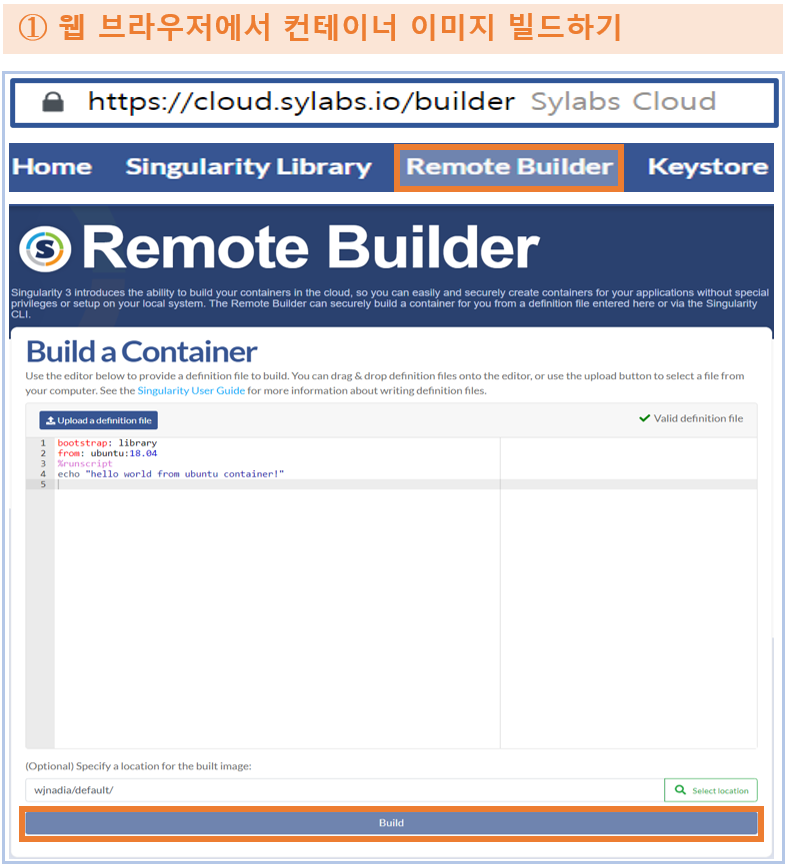

# \[별첨3] Singularity 컨테이너 사용법

싱귤레러티(Singularity)는 도커(Docker)와 같이 OS 가상화를 구현하기 위한 HPC 환경에 적합한 컨테이너 플랫폼이다. 사용자 작업 환경에 적합한 리눅스 배포판, 컴파일러, 라이브러리 등을 포함하는 컨테이너 이미지를 생성하고 컨테이너를 구동하여 사용자 프로그램을 실행할 수 있다.

&#x20;


## 가. 싱귤레러티 모듈 적재

```
$ module load singularity/3.6.4
```

&#x20;

&#x20;

## 나. 싱귤레러티 컨테이너에서 쉘 실행

```
$ singularity shell [이미지 이름]

$ singularity shell tensorflow-1.12.0-py3.simg
Singularity: Invoking an interactive shell within container...

Singularity tensorflow-1.12.0-py3.simg:tensorflow>
```

&#x20;

&#x20;

## 다. 싱귤레러티 컨테이너에서 사용자 프로그램 실행

```
$ singularity exec [이미지 이름] 실행명령어

$ singularity exec tensorflow-1.12.0-py3.simg python convolutional.py
```

_※ 계산 노드에서 스케줄러(PBS)를 통한 컨테이너 실행은 지침서 '스케줄러(PBS)를 통한 작업 실행' 나.-2) '인터렉티브 작업제출'의 예제 참조_

_※ /apps/applications/tensorflow/1.12.0/examples 디렉터리에서 convolutional 모델 예제 프로그램 (convolutional.py)과 데이터 디렉터리(data)를 사용자 작업 디렉터리로 복사하여 테스트 할 수 있음_

&#x20;

| 소프트웨어(프레임워크)     | 컨테이너 이미지 파일                                                       |
| ---------------- | ----------------------------------------------------------------- |
| tensorflw 1.12.0 | /apps/applications/tensorflow/1.12.0/tensorflow-1.12.0-py3.simg   |
| tensorflw 1.13.1 | /apps/applications/singularity\_images/tensorflow-1.13.1-py3.simg |
| pytorch 1.2.0    | /apps/applications/singularity\_images/pytorch-1.2.0-py3.simg     |

&#x20;

&#x20;

## 라. root 권한 없이 사용자가 싱귤레러티 컨테이너 이미지 빌드하기&#x20;

**1) 로컬 빌드**

```
$ singularity build --fakeroot ubuntu1.sif ubuntu.def (recipe 파일로부터 ubuntu1.sif 이미지 빌드하기)
 $ singularity build --fakeroot ubuntu2.sif library://ubuntu:18.04 (싱규레러티 라이브러리로부터 ubuntu2.sif 이미지 빌드하기)
 $ singularity build --fakeroot ubuntu3.sif docker://ubuntu:18.04 (도커 허브로부터 ubuntu3.sif 이미지 빌드하기)
```

_※ 3.6.4 버전에서 지원하며, KISTI 홈페이지 > 기술지원 > 상담신청을 통해 관리자가 fakeroot 사용 등록을 해주어야 함._\
_※ 단, 생성된 싱귤레러티 이미지 파일(\*.sif)을 수정하기 위해서는 root 권한이 필요하며, 샌드박스(쓰기 가능 chroot 디렉터리)로 변환해야 함._

&#x20;

**(ubuntu.def recipe 파일 예제)**

```
bootstrap: library
from: ubuntu:18.04
%post
apt update
%runscript
echo "hello world from ubuntu container!"
```

&#x20;

**2) 원격 빌드**

```
 $ singularity build --remote ubuntu4.sif ubuntu.def 
 (Sylabs Cloud에서 제공하는 원격 빌드 서비스 이용하여 recipe 파일로부터ubuntu4.sif 이미지 빌드하기)
```

_※ Sylabs Cloud(https://cloud.sylabs.io)에서 제공하는 원격빌드 서비스를 이용하려면 액세스 토큰을 생성하여 누리온에 등록해야 함 \[참조 1]_\
_※ 또한, Sylabs Cloud에 웹 브라우저 접속을 통해서 싱귤레러티 컨테이너 이미지의 생성∙관리가 가능함 \[참조 2]_

&#x20;

&#x20;

## 마. 싱귤레러티 컨테이너 이미지 가져오기/내보내기

```
$ singularity pull tensorflow.sif library://dxtr/default/hpc-tensorflow:0.1 (Sylabs cloud 라이브러리에서 컨테이너 이미지 가져오기)
$ singularity pull tensorflow.sif docker://tensorflow/tensorflow:latest (도커 허브에서 이미지를 가져와서 싱귤레러티 이미지로 변환)
$ singularity push -U tensorflow.sif library://ID/default/tensorflow.sif (Sylabs Cloud 라이브러리에 싱귤레러티 이미지 내보내기(업로드))
```

_※ Sylabs Cloud(https://cloud.sylabs.io)에 이미지를 내보내기(업로드) 위해서는 액세스 토큰을 생성하여 누리온에 등록해야 함 \[참조 1]_

&#x20;

&#x20;

## \[참조 1] Sylabs Cloud 액세스 토큰 생성 및 누리온에 등록하기&#x20;

&#x20;


&#x20;


&#x20;

&#x20;

## \[참조 2] 웹 브라우저에서 리모트 빌더에 의한 싱규레러티 컨테이너 이미지 빌드하기&#x20;

&#x20;




_※  누리온에서 singularity 명령어로 리모트 빌드한 이미지 목록도 포함됨_


&#x20;
